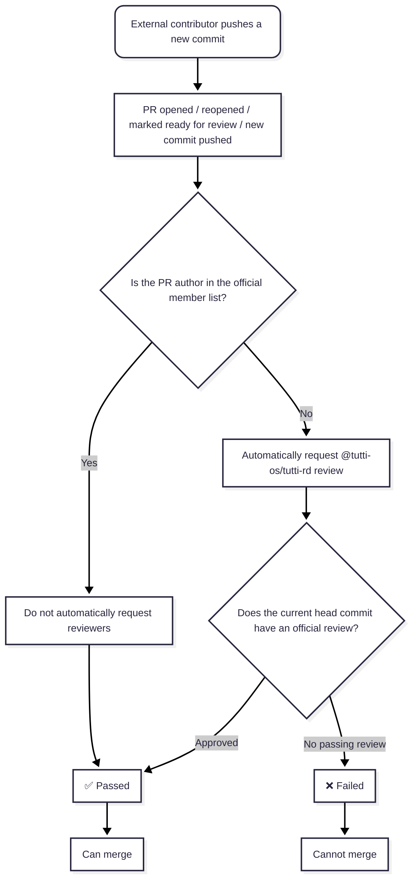

# Contributing to Tutti

[English](CONTRIBUTING.md) | [简体中文](CONTRIBUTING.zh-CN.md) | [繁體中文](CONTRIBUTING.zh-TW.md)

Thank you for your interest in contributing to Tutti! This guide covers everything you need to set up a development environment, follow our conventions, and get your changes merged.

By participating in this project, you agree to follow our [Code of Conduct](CODE_OF_CONDUCT.md).

> Note: this codebase uses the internal codename `tutti` — you will see it in directory and binary names such as `services/tuttid`.

## Repository Layout

- `apps/desktop`: Electron desktop shell, renderer UI, preload bridge, and native desktop integration
- `services/tuttid`: long-running local daemon and primary business core
- `packages/clients/*`: shared domain-specific clients
- `packages/configs/*`: shared engineering config
- `packages/ui/*`: shared visual system boundaries

## Development Environment

Recommended local prerequisites:

- Node.js `24` or newer; `.node-version` pins the project baseline
- pnpm `10.11.0`
- Go `1.24`
- `golangci-lint` `v2.12.0`

Install workspace dependencies:

```sh
pnpm install
```

Install the pinned `golangci-lint` version:

```sh
pnpm install:golangci-lint
```

Check local prerequisites:

```sh
pnpm setup:dev
```

Start the desktop app in development with prerequisite checks and a prebuilt `tuttid`:

```sh
make dev-gui
```

If you already have a warmed daemon binary and only want the raw Electron/Vite loop, `pnpm dev:desktop` still works.

## Common Commands

```sh
make dev-gui
pnpm build
pnpm typecheck
pnpm lint
pnpm lint:ts
pnpm lint:go
pnpm test:ts
pnpm test:go
pnpm check:golangci-version
pnpm install:golangci-lint
pnpm generate:defaults
pnpm check:defaults-generated
```

Full validation entrypoint:

```sh
pnpm check:full
```

## Repository Rules

- Business logic belongs in `services/tuttid`
- UI and desktop integration belong in `apps/desktop`
- Code should move into `packages/` only when there is a real shared boundary
- Business-code files should stay at or below `800` lines; crossing the limit is a refactoring signal

Deeper references:

- Architecture overview: [docs/architecture/README.md](docs/architecture/README.md)
- Project structure: [docs/architecture/project-structure.md](docs/architecture/project-structure.md)
- Repository conventions: [docs/conventions/README.md](docs/conventions/README.md)
- Static analysis and lint rules: [docs/conventions/static-analysis.md](docs/conventions/static-analysis.md)
- Agent contributor instructions: [AGENTS.md](AGENTS.md)

## Commit Conventions

We follow [Conventional Commits](https://www.conventionalcommits.org/):

```
<type>(<scope>): <subject>
```

Examples from this repository:

```
fix(workspace-files): avoid protected directory prefetch
fix(agent): preserve provider permission defaults
```

Common types: `feat`, `fix`, `docs`, `refactor`, `test`, `chore`.

## Developer Certificate of Origin (DCO)

We require contributors to certify the [Developer Certificate of Origin](https://developercertificate.org/). It is a lightweight statement that you have the right to submit your contribution under the project's license (Apache-2.0).

Sign off each commit with the `-s` flag:

```sh
git commit -s -m "feat(scope): add something"
```

This appends a `Signed-off-by: Your Name <your@email>` line to the commit message.

## Pull Request Workflow

1. Fork the repository and create a branch from `main`. Suggested branch naming: `feat/...`, `fix/...`, `docs/...`
2. Make your changes; keep each PR focused on a single concern
3. Open a PR with a clear description of the motivation and changes
4. CI runs TypeScript linting, Go linting, typechecking, tests, and tooling consistency checks; all checks must pass
5. A maintainer reviews your PR; please respond to feedback and keep the conversation in the PR

Local hooks use `husky`:

- `pre-commit` runs staged formatting and UI-boundary checks
- `pre-push` runs `pnpm check:full`

## Pull Request Review Gate

Tutti uses the `external-pr-review-gate` workflow to separate internal team changes from external contributions. Internal authors are defined by the organization variable `TUTTI_RD_MEMBERS`; the `tutti-rd` GitHub team is the review target for external PRs.

- PRs opened by `tutti-rd` members do not automatically request reviewers and can pass the review gate without a separate official approval
- PRs opened by non-`tutti-rd` authors automatically request review from `@tutti-os/tutti-rd`
- External PRs can merge only after a `tutti-rd` member approves the current head commit
- Pushing a new commit refreshes the gate; the new head commit needs a fresh passing review
- Maintainers must update both `TUTTI_RD_MEMBERS` and the `tutti-rd` team when official team membership changes



## Documentation Language Policy

- `README.*` and `CONTRIBUTING.*` are maintained in English, Simplified Chinese, and Traditional Chinese
- **English is the source of truth** — when you change `README.md` or `CONTRIBUTING.md`, update `*.zh-CN.md` and `*.zh-TW.md` in the same PR
- If a translation conflicts with the English version, the English version prevails
- `LICENSE`, `NOTICE`, `CODE_OF_CONDUCT.md`, `SECURITY.md`, and the `docs/` tree are English-only

## Reporting Issues

- Bug reports and feature requests: use the [issue templates](.github/ISSUE_TEMPLATE)
- Security vulnerabilities: **do not open a public issue** — see [SECURITY.md](SECURITY.md)

## License

By contributing to Tutti, you agree that your contributions will be licensed under the [Apache License 2.0](LICENSE).
