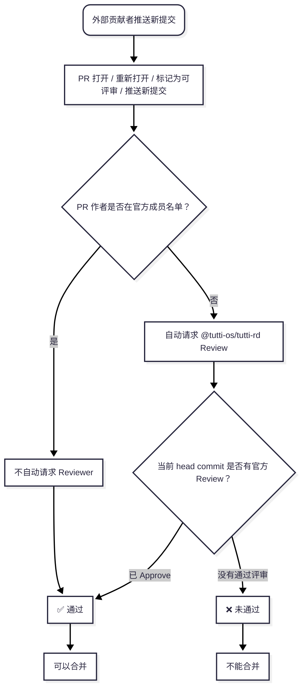

# 为 Tutti 做贡献

[English](CONTRIBUTING.md) | [简体中文](CONTRIBUTING.zh-CN.md) | [繁體中文](CONTRIBUTING.zh-TW.md)

感谢你有兴趣为 Tutti 做贡献！本指南涵盖搭建开发环境、遵循项目规范以及让你的改动被合并所需的全部内容。

参与本项目即表示你同意遵守我们的[行为准则](CODE_OF_CONDUCT.md)。

> 注：本代码库使用内部代号 `tutti`，你会在目录和二进制命名中看到它（如 `services/tuttid`）。

## 仓库结构

- `apps/desktop`：Electron 桌面外壳、渲染器 UI、preload 桥接层和原生桌面集成
- `services/tuttid`：长驻本地守护进程，核心业务所在
- `packages/clients/*`：共享的领域客户端
- `packages/configs/*`：共享的工程配置
- `packages/ui/*`：共享的视觉系统边界

## 开发环境

推荐的本地环境：

- Node.js `24` 或更高；`.node-version` 固定了项目基线
- pnpm `10.11.0`
- Go `1.24`
- `golangci-lint` `v2.12.0`

安装 workspace 依赖：

```sh
pnpm install
```

安装固定版本的 `golangci-lint`：

```sh
pnpm install:golangci-lint
```

检查本地环境：

```sh
pnpm setup:dev
```

以带前置检查和预构建 `tuttid` 的方式启动桌面应用开发：

```sh
make dev-gui
```

如果你已有可用的 daemon 二进制，只想跑原始的 Electron/Vite 循环，`pnpm dev:desktop` 仍然可用。

## 常用命令

```sh
make dev-gui
pnpm build
pnpm typecheck
pnpm lint
pnpm lint:ts
pnpm lint:go
pnpm test:ts
pnpm test:go
pnpm check:golangci-version
pnpm install:golangci-lint
pnpm generate:defaults
pnpm check:defaults-generated
```

完整验证入口：

```sh
pnpm check:full
```

## 仓库规则

- 业务逻辑归属 `services/tuttid`
- UI 与桌面集成归属 `apps/desktop`
- 只有存在真实共享边界时，代码才应进入 `packages/`
- 业务代码文件应保持在 `800` 行以内；超过即为重构信号

深入参考：

- 架构总览：[docs/architecture/README.md](docs/architecture/README.md)
- 项目结构：[docs/architecture/project-structure.md](docs/architecture/project-structure.md)
- 仓库约定：[docs/conventions/README.md](docs/conventions/README.md)
- 静态分析与 lint 规则：[docs/conventions/static-analysis.md](docs/conventions/static-analysis.md)
- Agent 贡献者说明：[AGENTS.md](AGENTS.md)

## 提交规范

我们遵循 [Conventional Commits](https://www.conventionalcommits.org/)：

```
<type>(<scope>): <subject>
```

本仓库中的示例：

```
fix(workspace-files): avoid protected directory prefetch
fix(agent): preserve provider permission defaults
```

常用类型：`feat`、`fix`、`docs`、`refactor`、`test`、`chore`。

## 开发者原创证书（DCO）

我们要求贡献者签署 [Developer Certificate of Origin](https://developercertificate.org/)。这是一份轻量声明，表明你有权以本项目的协议（Apache-2.0）提交你的贡献。

用 `-s` 参数为每个 commit 签名：

```sh
git commit -s -m "feat(scope): add something"
```

这会在 commit message 末尾追加一行 `Signed-off-by: Your Name <your@email>`。

## Pull Request 流程

1. Fork 仓库并从 `main` 创建分支。建议的分支命名：`feat/...`、`fix/...`、`docs/...`
2. 完成你的改动；每个 PR 只关注一件事
3. 提交 PR，清晰描述动机与改动内容
4. CI 会运行 TypeScript lint、Go lint、类型检查、测试和工具一致性检查；所有检查必须通过
5. 维护者会 review 你的 PR；请回应反馈，并把讨论保留在 PR 中

本地钩子使用 `husky`：

- `pre-commit` 运行暂存区格式化和 UI 边界检查
- `pre-push` 运行 `pnpm check:full`

## Pull Request 评审门禁

Tutti 使用 `external-pr-review-gate` workflow 区分内部团队改动和外部贡献。官方作者由组织变量 `TUTTI_RD_MEMBERS` 定义；GitHub 团队 `tutti-rd` 是外部 PR 的 review 请求目标。

- `tutti-rd` 成员发起的 PR 不会自动请求 reviewer，也不需要额外官方 approve 即可通过评审门禁
- 非 `tutti-rd` 作者发起的 PR 会自动请求 `@tutti-os/tutti-rd` review
- 外部 PR 只有在当前 head commit 获得 `tutti-rd` 成员 approve 后才能合并
- 推送新提交会刷新门禁；新的 head commit 需要重新获得通过评审
- 官方团队成员变化时，维护者必须同时更新 `TUTTI_RD_MEMBERS` 和 `tutti-rd` 团队



## 文档语言策略

- `README.*` 和 `CONTRIBUTING.*` 以英文、简体中文、繁体中文三语维护
- **英文版是唯一基准（source of truth）**——修改 `README.md` 或 `CONTRIBUTING.md` 时，须在同一个 PR 中同步更新 `*.zh-CN.md` 和 `*.zh-TW.md`
- 译文与英文版冲突时，以英文版为准
- `LICENSE`、`NOTICE`、`CODE_OF_CONDUCT.md`、`SECURITY.md` 与 `docs/` 目录只维护英文

## 反馈问题

- Bug 报告与功能请求：使用 [issue 模板](.github/ISSUE_TEMPLATE)
- 安全漏洞：**请勿提交公开 issue**——参见 [SECURITY.md](SECURITY.md)

## 协议

向 Tutti 提交贡献，即表示你同意你的贡献以 [Apache License 2.0](LICENSE) 授权。

> 翻译说明：本文档与英文版内容同步，如有出入，以[英文版](CONTRIBUTING.md)为准。
