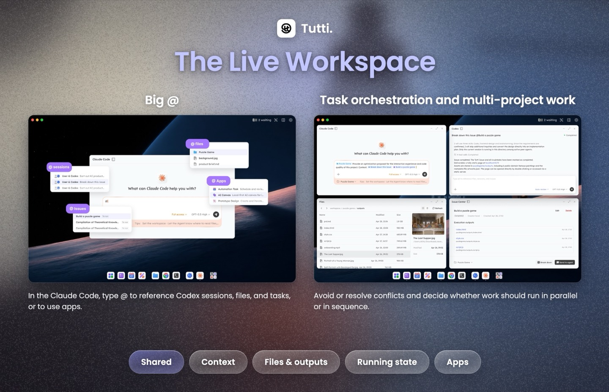
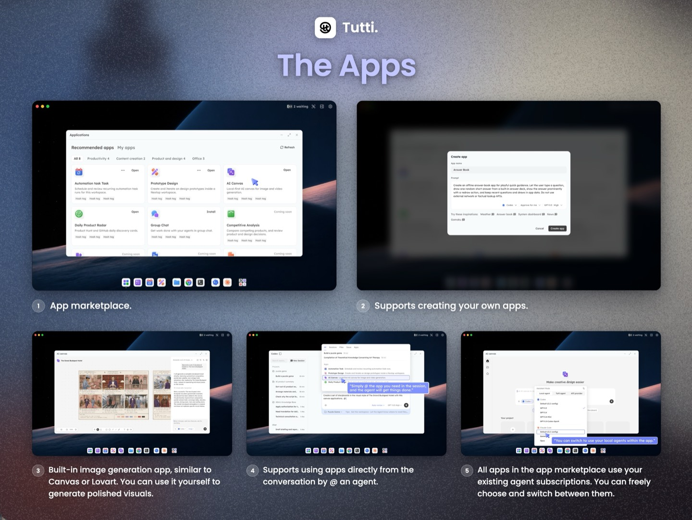
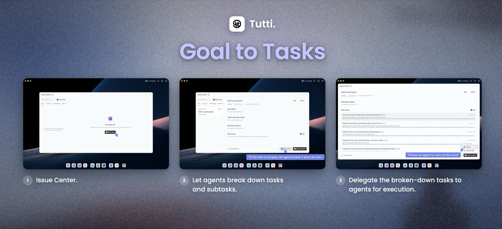
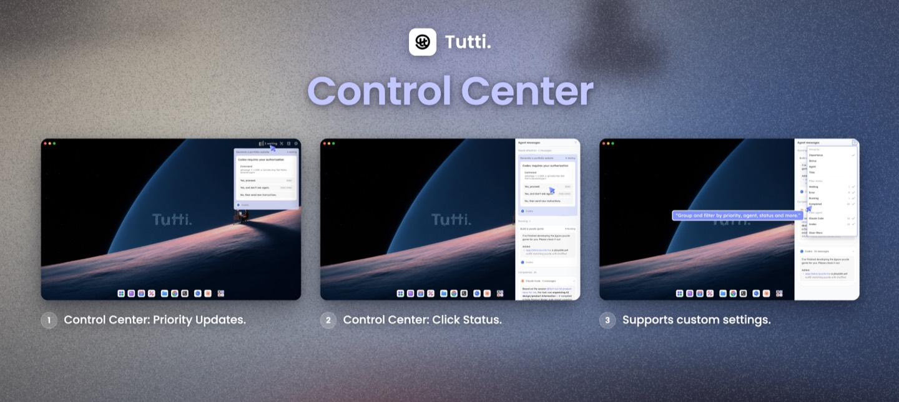
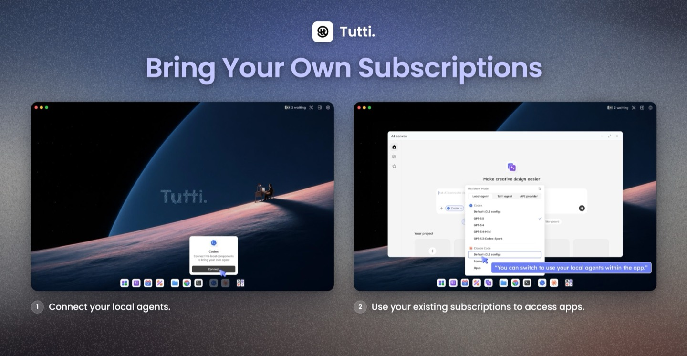
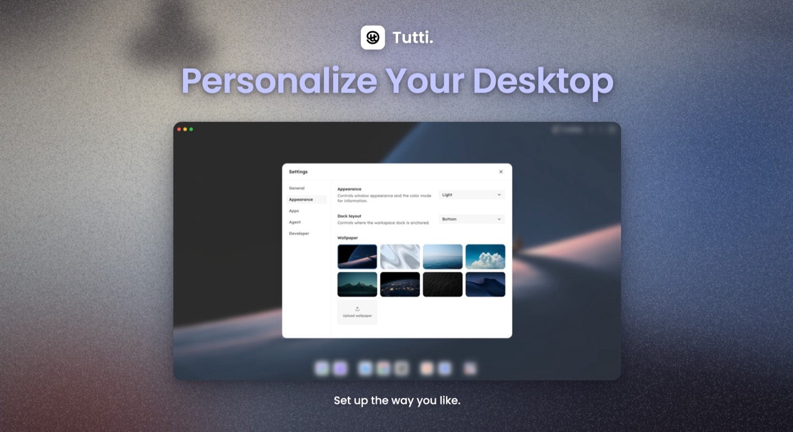

<div align="center">


**Where people and agents build in tune.**

[Website](https://tutti.sh) · [Documentation](docs/README.md) · [Contributing](CONTRIBUTING.md)

[English](README.md) | [简体中文](README.zh-CN.md) | [繁體中文](README.zh-TW.md)

[](LICENSE)
[](https://tutti.sh)

</div>

---

Like Tutti? Give us a star, fork the repo, open an issue, or send a PR.

We're building Tutti with the community. Join our Discord to meet the team and other builders, share feedback, ask questions, and help shape what comes next:


## What is Tutti?

Agents work in isolation by default. Tutti brings them into one live workspace, where your Claude, Codex, and Gemini can share context, files, apps, and running tasks. Your Codex can see what Claude built.

Tutti also comes with its own app ecosystem, including apps for image generation, UI/UX design, docs, decks, and more. You can use them, and your agents can use them too.

When Codex calls an image-generation app to create an image, Claude Code can use that image directly to build the frontend. No copy-pasting required.

Everything is visible and connected inside Tutti. Any artifact, including app-generated outputs, can be passed across agents and used directly in the next step.

No terminal. No setup friction. Just open Tutti and start building.

## Features

### The Live Workspace

Agents don't hand off summaries. They share the same live workspace: context, files, running tasks, and apps. Your Codex sees what Claude changed, what's running, and the current project state. This unlocks two key capabilities:

**Big @**

- In Codex, you can use `@` to reference past conversations, files, apps, app outputs, and tasks. No repeated copy-pasting or re-uploading.
- You can also reference Claude Code's past conversations, files, apps, app outputs, and tasks from inside Codex, then build on top of them without manually moving context around.

**Task orchestration and multi-project building**

- With shared visibility into each other's work, agents can avoid or resolve conflicts and decide whether work should run in parallel or in sequence. Agents from different providers, such as Claude and Codex, or Gemini and OpenClaw (DeepSeek), can work together without getting in each other's way.



### The Apps

Apps run on Tutti, for you and your agents. Use them yourself, or let any agent call them. Create images, videos, and more with official, community-built, or custom apps.

All apps reuse your existing agent subscriptions.



### Goal to Tasks

Stop assigning every step by hand. Describe the goal. Tutti breaks it into clear tasks. Review each task, then assign it to the agent you want.



### Control Center

No more switching back and forth across multiple tabs. One view gives you the full picture: all agent conversations, actions waiting for your approval, and running tasks. When something needs your confirmation, you can quickly locate it and approve it with one click.



### Bring Your Own Subscriptions

Connect your existing Claude, Codex, and Gemini subscriptions directly. All apps and agents run on top of them, with no extra fees.



### Personalize Your Workspace

Set up your workspace the way you like. Switch between dark mode and light mode, change your desktop background, adjust the dock position, customize icon styles, and more.



## Who is Tutti for?

Tutti is built for anyone who uses AI agents to build. If you are tired of switching back and forth between different agents and apps, re-briefing them over and over, and manually moving outputs from one place to another, Tutti is designed for you.

- **Indie developers:** Have Claude create the plan, then let Codex take over the development, without having to explain the project context again.
- **Designers:** Create a design using a design app in Tutti, then let Codex use it directly to build the final implementation.
- **Product managers:** After Codex writes the PRD, it can automatically call a UI/UX design app in Tutti to generate a prototype, without you having to open Figma.

Whatever your role, Tutti helps you find the lowest-friction way to combine the tools and agents you need at each step. It is fully GUI-based, with no terminal or command line required. Just open it and start using it.

## What You Can Do With Tutti

**In Tutti · Local** (Runs locally. Outputs stay local.)

- Ask Codex to continue Claude's work without re-briefing.
- Let Claude write a PRD, then directly call a design app to generate visuals.
- Use all apps inside Tutti with your existing agent subscriptions.
- Describe a goal, let agents break it into subtasks, then assign each task to the right agent.

**In Tutti · Cloud** (Runs locally. Outputs live in the cloud.)

Everything in the local version, plus:

- Work across multiple devices as if you were using the same computer.
- Collaborate with friends without sending files back and forth, pasting progress updates, or summarizing what an agent just did. As long as you are in the same cloud workspace, you can see each other's conversations, files, outputs, task progress, and app-generated results within that workspace.
- Use `@` to reference your teammate's files, agent conversations, and more, then let your agent build on top of them.
- Preview a locally running website (localhost) directly in the cloud workspace without deploying it first. Your friends can open it, give feedback, and help you make changes.
- When a task requires more than one person, assign it to a teammate's agent.

> ⚠️ Sharing is scoped to each workspace. The inviter and invitees must join the same workspace, and only the content created inside that workspace will be shared. Everything else remains private.

## Tutti · Local vs Tutti · Cloud

|                   | Tutti · Local (open source)                                                | Tutti · Cloud (coming soon)                                                                                 |
| ----------------- | -------------------------------------------------------------------------- | ----------------------------------------------------------------------------------------------------------- |
| **Best for**      | One person, multiple agents                                                | One person, multiple agents · One person, multiple devices · Two or more people, each with their own agents |
| **Runs on**       | Runs locally. Outputs stay local.                                          | Agents run locally. Outputs live in the cloud.                                                                    |
| **Shares**        | Context, files, outputs, tasks, running state, and apps across your agents | Everything in the Local version, plus sharing across multiple people and multiple devices                   |
| **Subscriptions** | Use your existing Claude, Codex, Gemini, and other agent subscriptions     | Use your existing Claude, Codex, Gemini, and other agent subscriptions                                      |

This repository contains **Tutti · Local**: the desktop app and the local daemon. It is free and open source under Apache-2.0. Tutti · Cloud is a separate hosted service and its code is not part of this repository.

## FAQ

### Do I need to buy a separate agent subscription?

No. Tutti works with your existing Claude, Codex, Gemini, and other agent subscriptions.

### What if I don't have an agent subscription?

You can start with Tutti Agent inside Tutti. Tutti Agent is free during Early Access. Usage-based billing may apply later.

### What's the difference between Tutti Local and Tutti Cloud?

Use Local if you work alone with multiple agents. Use Cloud if you want to collaborate with teammates, work across multiple devices, or keep outputs in a shared cloud workspace.

### In the Cloud version, can my teammates see my private work?

Only work created inside a cloud workspace is visible to the people you invite. If you create a workspace in Tutti Cloud and invite teammates or friends, they can see and collaborate on what's built there. Everything else remains private.

### Does Tutti replace my coding agent?

No. Tutti is the workspace around your agents. You can keep using Claude Code, Codex, Gemini, and other agents you already trust.

### Is Tutti only for coding?

No. Tutti is useful for coding, design, content, app workflows, and any work where multiple agents or teammates need the same context and outputs.

## Getting Started

### Download

<!-- TODO: download link for Tutti · Local -->

Download Tutti · Local — coming soon.

<!-- TODO: waitlist link for Tutti · Cloud -->

Join the waitlist for Tutti · Cloud — coming soon.

### Build from source

Prerequisites:

- Node.js `24` or newer (`.node-version` pins the baseline)
- pnpm `10.11.0`
- Go `1.24`

```sh
pnpm install
pnpm setup:dev
make dev-gui
```

See [CONTRIBUTING.md](CONTRIBUTING.md) for the full development guide.

## Community & Contributing

Contributions are welcome — read the [Contributing Guide](CONTRIBUTING.md) to get started, and our [Code of Conduct](CODE_OF_CONDUCT.md) for community standards.

To report a security vulnerability, see [SECURITY.md](SECURITY.md).

## License

Tutti is licensed under the [Apache License 2.0](LICENSE).

> Note: this codebase uses the internal codename `tutti` — you will see it in directory and binary names such as `services/tuttid`.
