<div align="center">


**Where people and agents build in tune.**

[Website](https://tutti.sh/?tc=25q) · [Documentation](docs/README.md) · [Contributing](CONTRIBUTING.md)

[English](README.md) | [简体中文](README.zh-CN.md) | [繁體中文](README.zh-TW.md)

[](LICENSE)
[](https://tutti.sh/?tc=25q)

</div>

---

If you like Tutti, give our GitHub repo a star, fork it, open an issue, or send a PR.

Anyone interested is welcome to join our [Discord](https://discord.gg/UUemKEWtw6) to share feedback, ask questions, and help shape the future of human-agent collaboration.

**Tutti is now open-source.**

**Tutti · VM is on the way. If you're interested, join the waitlist on our site:**

**[tutti.sh →](https://tutti.sh/?tc=25q)**

## What is Tutti?

Claude Code is powerful. So is Codex. So is Canvas. So is Claude Design.

But the moment a real workflow needs dependencies and handoffs, the busiest person in the room ends up being you.

Claude finishes an API; now Codex has to build the frontend. So you paste the API docs, bring Codex up to speed on where things stand, and re-explain why you built it that way. And before the frontend even starts, if you want decent UI, you need design and assets too. So you summarize everything again, generate visuals in an image app, then download, upload, and paste them into the next agent and explain the requirements one more time.

Agents were supposed to do the work for you. Instead, you've become the messenger between them.

### Tutti provides a real-time shared workspace where context, files, apps, and tasks are all connected


Codex can pick up Claude's output without losing any context, as if they shared one brain.

On top of that, Tutti has its own app ecosystem: image generation, UI/UX design, docs, and presentations. You can use them, and so can your agents. When Codex calls the prototype-design app, it's as if it gained Claude Design's abilities, and Claude Code can take the result straight into frontend work, with no copy-pasting on your part.

**Everything in Tutti is visible and connected. Any output, including what apps generate, can flow between agents and be used directly in the next step.**

## Sounds like you?

- You work with several AI agents at once (Codex, Claude Code, Canvas, and so on).
- You've copied context between agents more than once, maybe even built your own Markdown-based handoff workflow.
- You try to let AI handle everything, but it never quite flows, and every new session starts from scratch.
- You've subscribed to a few different AI products, but it never feels worth the money.
- For anything complex, your tools sit in separate silos, and the back-and-forth only grows.

**Tutti is not a replacement for your coding agent. It's a real-time shared workspace for your agents.**

<p align="center">
  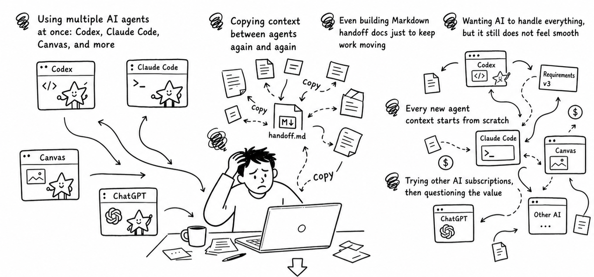
</p>

## Three core features

### 1) A real-time shared workspace

Agents no longer just hand off summaries. They share the same real-time workspace, with context, files, running tasks, and apps all connected. Your Codex can see what Claude changed, what is running, and the current state of the project.

This unlocks three core capabilities:

#### Big @

- In Codex, you can @ past conversations, files, app invocations, and tasks. No repeated copy-pasting or uploading.
- You can also @ Claude Code's past conversations, files, app invocations, and tasks from inside Codex, then build on top of them without manually carrying over context.
- You can also ask Codex to direct @ Claude Code (app) to do the work.

<p align="center">
  
  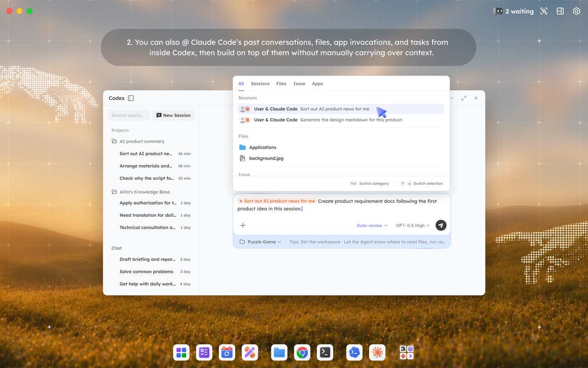
  
</p>

#### Reference with "+"

In the agent chat box, click "+" to reference local files or outputs generated by apps.

<p align="center">
  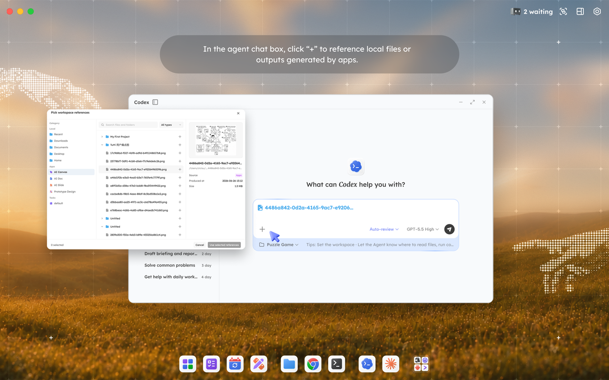
</p>

#### Task orchestration and multi-project work

With shared visibility into each other's work, agents can avoid or resolve conflicts and decide whether work should run in parallel or in sequence. Agents from different providers, such as Claude and Codex, or Gemini and OpenClaw (DeepSeek), can work together without getting in each other's way.

**In Tutti · VM:**

- @ works across collaborators too. @ a teammate to pull in any of their agents' conversations, files, or tasks, and click "+" to reference outputs from apps they've used.

### 2) Apps that both you and your agents can use

A full workflow is rarely one agent's job. Building a page might start with a prototype, then code, then visuals. Writing an article might need images, layout, and export. Each of these is handled by a different powerful agent or tool, so you end up subscribing to several and switching between them all day: opening, downloading, uploading, screenshotting, pasting. The work itself doesn't get harder; moving information around is what wears you out.

Tutti has its own app center, shared in real time across the whole workspace. You can use these apps yourself, or have your agents call them.

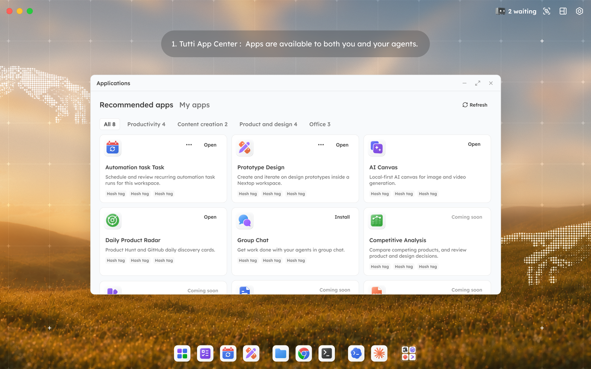 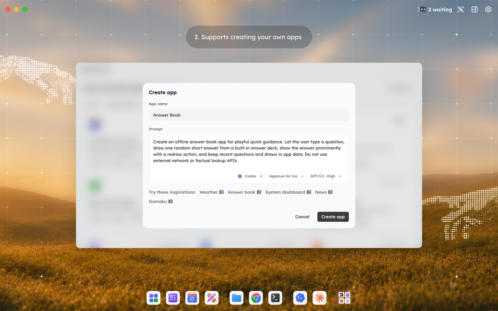

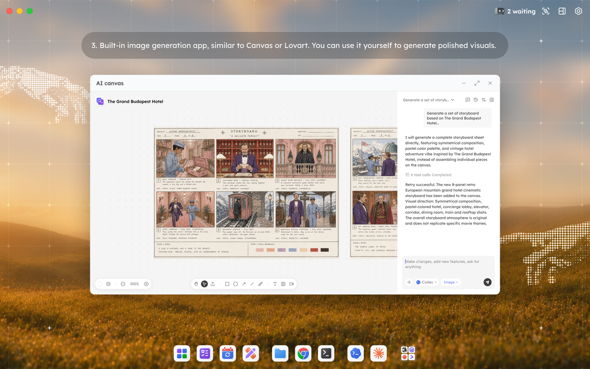 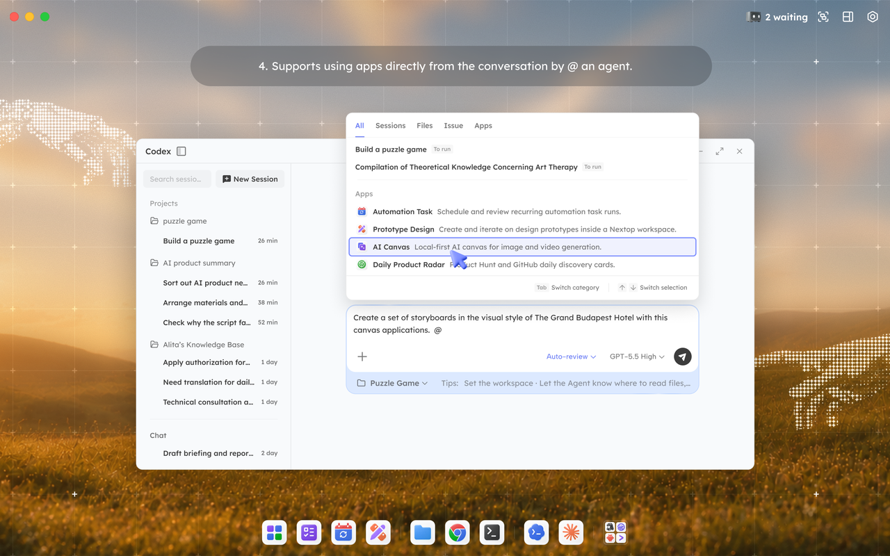

**For example:**

- In Codex, @ a prototype-design app to generate UI drafts, which effectively gives Codex Claude Design-like abilities. The output goes straight into Codex's development work.
- Generate visuals yourself in the image app (AI Canvas), then have Claude Code or Codex drop them into the page.
- Once you've agreed on an article's structure, @ Codex with a doc app to draft and organize it, then export to HTML.
- Need a deck in a few days for an external product intro? @ Claude Code with the AI PPT app to generate one. Want to tweak a few details by hand? AI PPT lets you drag modules around and edit text freely.

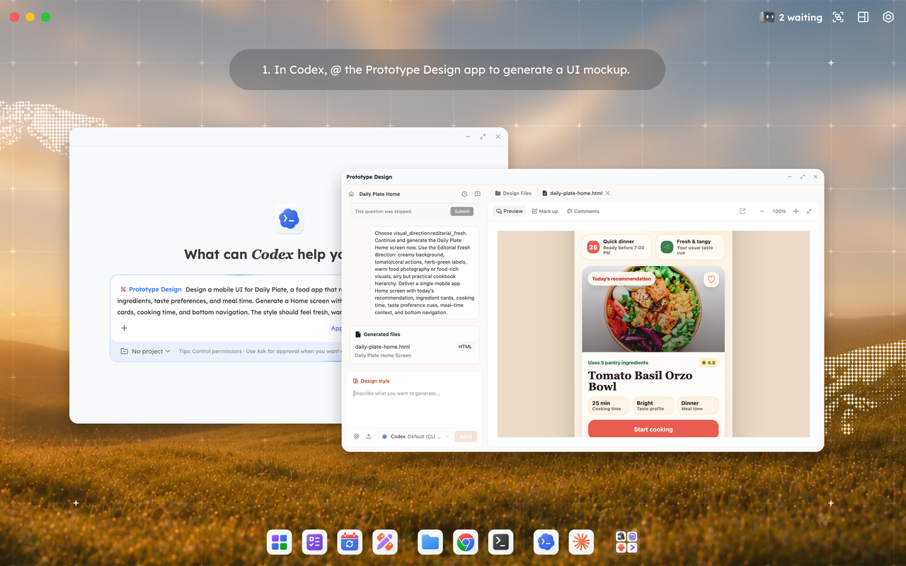 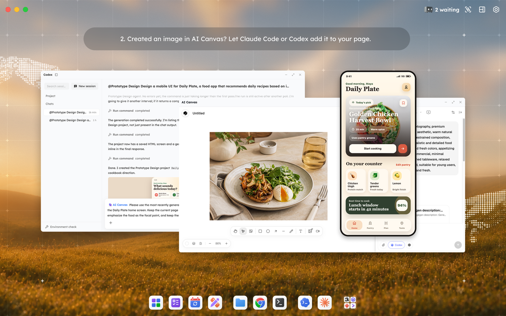

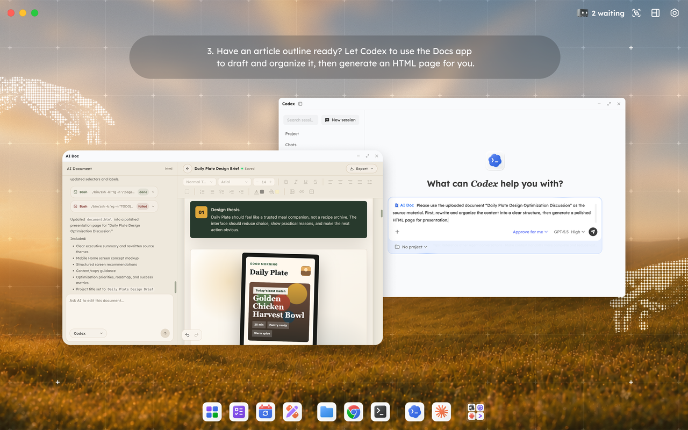 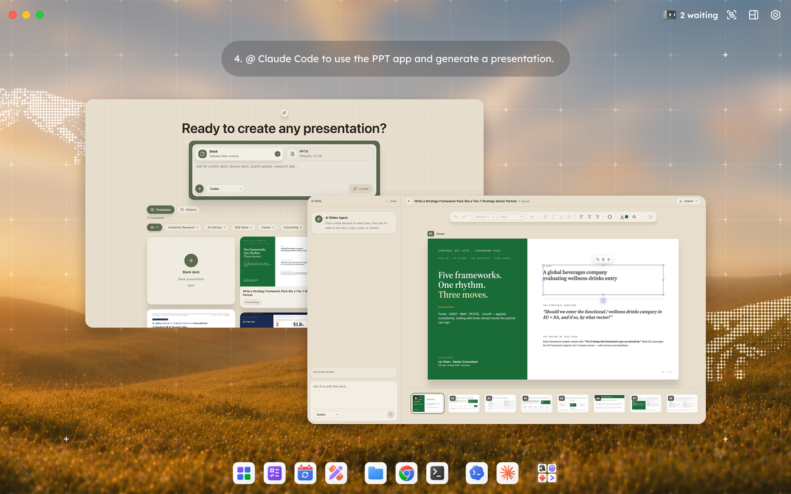

Every app output stays in the same workspace. When the next step needs it, just reference it with "+" and keep going.

Apps also run on your existing agent subscriptions, instead of bundling and reselling capabilities on top of a model. Use official apps, community-built ones, or build your own.

### 3) Less work about work

#### Goals to tasks

No manual breakdown, no planning every step. Just describe the goal, for example "I want to build a website," and Tutti breaks it into clear sub-tasks. You review them and assign each to the right agent.

<p align="center">
  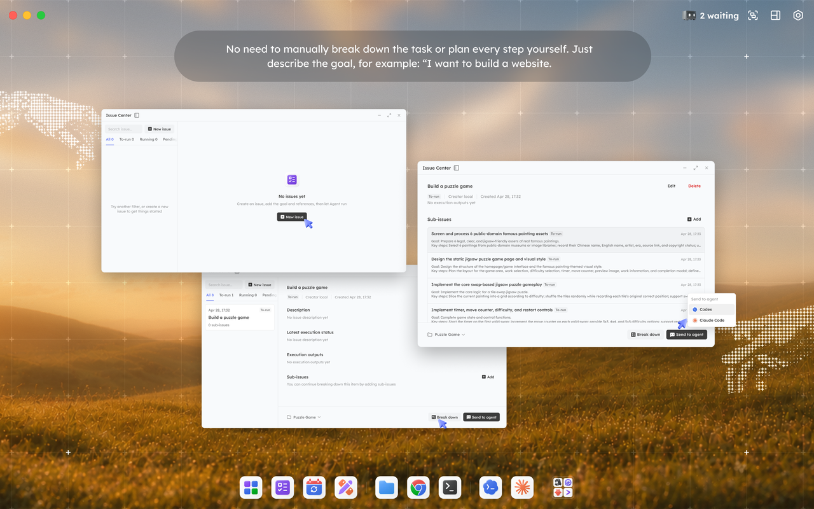
</p>

#### Control Center

No more tab-switching. One view for everything: every agent conversation, every action waiting on your approval, every task that's running. Anything that needs you is surfaced clearly, so you can find it fast and handle it in one click.

<p align="center">
  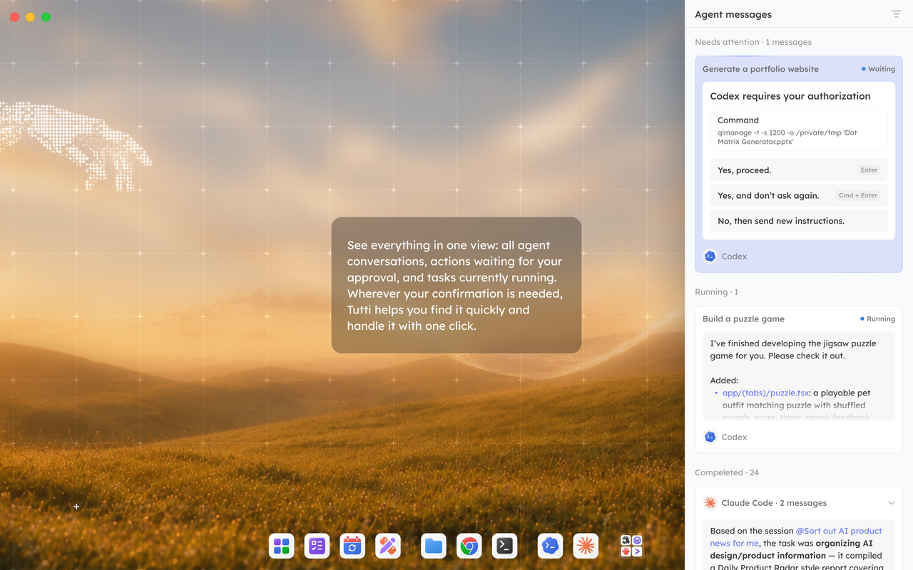
</p>

#### GUI Interface

No command line. Open Tutti and start using agents, apps, tasks, and files right away. Power users skip several steps and cut the friction; builders, designers, and content creators who'd rather not touch a terminal can just get going.

## Reuse your existing subscriptions

Connect the agent subscriptions you already have. Every app and agent runs on top of them, at zero extra cost. (Currently Claude Code and Codex; Gemini, OpenClaw, and Hermes are coming soon.)

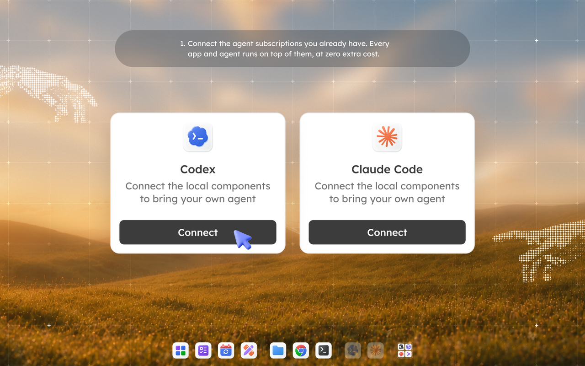 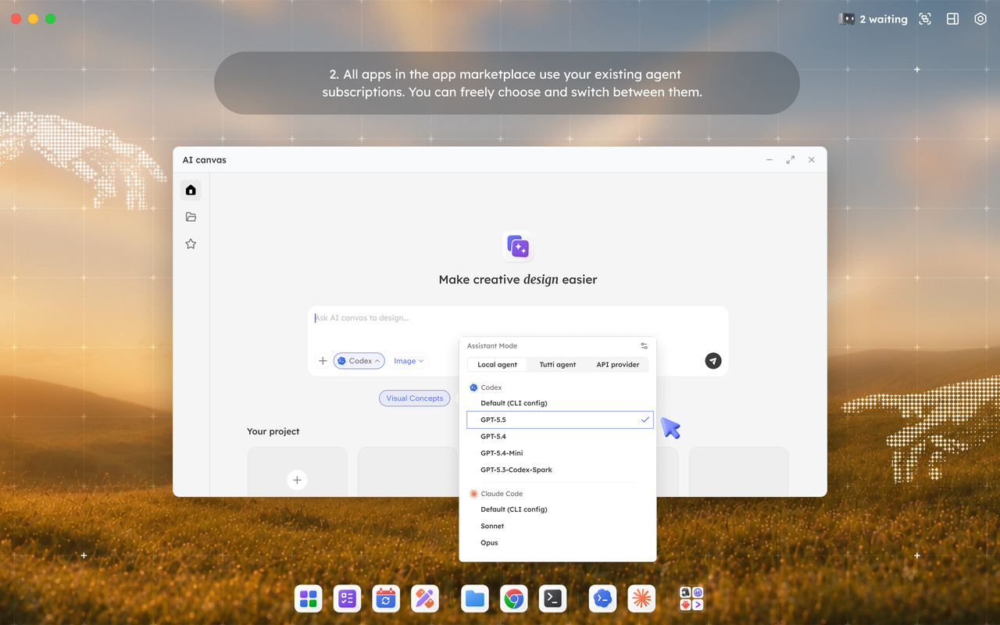

## Tutti vs Tutti · VM

|                   | Tutti (open source)                                                                                                                    | Tutti · VM (coming soon)                                                                                                                                                                                                                                                                                                                                                            |
| ----------------- | -------------------------------------------------------------------------------------------------------------------------------------- | ----------------------------------------------------------------------------------------------------------------------------------------------------------------------------------------------------------------------------------------------------------------------------------------------------------------------------------------------------------------------------------- |
| **Best for**      | One person, multiple agents                                                                                                            | One person, multiple agents<br>One person, multiple devices<br>Two or more people, each with their own agents                                                                                                                                                                                                                                                                       |
| **Runs on**       | Agents run locally, and the working state stays local                                                                                  | Multi-layer virtualization virtualizes your local agent into a real-time shared cloud workspace.<br><br>The agent still runs locally while its working state lives in the cloud in real time: what's being discussed, what's running, and what's already been created. This enables cross-device, multi-user collaboration among agents, with no context loss, like a shared brain. |
| **Shares**        | Context, apps, outputs, tasks, and running state across multiple agents                                                                | Everything in the local version, plus sharing across multiple people and devices                                                                                                                                                                                                                                                                                                    |
| **Subscriptions** | Your own Claude, Codex, and other subscriptions<br>(Currently Claude Code and Codex; OpenClaw, Gemini, and Hermes are in development.) | Your own Claude, Codex, and other subscriptions<br>(Currently Claude Code and Codex; OpenClaw, Gemini, and Hermes are in development.)                                                                                                                                                                                                                                              |

### What can you do with Tutti?

- Let Codex continue work Claude started, with no need to re-explain context.
- After Claude writes a PRD, have it call a design app to generate visuals.
- Use your existing agent subscriptions to run every app inside Tutti.
- Describe a goal, let Tutti break it into sub-tasks, then assign each to the agent best suited for it.

### What can you do with Tutti · VM?

**Everything in Tutti, plus:**

- Open a cloud room where several devices work together, as if they're on one machine.
- Collaborate without sending files, pasting progress, or re-explaining what your agents did. In the same room, you see conversations, files, outputs, task progress, and app results in real time.
- @ a teammate's files or agent conversations, so your agents can build straight on top of them.
- Your local work (e.g. a localhost site) opens right in the room with no deploy, so others can preview it and give feedback on the spot.
- Assign tasks to a teammate's agent when a workflow needs more than one person.

> ⚠️ All sharing is scoped to the room: only what's created inside the same room is shared with the people you invite. Everything else stays private.

## Who is Tutti for?

Anyone building with AI agents. If you're tired of switching between agents and apps, tired of re-explaining context over and over, tired of moving outputs around by hand, and tired of paying separately for every subscription, Tutti is for you.

- **Independent developers**: let Claude draft the plan and Codex carry development forward, with no project context to re-explain.
- **Designers**: build mockups in a design app, then let Codex turn them straight into working code.
- **Product managers**: after Codex writes a PRD, have it call a UI/UX design app to generate a prototype, no Figma required.
- **Content creators**: produce scripts, visuals, and layouts end to end in one shared workspace.

Whatever your role, you'll find the lowest-friction path through each step. Fully GUI-based, no terminal, just open and go.

### What about Tutti · VM?

Tutti first solves collaboration between you and your agents.

Tutti · VM solves the next layer: when work moves outward, how different people, different devices, and each person's agents can stay in the same real-time shared space. In other words, multi-user agent-to-agent collaboration.

Using multi-layer virtualization technology, Tutti · VM virtualizes your local agent into a real-time shared cloud workspace.

Here, the agent still runs locally, using your own subscriptions and configurations. But its working state lives in the cloud: what is being discussed, what is being worked on, and what has already been created all stay in the same Room. Websites, images, documents, and decks no longer need to be uploaded or downloaded. Just share them with a link.

You and your friends join the same room. You can @ a task someone started last night, or hand a piece of work to their agent to keep running.

**In Tutti · VM, the Room is both the boundary and the oasis.**

## FAQ

### Do I need to buy a separate agent subscription?

No. Tutti works with your existing Claude, Codex, Gemini, and other agent subscriptions.

### What if I don't have an agent subscription?

You can start with the Tutti Agent inside Tutti. Tutti Agent is free during Early Access. Usage-based billing may apply later.

### What's the difference between Tutti and Tutti · VM?

Use Tutti · VM if you want to collaborate with teammates, work across multiple devices, or keep outputs in a shared cloud workspace.

### In the Tutti · VM version, can my teammates see my private work?

If you create a room in Tutti · VM and invite teammates or friends, they can see and collaborate on what's built there. Everything else remains private.

### Does Tutti replace my coding agent?

No. Tutti is the workspace around your agents. You can keep using Claude Code, Codex, Gemini, and other agents you already trust.

### Is Tutti only for coding?

No. Tutti is useful for coding, design, content, app workflows, and any work where multiple agents or teammates need the same context and outputs.

## Getting Started

### Download

<!-- TODO: download link for Tutti · Local -->

Download Tutti · Local — coming soon.

<!-- TODO: waitlist link for Tutti · Cloud -->

Join the waitlist for Tutti · Cloud — coming soon.

### Build from source

Prerequisites:

- Node.js `24` or newer (`.node-version` pins the baseline)
- pnpm `10.11.0`
- Go `1.24`

```sh
pnpm install
pnpm setup:dev
make dev-gui
```

See [CONTRIBUTING.md](CONTRIBUTING.md) for the full development guide.

## Community & Contributing

Contributions are welcome — read the [Contributing Guide](CONTRIBUTING.md) to get started, and our [Code of Conduct](CODE_OF_CONDUCT.md) for community standards.

To report a security vulnerability, see [SECURITY.md](SECURITY.md).

## License

Tutti is licensed under the [Apache License 2.0](LICENSE).

> Note: this codebase uses the internal codename `tutti` — you will see it in directory and binary names such as `services/tuttid`.
