<div align="center">

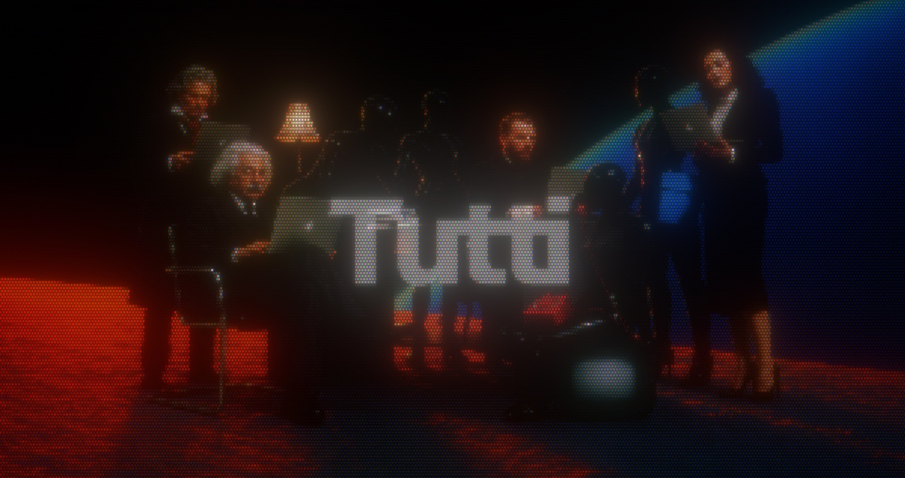

**人與 Agent「同頻」協作的地方。**

[官網](https://tutti.sh/?tc=25q) · [文件](docs/README.md) · [參與貢獻](CONTRIBUTING.zh-TW.md)

[English](README.md) | [简体中文](README.zh-CN.md) | [繁體中文](README.zh-TW.md)

[](LICENSE)
[](https://tutti.sh/?tc=25q)

</div>

---

如果你喜歡 Tutti，歡迎給我們一個 Star，或者 Fork 倉庫、提交 Issue、發起 PR。

也歡迎感興趣的朋友加入我們的微信群，分享回饋、提出問題，一起定義人與 Agent 協作的未來。


**Tutti，現已開源。**

**Tutti · VM 正在路上，有興趣的各位，歡迎到官網加入我們的 Waitlist：**

**[tutti.sh →](https://tutti.sh/?tc=25q)**

## Tutti 是什麼？

你的 Claude Code 很強，Codex 也很強，Canvas 很強，Claude Design 也很強。

可涉及到真實的工作流，需要互相依賴、彼此接力的時候。

這其中，最忙的常常是你。

Claude 寫完接口，Codex 要接前端，你複製接口文件、補充當前進度，再解釋剛才為什麼這麼寫。前端之前，想要頁面好看還涉及到設計、做圖，總結一下再用生圖應用出了圖。又下載、上傳、貼給下一個 Agent，再去描述一下需求。

說好是讓 Agents 幫你幹活，最後你成了它們之間的傳話筒。

### Tutti 提供了一個即時共享的工作空間：上下文、檔案、應用、任務，全部打通

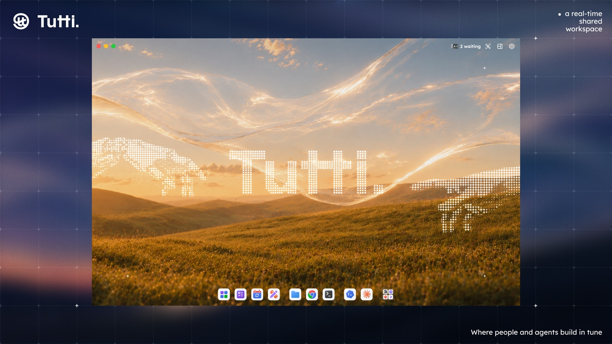

Codex 能無縫使用 Claude 的產出，彼此不丟任何上下文，一致得像「共腦」。

不僅如此，Tutti 還有自己的應用生態：生圖、UI/UX 設計、寫文件、做 PPT；你能用，Agent 也能用。

Codex 調用原型設計應用做好了設計，就像擁有了 Claude Design 的能力；Claude Code 可以直接拿去做頁面開發，不用你來回複製貼上。

**一切在 Tutti 中彼此可見、互相依賴。任何產物，包括應用生成的輸出，都能在不同 Agent 之間流轉、傳遞，直接用於下一步。**

## 如果這是你，歡迎你來用用！

- 同時用多個 AI Agent（Codex、Claude Code、Canvas 等等）
- 不止一次在 Agent 之間複製過上下文，甚至自己搭了個 Markdown 文件交接的工作流
- 什麼事都想讓 AI 做，卻總覺得還沒那麼順手，換個新 Agent 上下文都得從頭再來
- 嘗試過訂閱其他 AI 產品，卻又覺得不夠划算
- 面對更複雜的工作流時：不同產品之間是孤島，來回搬運同步的步驟只會變得更多

**Tutti 不是替代你的 coding agent，而是 Agent-Agent 即時共享的工作空間。**

<p align="center">
  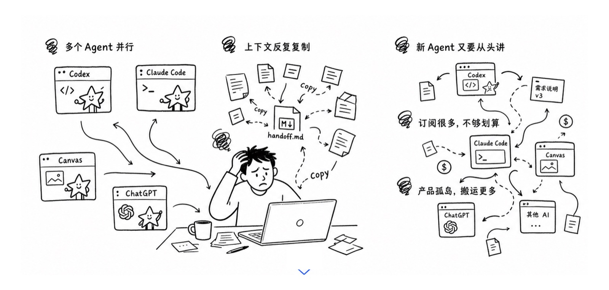
</p>

## 三大核心功能

### 1）即時共享的工作空間

Agent 不再簡單交接摘要，而是共享同一個即時工作空間：共享上下文、檔案、在跑的任務、應用。你的 Codex 能看到 Claude 改了什麼、正在運行什麼、專案當前處於什麼狀態。

所以你解鎖了三項能力：

#### Big「@」

- 你可以在 Codex 中 @ 歷史對話、檔案、應用、任務；無需反覆貼上、上傳。
- 你也可以在 Codex 中 @ Claude Code 的歷史對話、檔案、應用、任務，並在此基礎上建構，無需手動搬運上下文。
- 你也可以在 Codex 中，讓 Codex 指揮、@ Claude Code（應用）幹活。

<p align="center">
  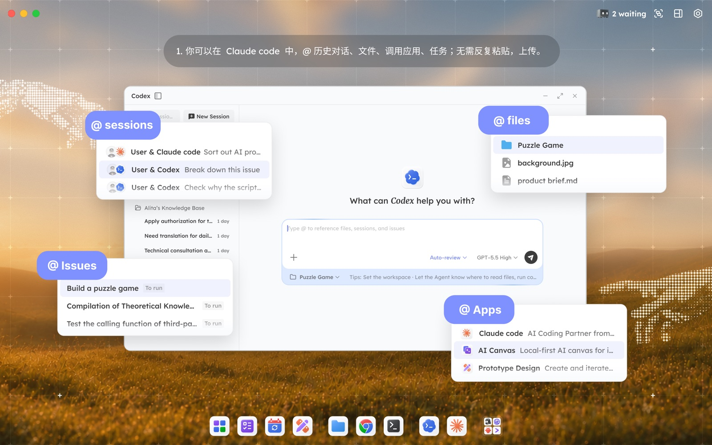
  
  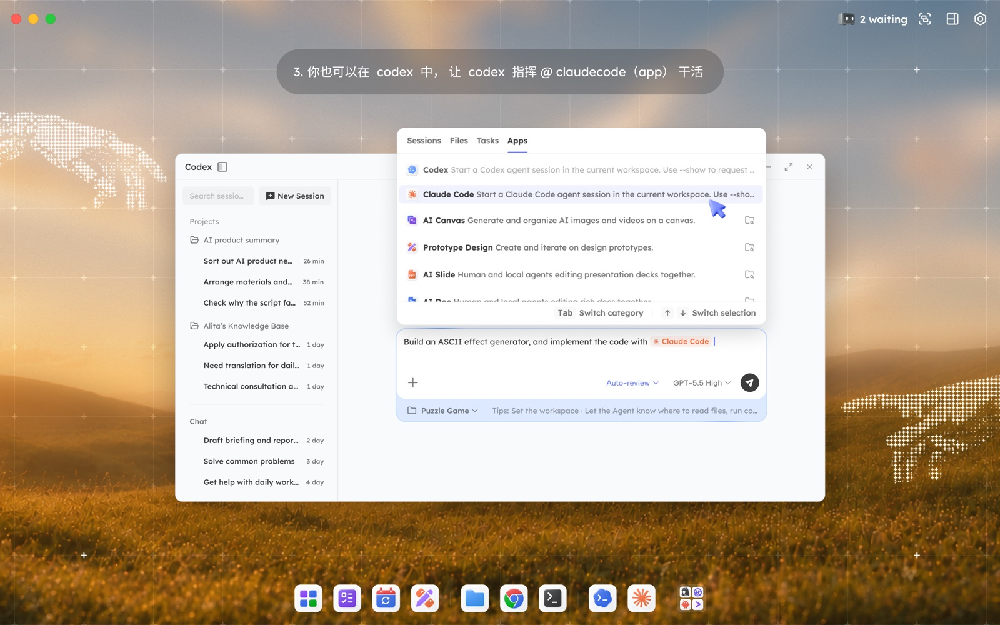
</p>

#### 引用「+」

在 Agent 對話框點擊「+」：引用本機檔案、引用應用生成的產物。

<p align="center">
  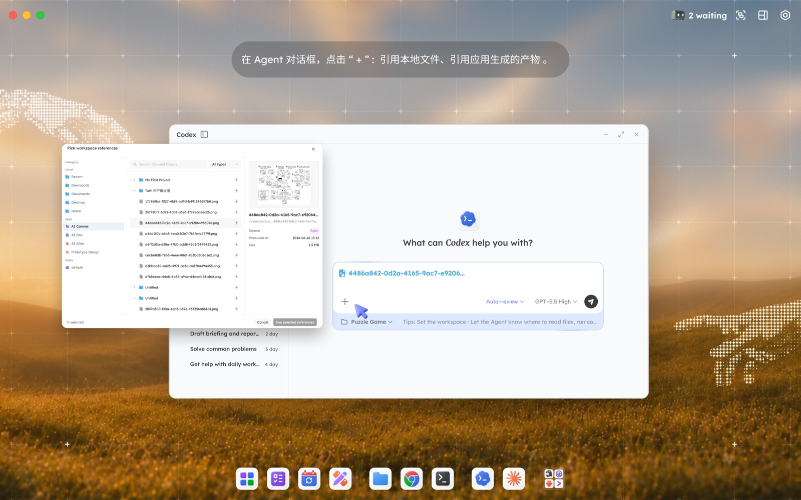
</p>

#### 任務編排與多專案建構

各 Agent 彼此「可見」，因此可以自動迴避或處理衝突，自己判斷該並行還是串行。跨不同服務提供方的 Agent，比如 Claude 和 Codex、Gemini 和 Hermes（Kimi），一樣不打架。

**Tutti · VM 中：**

- 「@」流動在協同者之間，你可以 @ 朋友與他任意 Agent 的對話、檔案、任務，也可以點擊「+」引用朋友調用應用生成的產物。

### 2）人-Agent 共用的「應用」

完整的工作很少只靠一個 Agent。

做一個頁面，可能要先出原型，再寫程式碼，再補圖。寫一篇文章，也可能要配圖、排版、匯出。這些能力都有很強大的 Agent 承接，你挨個付費，然後來回打開、下載、上傳、截圖、貼上。工作還沒變難，搬東西先搬煩了。

Tutti 裡有自己的應用中心，也即時共享整個工作空間。這些應用你可以自己使用，也可以被你的 Agent 調用。

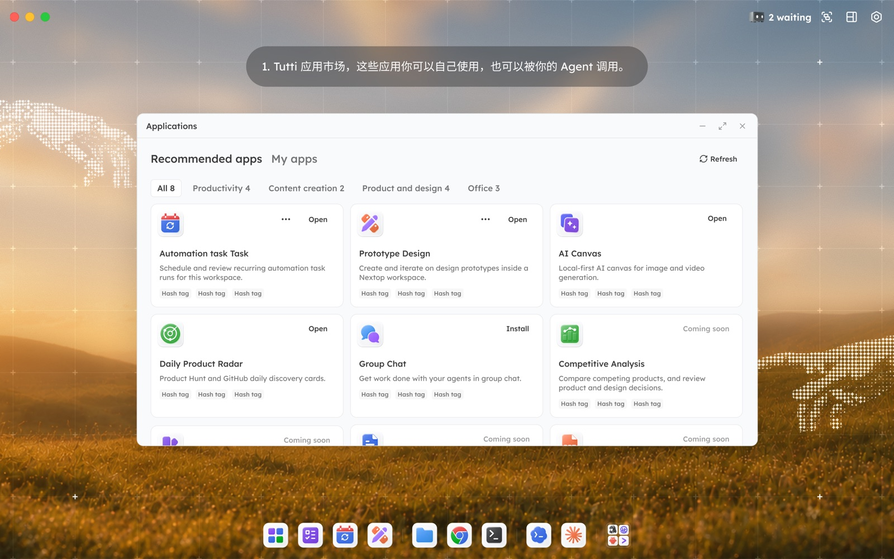 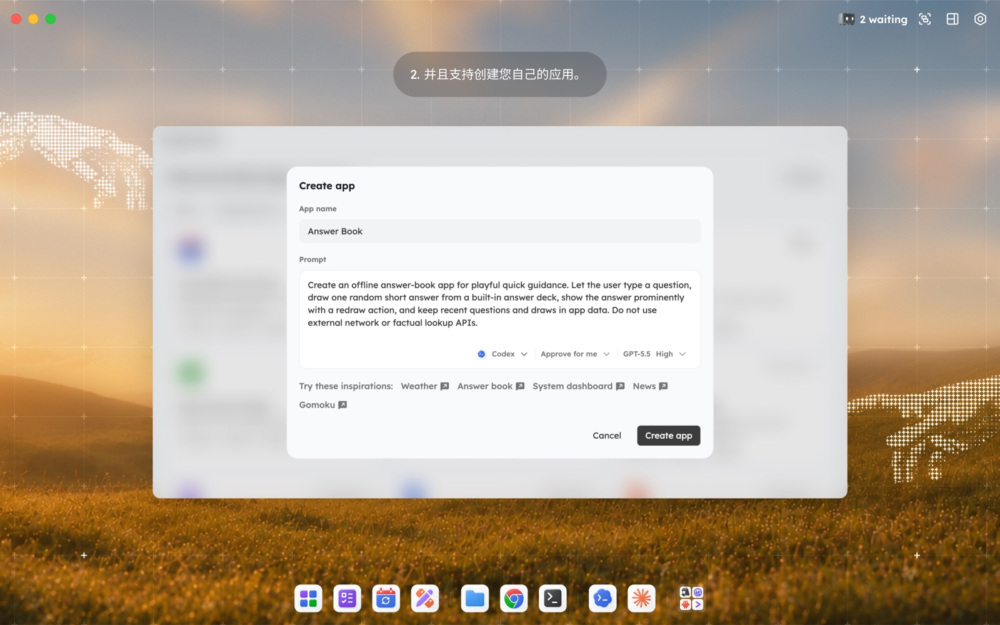

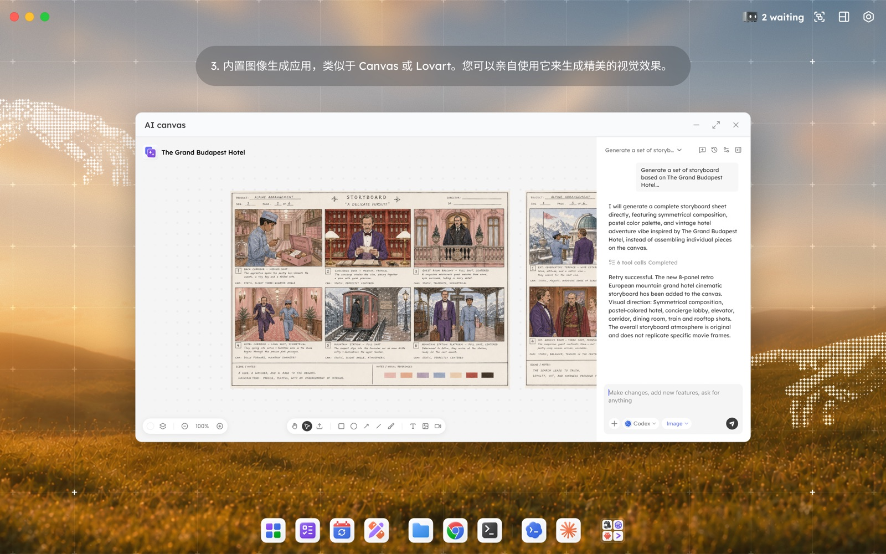 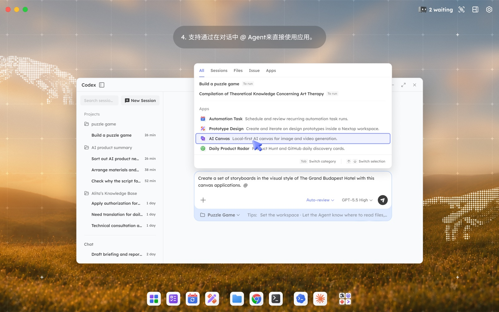

**比如：**

- 在 Codex @ 原型設計應用生成 UI 稿，讓 Codex 長出 Claude Design 的能力，生成好的東西再讓 Codex 拿去開發。
- 你自己用生圖應用（AI Canvas）生成了配圖，讓 Claude Code 或 Codex 幫你放進頁面裡。
- 討論好文章框架，@ Codex 用文件應用起草、整理，再幫你生成一個 HTML。
- 過幾天要做個 Pre？有個產品介紹想對外發一發？@ Claude Code 用 PPT 應用生成簡報。幾處細節想手動調一調？不用擔心，這裡的 AI PPT 支援你自由拖曳模組、編輯文案。

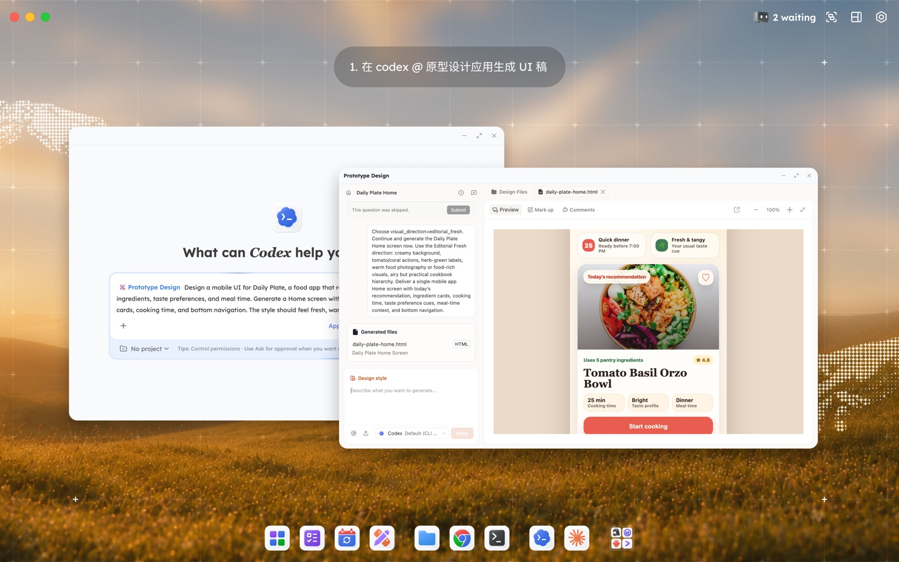 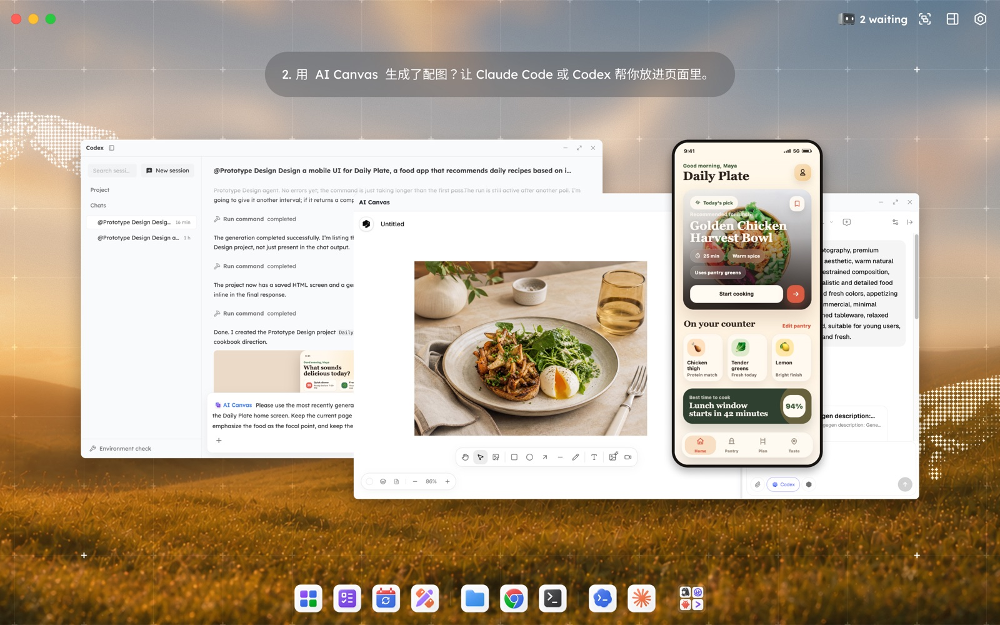

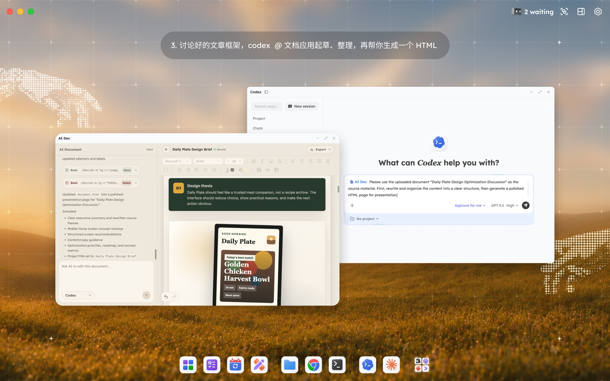 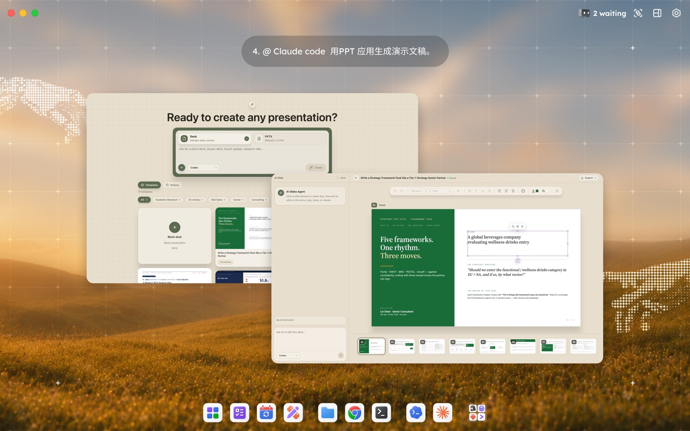

應用產物都會留在同一個工作空間裡。下一步需要時，一個「+」引用一下，就能接上。

這些應用也都複用你已有的 Agent 訂閱，不把這些能力包一層再賣給你。你可以使用官方、社群創建的應用，也可以自己創建。

### 3）少操作，多產出（Less work about work）

#### 從目標到任務

不用手動拆分、規劃每一步。你只需要描述目標，比如「我想做一個網頁」。Tutti 會把它拆解為清晰的子任務。你只需要審核，再分配給合適的 Agent。

<p align="center">
  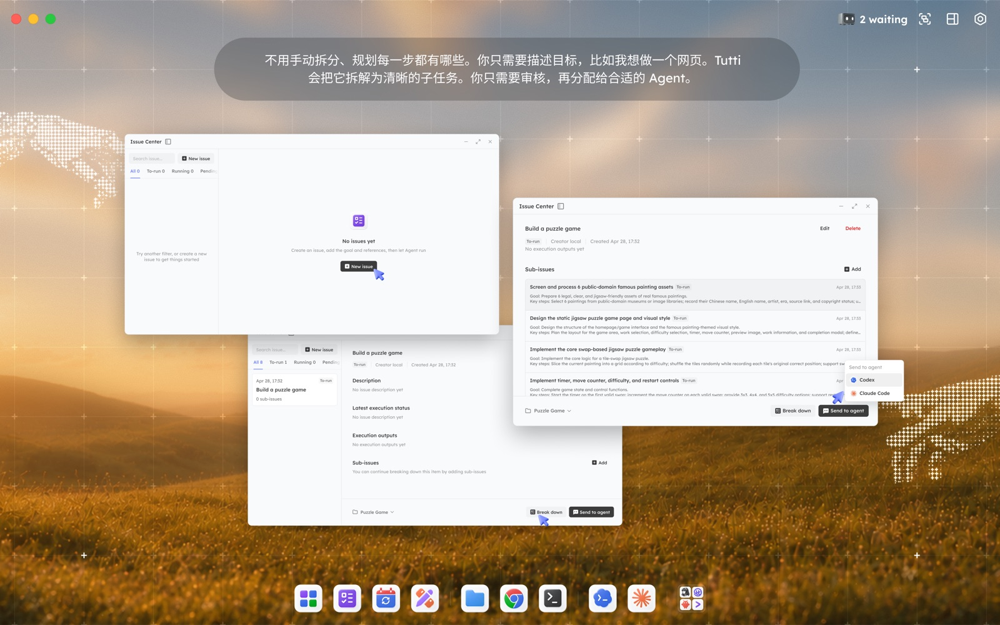
</p>

#### 控制中心

不用在多個 Tab 中來回切換。一個視圖看全局：所有 Agent 對話、待你審批的操作、正在運行的任務。需要你確認的地方，快速定位，一鍵處理。

<p align="center">
  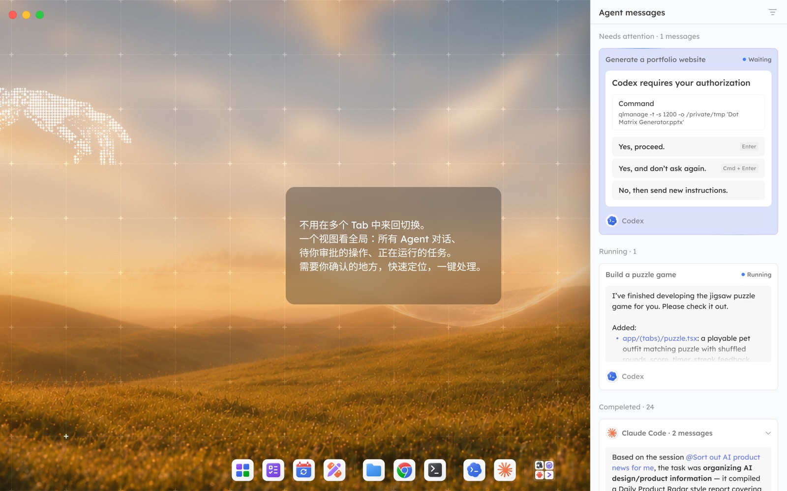
</p>

#### GUI 介面

無需命令列。打開 Tutti，就能使用 Agents、應用、任務和檔案。重度 AI 用戶可以少折騰幾步，不想碰終端機的產品、設計、內容創作者也能直接上手。

## 複用你原有的訂閱

直接接入你已有的 Claude、Codex、Gemini 訂閱。所有應用和 Agent 都在此基礎上運行，零額外費用。

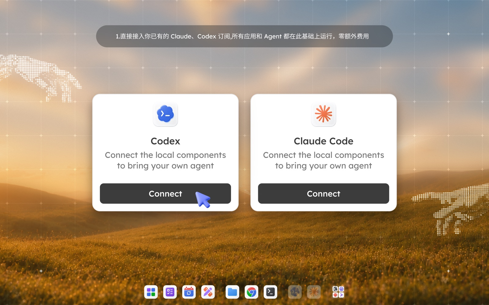 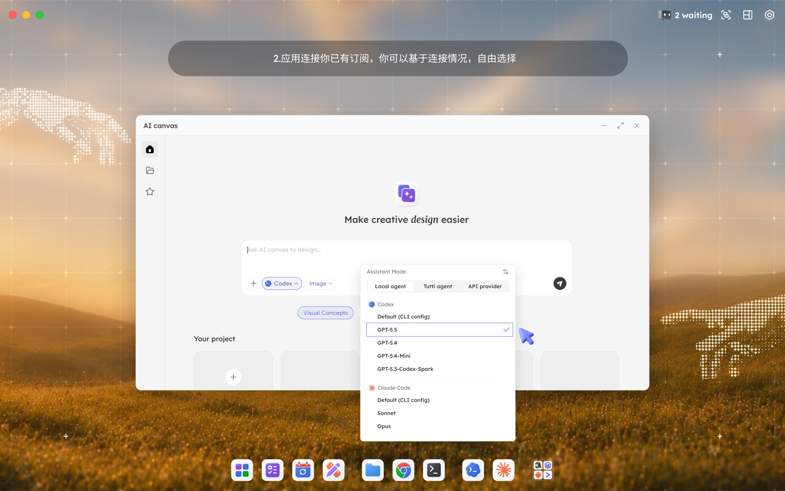

## Tutti vs Tutti · VM

|              | Tutti（開源）                                                                                               | Tutti · VM（即將上線）                                                                                                                                                                                                           |
| ------------ | ----------------------------------------------------------------------------------------------------------- | -------------------------------------------------------------------------------------------------------------------------------------------------------------------------------------------------------------------------------- |
| **適合誰**   | 一個人，多個 Agent                                                                                          | 一個人，多個 Agent<br>一個人，多台設備<br>兩人及以上，各自帶著自己的 Agent                                                                                                                                                       |
| **跑在哪**   | Agent 跑在本機，工作態在本機                                                                                | 採用多層虛擬機技術，把你的本機 Agent 虛擬化進一個即時共享的雲端工作空間。<br><br>Agent 仍然跑在本機，工作態即時進雲端：正在聊的、正在跑的、做好了的……於是你能跨設備、跨人、跨 Agent 協作，彼此不丟任何上下文，一致得像「共腦」。 |
| **共享什麼** | 多個 Agent 之間共享上下文、應用、產物、任務和運行狀態                                                       | 包含本機版的全部內容，另外支援在多人、多設備之間共享                                                                                                                                                                             |
| **訂閱**     | 你自己的 Claude、Codex 等訂閱<br>（目前僅支援 Claude Code、Codex；OpenClaw、Gemini、Hermes 正在開發接入中） | 你自己的 Claude、Codex 等訂閱<br>（目前僅支援 Claude Code、Codex；OpenClaw、Gemini、Hermes 正在開發接入中）                                                                                                                      |

### Tutti：你可以用它來做什麼？

- 讓 Codex 接著 Claude 的工作繼續做，不用重新說明上下文。
- 讓 Claude 寫完 PRD 後，直接調用設計應用生成圖片。
- 用你已有的 Agent 訂閱，調用 Tutti 內的所有應用。
- 描述一個目標，讓 Tutti 拆成多個子任務，再把每個分配給合適的 Agent 執行。

### Tutti · VM：你可以用它來做什麼？

**包含 Tutti 的全部能力，額外實現：**

- 開一個雲端房間，讓多台設備在裡面工作，就像在用同一台電腦。
- 和朋友協作時，不用互相發檔案、貼進度、複述 Agent 剛做了什麼。只要在同一個雲端房間，就能看到彼此在房間裡的對話、檔案、產物、任務進展和應用生成的結果。
- 用「@」引用同事的檔案、與 Agent 的對話等，讓你的 Agent 在此基礎上繼續建構。
- 你在本機跑起來的網站（localhost），不用先部署上線，朋友就能在雲端房間裡直接打開預覽，給你提意見、幫你改。
- 當一件事需要多人，把任務分配給同事的 Agent 執行。

> ⚠️ 以上共享以房間為維度：邀請人與受邀人需加入同一房間，只有在同一房間內產出的內容才會被共享，其餘內容都保持私密。

## Tutti 適合誰？

任何用 AI Agent 來 build 的人：只要你受夠了在不同 Agent、應用之間來回切換，受夠了反覆重新交代背景、手動搬運產物，受夠了為每份訂閱單獨花錢，Tutti 就是為你設計的。

- **獨立開發者**：讓 Claude 出方案，Codex 接力開發，不用再重複解釋專案背景。
- **設計師**：用設計應用出設計稿，直接讓 Codex 拿去開發落地。
- **產品經理**：讓 Codex 寫完 PRD 後，自動調用 UI/UX 設計應用出原型，不用再打開 Figma。
- **內容創作者**：腳本、配圖，在同一個工作空間裡一站式產出。

無論你是什麼角色，都能在這裡找到各環節裡摩擦最低的使用組合。全 GUI 介面，無需終端機命令列，打開就能用。

### Tutti · VM 呢？

Tutti 先解決你和你的 Agents。

Tutti · VM 要解決的是：當工作往外走，不同人、不同設備、彼此的 Agents 怎麼待在同一個即時共享空間裡 —— 即多人的 Agent-Agent 協作。

**通過多層虛擬機技術，把你的本機 Agent 虛擬化進一個即時共享的雲端工作空間。**

在這裡，Agent 仍然跑在你的本機，繼續使用你自己的訂閱和配置。但工作態會在神奇的雲端：正在聊的、正在做的、已經做好的，都會留在同一個 Room 裡。網站、圖片、文件、PPT 不需要再上傳下載，複製連結就能分享。

你和朋友進入同一個 Room，你可以「@」他昨晚做到一半的任務，也可以把一段工作交給他的 Agent 接著跑。

**Room 在這裡，是邊界，也是綠洲。**

## FAQ

### 我需要另外購買一個 Agent 訂閱嗎？

不需要。Tutti 可以使用你已經在用的 Claude、Codex、Gemini 以及其他訂閱。

### 如果我沒有 Agent 訂閱怎麼辦？

你可以在 Tutti 內使用 Tutti Agent。Tutti Agent 在 Early Access 期間免費，之後可能會採用按用量計費。

### Tutti 和 Tutti · VM 有什麼區別？

如果你想和團隊成員協作、跨多台設備工作，或者希望把產物保存在一個共享的雲端工作空間裡，可以使用 Tutti · VM。

### 在 Tutti · VM 版本裡，我的團隊成員能看到我的私人工作內容嗎？

只有在 Tutti · VM 的房間內創建的內容，才會被你邀請進該空間的人看到。其他內容都會保持私密。

### Tutti 會替代我的 coding agent 嗎？

不會。Tutti 是圍繞你的 agents 建構的工作空間。你仍然可以繼續使用你已經信任的 Claude Code、Codex、Gemini 和其他 agents。

### Tutti 只適合 coding 嗎？

不是。Tutti 適用於 coding、設計、內容創作、應用工作流，以及任何需要多個 agents 或團隊成員共享同一上下文和產物的工作場景。

## 快速開始

### 下載

<!-- TODO: Tutti · 本機版下載連結 -->

下載 Tutti · 本機版 —— 即將開放。

<!-- TODO: Tutti · 雲端版等候名單連結 -->

加入 Tutti · 雲端版等候名單 —— 即將開放。

### 從原始碼建置

環境需求：

- Node.js `24` 或更高（`.node-version` 固定了基線版本）
- pnpm `10.11.0`
- Go `1.24`

```sh
pnpm install
pnpm setup:dev
make dev-gui
```

完整開發指南見 [CONTRIBUTING.zh-TW.md](CONTRIBUTING.zh-TW.md)。

## 社群與貢獻

歡迎參與貢獻——請先閱讀[貢獻指南](CONTRIBUTING.zh-TW.md)，並了解我們的[行為準則](CODE_OF_CONDUCT.md)。

回報安全漏洞請參見 [SECURITY.md](SECURITY.md)。

## 授權

Tutti 基於 [Apache License 2.0](LICENSE) 開放原始碼。

> 註：本程式碼庫使用內部代號 `tutti`，你會在目錄與二進位檔命名中看到它（如 `services/tuttid`）。

> 翻譯說明：本文件與英文版內容同步，如有出入，以[英文版](README.md)為準。
