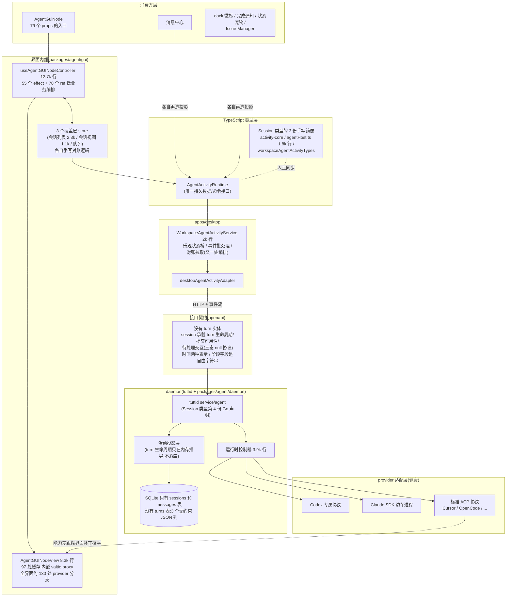
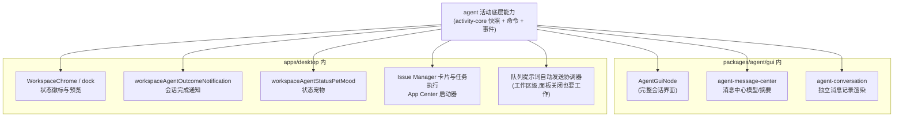
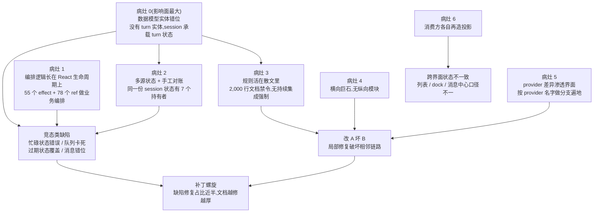
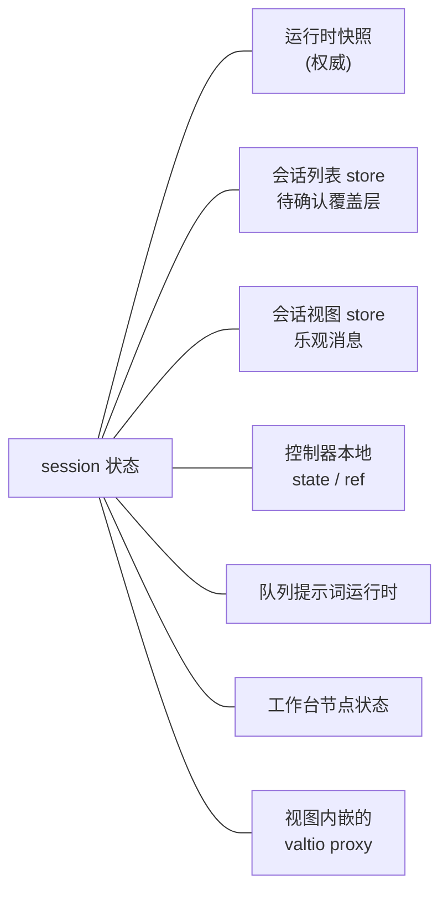
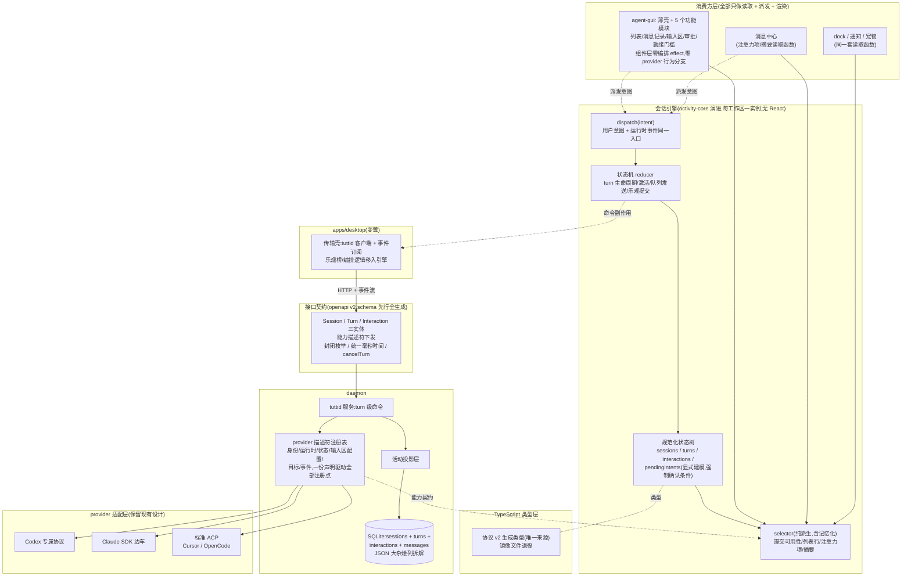
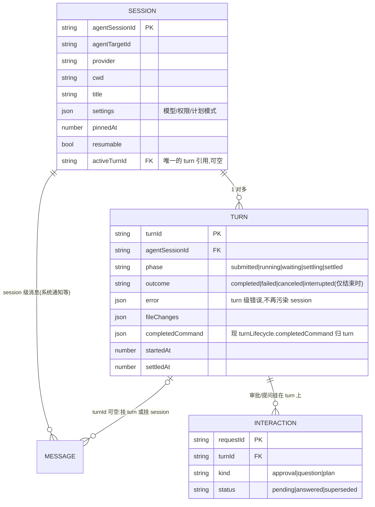
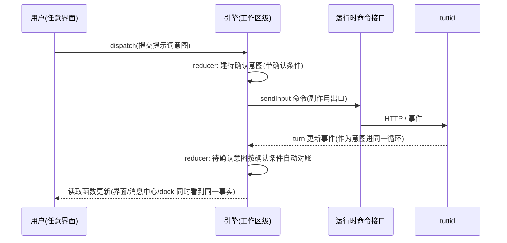
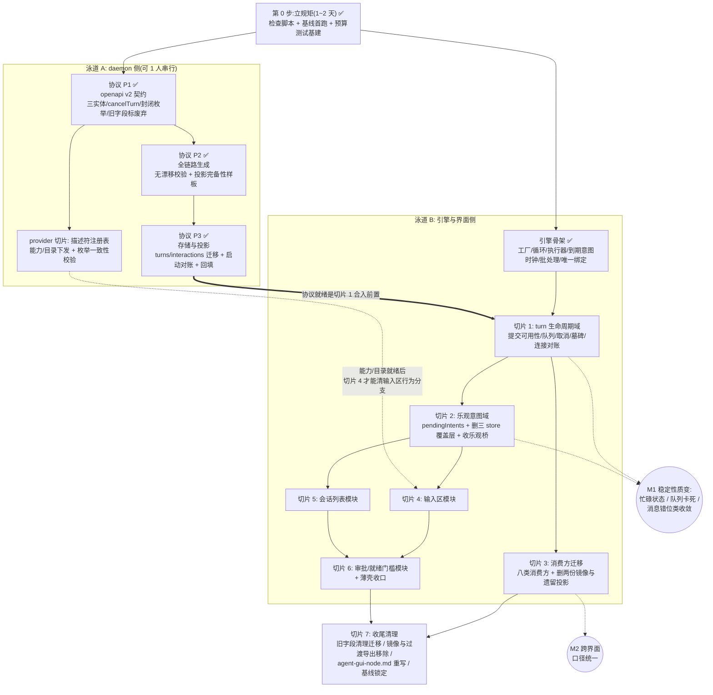

# Agent GUI 架构收敛方案

状态：架构重构完成（2026-07-11 复核）。本文的第 1、2 章保留原始问题基线，
不代表当前代码规模；当前完成度以第 4 章和根目录
`AGENT_GUI_CONTROLLER_REFACTOR_HANDOFF.md` 为准。`useAgentGUINodeController.ts`
当前为 715 行，已低于 800 行硬限制并只负责纵向模块装配。终值基线与完整验证
已锁定；切片 7 只保留客户端覆盖窗口结束后删除私有持久化 migration reader 的
发布生命周期任务，该 reader 不进入公共契约或新写路径。

范围：agent 活动数据的模型协议、`packages/agent/activity-core`、
`packages/agent/gui`，以及它们的全部消费方。不在范围内：daemon 内部各
provider 适配器的实现细节（这部分是健康的，见 2.8 节）。

本文回答三个问题：现状为什么缺陷修不完（第 1、2 章）；目标架构长什么样（第 3 章）；怎么小步走过去、走完之后如何不被改回去（第 4、5、6 章）。

方案核心是四件事：

1. 修数据模型：引入 Session、Turn、Interaction 三个实体，turn 状态归 turn，派生值只在客户端推导；
2. 把编排逻辑从 React 里拿出来：建一个工作区级的会话引擎，所有消费界面共享同一套状态和读取函数；
3. 把架构规则从文档里拿出来：翻译成类型约束、状态机测试和持续集成检查；
4. 把巨石文件切成按功能域划分的纵向模块。

## 术语约定

| 本文用词    | 含义                                               | 代码对应              |
| ----------- | -------------------------------------------------- | --------------------- |
| daemon      | 本地业务核心 tuttid，负责业务规则与持久化          | `services/tuttid`     |
| provider    | Codex、Claude Code、Cursor 等 agent 后端           | `provider` 字段       |
| session     | 一个持续的对话上下文（界面上称"会话"）             | `Session`             |
| turn        | 一次用户提交驱动的执行过程：提交、运行、等待、结束 | `Turn`                |
| interaction | turn 执行中 agent 发起的审批、提问、计划确认       | `Interaction`         |
| 会话引擎    | 本方案新建的编排层，见 3.3 节                      | engine                |
| 对账        | 把本地乐观状态与 daemon 权威数据核对合并的过程     | reconcile             |
| 乐观状态    | 等待 daemon 确认前，先行展示的本地预期状态         | optimistic / pending  |
| 投影        | 把底层数据变换为界面所需形状的纯函数               | projection / selector |

引擎相关的 `intent`（用户意图或运行时事件，引擎的唯一输入）、`reducer`（纯函数状态迁移）、`selector`（纯函数读取派生值）按代码原词使用。"会话列表"、"会话视图"指界面面板，实体一律写 session。

---

## 1. 现状

### 1.1 系统全貌

数据从 provider 进程流向界面，途经五层：



原始设计意图是清晰的：持久状态归运行时接口、界面局部状态归节点、投影用纯函数。方向没有问题，`shared/agentConversation`（消息记录的投影与渲染）至今健康，可整体保留。问题出在设计意图与实际代码之间的偏差，第 2 章逐一诊断。

### 1.2 不止一个界面在消费这份数据

AgentGuiNode 只是 agent 活动数据的消费方之一。检索`@tutti-os/agent-activity-core` 与活动运行时接口的实际引用，共有八类消费方：



两个直接推论：

1. session 状态天然是工作区级的，不是界面面板级的。队列自动发送已经被迫做成工作区级协调器（面板全部关闭时队列也要继续发送），这是现实给出的裁决：把编排放进面板的生命周期里本来就是错位。
2. 编排层不能是 AgentGuiNode 的私有实现。消息中心、dock、通知需要的"哪些 session 在跑、哪个 turn 在等审批、完成了什么"与 AgentGuiNode 是同一套语义，今天它们各自从快照和散装投影里再推一遍。

### 1.3 规模数据

| 指标                           | 数值                          | 备注                                                                     |
| ------------------------------ | ----------------------------- | ------------------------------------------------------------------------ |
| `useAgentGUINodeController.ts` | 12,718 行                     | 55 个 `useEffect`、81 个 `useCallback`、78 个 `useRef`、30 个 `useState` |
| `AgentGUINodeView.tsx`         | 8,293 行                      | 单个视图组件，内部自带 valtio proxy                                      |
| `AgentComposer.tsx`            | 4,648 行                      |                                                                          |
| 对应测试文件                   | 20,463 / 5,875 / 5,416 行     | 测试同样巨石化，测试数据全局耦合                                         |
| `AgentGUINodeProps`            | 79 个 props                   | 包的公共入口，且仍在上涨                                                 |
| `AgentGUINodeViewModel`        | 约 56 个字段                  | 一个扁平大对象喂给整个视图                                               |
| 架构文档 `agent-gui-node.md`   | 1,993 行                      | 绝大部分是历次缺陷沉淀的"禁令"                                           |
| 近两月提交（本包）             | 894 个，其中 423 个标题含 fix | 缺陷修复占比 47%                                                         |

仓库硬规则"业务文件不超过 800 行"在这里超出 10 到 16 倍。

---

## 2. 问题诊断

### 2.1 因果链总览

七个病灶，共同导向四类症状。病灶 0 影响面最大——它直接加重病灶 2、3，并贡献了大部分竞态类缺陷——但它不是一切的根因：病灶 1、4、5、6 有各自独立的成因，只修数据模型不会让它们消失，解法也彼此独立（对照见 3.1）：



### 2.2 病灶 0：数据模型里没有"turn"

对全链路五层逐层取证（openapi 接口契约、SQLite 表结构、daemon Go 运行时、activity-core TypeScript 类型、界面投影类型），turn 在任何一层都不是实体：

| 层            | 位置                                                 | turn 的存在形式                                                                                                     |
| ------------- | ---------------------------------------------------- | ------------------------------------------------------------------------------------------------------------------- |
| 接口契约      | `services/tuttid/api/openapi/tuttid.v1.yaml`         | 没有 turn schema；只有内嵌在 session 里的 `AgentActivityTurnLifecycle`，`phase`、`outcome` 是只要求非空的自由字符串 |
| SQLite        | `packages/agent/store-sqlite/migrations_activity.go` | 没有 turns 表；只有 messages 表上一个允许空串的 `turn_id` 列                                                        |
| daemon 运行时 | `packages/agent/daemon/runtime` + `daemon/activity`  | `TurnLifecycle` 结构体只活在内存，由事件即时推导（`applyExplicitTurnLifecycleToPatch`），不落库                     |
| activity-core | `packages/agent/activity-core/src/types.ts`          | session 内嵌 `turnLifecycle` 加一堆散字段                                                                           |
| 界面          | session 摘要 / 各 store                              | 从 session 状态再推导一遍                                                                                           |

其中"turn 运行状态不持久化"是被低估的一条：daemon 重启后，只能靠 sessions 表的 `status` 和 `current_phase` 两个字符串去猜之前的 turn 状态。取消操作的返回值里存在 `stale_turn_reconciled`（过期 turn 已对账）这个枚举值，就是这个缺陷的制度化——"过期的持久化 turn 需要对账"这一族缺陷有结构性来源。

session 实体承载 turn 状态的错位，以 activity-core 为例（接口契约与 Go 侧结构相同）：

```ts
// 现状:会话一个实体承载三种生命周期
export interface AgentActivitySession {
  // ---- session 自身的身份/设置(合理) ----
  workspaceId; agentSessionId; agentTargetId; provider; cwd; title;
  pinnedAtUnixMs; resumable; visible; model; ...
  // ---- 实际属于"当前 turn"的状态(错位) ----
  status;              // 取值 working/waiting/completed/canceled/failed
                       //   —— 这些是 turn 的结果,不是 session 的状态
  turnLifecycle;       // 内嵌的 activeTurnId + phase + outcome
  submitAvailability;  // 由 turn 生命周期派生,却作为字段存储
  pendingInteractive;  // 属于某个 turn 的 interaction,被迫用"三态 null"表达
  currentPhase;        // 与 status / turnLifecycle.phase 三处冗余
  lastError;           // turn 失败与 session 失败混在一个字段
  // ---- 无类型的大杂烩 ----
  runtimeContext?: Record<string, unknown>;  // capabilities / backgroundAgents
                                             //   / goal / imported 全塞这里
}
```

三个直接证据说明取消和状态的语义错位不是猜测：

1. `cancelSession(workspaceId, agentSessionId)` 的返回原因取值是`active_turn_canceled`、`no_active_turn`、`stale_turn_reconciled`——接口自己承认这是 turn 操作，session 层面根本没有"取消"这个概念。
2. 现行架构文档要求 daemon 终结 turn 时"原子地"清掉`turn.activeTurnId` 和 `turnLifecycle.activeTurnId`、把`turnLifecycle.phase` 置为已结束、`currentPhase` 置为空闲、替换提交可用性——四个字段必须手工同步，因为它们是同一个事实（turn 结束了）的四份非规范化拷贝。
3. 文档规定"session 级 `failed` 在后续 turn 开始后是历史状态，外层徽标要让最新 turn 的消息状态去澄清它"——这是 turn 结果污染 session 状态之后，在界面层打的语义补丁。

后果的传导路径：因为 turn 不是实体，乐观提交没有可归属的 turn 记录（衍生出"待确认提交的 turnId 重定向"一族缺陷）；`pendingInteractive` 只能用"字段缺席等于不变、有对象等于展示、显式 null 等于清除"的三态协议在多层类型间小心传递；提交可用性的接口值和本地推导会互相打架。病灶 2、3 的大部分内容都是在为这个病灶还债。

### 2.3 数据模型的另外五个问题

除了缺 turn 实体，模型协议还有五个独立的问题。

（一）同一实体七份平行声明，补丁类型四份镜像。

Session 类型的独立声明分布：

| 侧         | 声明位置                                                                       |
| ---------- | ------------------------------------------------------------------------------ |
| Go         | `packages/agent/daemon/runtime/types.go` 的 `Session`                          |
| Go         | `packages/agent/daemon/activity/types.go` 的 `WorkspaceAgentSession`           |
| Go         | `packages/agent/store-sqlite/repository.go` 的 `Session`                       |
| Go         | `services/tuttid/service/agent/session_types.go` 的 `Session`                  |
| Go         | `services/tuttid/api/generated/types.gen.go`（openapi 生成的类型）             |
| TypeScript | `packages/agent/activity-core/src/types.ts` 的 `AgentActivitySession`          |
| TypeScript | `packages/agent/gui/shared/contracts/dto/agentHost.ts`（1,802 行遗留镜像）     |
| TypeScript | `packages/agent/gui/shared/workspaceAgentActivityTypes.ts`（451 行又一份镜像） |

状态补丁类型同样至少四份（Go 的 `WorkspaceAgentStatePatch`，TypeScript 的 `AgentActivityStatePatch`、`AgentHostWorkspaceAgentStatePatch`、`WorkspaceAgentActivityStatePatch`）。现行文档中"`pendingInteractive`的三态必须穿过三层补丁类型被保留"这条规则，就是镜像地狱的直接受害者：加一个字段要人工同步四到八处，漏一处就是一个静默丢字段的缺陷——每层的克隆和映射函数都是丢失点。

（二）至少五套状态词汇表互相映射。

数据库自由字符串，到 `AgentActivitySessionStatus`（多出 `queued`、`unknown`），到 `AgentActivityDisplayStatus`（多出 `idle`），到界面的`AgentGUIConversationStatus`（多出 `ready`）；再叠加 `currentPhase` 与`turnLifecycle.phase` 两条独立的阶段轴。文档要求"status、currentPhase、turnLifecycle.phase 三元组必须一起归一化"，就是在为词汇表分歧买单。

（三）无约束的 JSON 列加弱类型逃逸。

`settings_json`、`runtime_context_json`、`payload_json` 全是没有 schema 约束的 TEXT 列；`role`、`kind`、`status` 没有枚举约束；TypeScript 侧用`(string & {})` 把取值检查系统性地关掉了。每个消费方对 `runtimeContext`的解读只能靠口头约定。

（四）时间表示两种并存。

同一个接口 schema 里，`createdAt`、`updatedAt`、`endedAt` 是 RFC3339 字符串，`pinnedAtUnixMs`、`occurredAtUnixMs` 是毫秒整数；TypeScript 侧再统一转回毫秒。两种表示加一个转换层，等于时区、精度、空值语义的长期缺陷面。

（五）消息身份三个字段，版本号两个名字。

自增 `id`、业务 `messageId`、`version`（部分链路又叫 `seq`）并存，合并去重规则复杂到需要专门的文档章节。乐观消息的本地版本号能压过 daemon 的权威消息，就是这里的产物。

### 2.4 编排逻辑长在 React 生命周期上

`useAgentGUINodeController` 用 effect 触发顺序、ref 缓存、清理守卫实现了本质上是异步状态机的东西：激活、会话切换、提交路由、乐观消息对账、队列自动发送、提交重定向。后果有两个：

- 竞态是结构性的。近期缺陷修复的标题直接印证：过期状态覆盖、队列与发送竞争、保住活动 turn 的忙碌状态、越过过期的提交阻塞把队列发出去、从 turn 生命周期推导提交可用性——全是同一类病：时序不由任何人显式拥有。
- 架构文档里出现大量这样的句子："活动 session 的 ref 是控制器缓存，不是事实源"、"React effect 清理可能临时扰动界面局部 ref，但不能把用户的提交重定向到新 session"。需要用散文警告开发者的地方，就是架构没兜住的地方。

### 2.5 同一份状态有七个持有者



文档规定"每个覆盖层都必须有回到运行时快照的对账路径"，但对账是每处手写的，于是每个覆盖层乘以每种事件顺序，等于一个潜在缺陷。乐观提交的本地版本号压过 daemon 的权威消息、提交可用性的接口值和本地推导打架，都是这个病灶的具体案例。

### 2.6 规则活在散文里，不在类型和结构里

那份 1,993 行的架构文档本质是补丁日志的规则化：turn 终结四字段原子性、`pendingInteractive` 三态、乐观提交不能进持久消息集……这些都可以用判别联合类型、状态机、双侧一致性测试强制，现在靠"改代码前先读文档"维持。已有一个好样板——提交可用性的 Go 与 TypeScript 双侧一致性测试——但只覆盖了一个点。

### 2.7 没有纵向模块，只有横向巨石

会话列表、消息记录、输入区、审批、provider 就绪门槛是五个耦合度不高的功能域，但它们共享同一个 79 个 props 的入口、同一个 56 字段的视图模型、同一个 12.7k 行控制器、同一个 8.3k 行视图。任何一个域的改动都在超大类型和超大文件里做手术，这是"改 A 坏 B"和多人互踩的直接原因。附带问题：包内状态技术栈混用 valtio、zustand、自研 store、React state，没有统一的订阅规则。

### 2.8 provider 差异渗透界面，接入面碎片化

先说健康的部分：标准 ACP 适配层不需要重构。`standard_acp_adapter.go` 是共享引擎；走标准 ACP 的 provider 通过 descriptor 的 runtime strategy 提供 command、mode 映射与环境配置，OpenCode 迁移后已不再保留 provider 专属的生产 ACP 配置文件。Claude Code 的 SDK-only 运行时边界与内部职责见 [Claude Code SDK Runtime](./claude-code-sdk-runtime.md)。需要修的是适配层之外的两处。

（一）provider 能力差异渗透界面。

能力差异没有在 daemon 边界收敛成能力契约，于是界面上按 provider 名字做分支。数量（非测试代码，两种口径）：严格的 `provider === "..."` 等值比较约 50 处；加上不等比较和 `case` 分支约 130 处（分布：控制器 36、输入区辅助函数 11、斜杠命令策略 10、视图 10、标题投影 10、图标映射 10、其余散布）。

背景放大器：实际存在三种接入方式（标准 ACP 协议、Codex 专属协议加代码生成、Claude SDK 边车进程）。当前各 provider 的实际运行时：

| provider                    | 当前运行时   | 备注                         |
| --------------------------- | ------------ | ---------------------------- |
| Cursor                      | 标准 ACP     | `cursor-agent` 的 ACP 模式   |
| OpenCode                    | 标准 ACP     | descriptor 通用 ACP strategy |
| Codex                       | 专属协议     | 已迁出 ACP，走代码生成       |
| Claude Code                 | SDK 边车     | 唯一运行时路径               |
| Tutti Agent                 | 专属协议家族 |                              |
| nexight / hermes / openclaw | 标准 ACP     |                              |

专属运行时承载更深的 provider 能力，例如评审、目标模式、后台任务、
上下文压缩和结构化补丁。架构结论：传输协议不是稳定边界，归一化的
活动契约才是；必须假设每个 provider 最终都可能拥有专属运行时，因此
能力必须由 daemon 下发，而不是界面按 provider 名字猜。

（二）接入注册面碎片化，加一个 provider 要动约 80 个文件。

`acp_providers.go` 自己维护着一份"加新 provider 的 11 步清单"注释：运行时侧 5 步（常量、适配器配置、控制器注册、权限模式映射、事件归一化）加 tuttid 侧 6 步（provider 常量、状态注册表、输入区配置、目标种子、模型目录、openapi 枚举加事件 schema 再生成），外加界面联合类型、不做类型检查的图标映射表、三处多语言文件。实测 OpenCode 的触点约 80 个非测试文件，横跨 daemon 运行时、tuttid 服务、界面包、桌面应用四个层面。

清单注释里自带三个静默失败点，等于承认这是布雷区：

- 漏了事件归一化注册：该 provider 的所有活动事件被静默丢弃；
- 漏了目标种子：界面磁贴存在，但启动 session 失败；
- 漏了图标表：不报错，静默回退到 Tutti 图标。

"每次加新 provider 都容易出问题"的根因就在这里：接入是 11 个分散注册点的人工一致性问题，而不是一份声明。

### 2.9 消费方各自再造投影

消息中心、dock 徽标、完成通知、状态宠物各自从快照推导"这个 session 现在怎么样了"。提交可用性、未读、"还在跑吗"的口径已经出现过跨界面不一致的缺陷修复。病灶 0 放大了这个问题：底层字段语义含混，每个消费方只能各猜一遍。

### 2.10 这一切是怎么发生的：没有一步违规

一个必须直面的事实：本方案的目标架构与原始设计意图高度同构——运行时是唯一事实源、投影纯函数化、控制器收编排、界面只留局部状态，这些原则现行文档从第一天就写着。现状不是设计错了，而是一步步被改歪的，且复盘劣化路径会发现，没有任何一步是违规的：

- "控制器收编排"没有规定尺寸与纯度上限，55 个 effect 每个单独看都合法；
- "覆盖层允许存在，只要有对账路径"是许可而非预算，三个覆盖层 store 每个都有对账路径；
- "视图模型是唯一出口"允许字段一次加一个，56 个字段各有当时的理由；
- 数据模型缺 turn 实体，每个 provider 接入时"把 turn 状态塞进 session"都是当时的最小改动；
- 每次修完缺陷往架构文档加一条禁令——文档在替架构记录它自己无法执行的规则，长到近 2,000 行。

混乱不是来自违规，而是合法动作的累积。散文式的架构约定对人类团队勉强有效（评审中有人守护意图），对 AI 辅助开发失效：AI 只看局部，完美执行字面规则，同时完美侵蚀架构意图。

因此本方案的自我定位是：分层哲学不变，把规则的载体从散文迁移到结构——从"AI 读了会忘的文档"变成"AI 无法违反的类型、纯度和持续集成检查"：

| 原架构的散文规则          | 目标架构的结构等价物                            |
| ------------------------- | ----------------------------------------------- |
| "编排尽量用纯辅助函数"    | `reducer` 是纯函数，effect 编排在引擎里无法表达 |
| "覆盖层必须有对账路径"    | 待确认意图不声明确认条件就无法通过编译          |
| "turn 终结四字段原子更新" | turn 是一条记录，没有四份拷贝可以失去同步       |
| "改之前先追全链路"        | 事件交错是 `reducer` 单元测试，持续集成替你追   |
| "文件别太大、别乱加字段"  | 指标基线只降不升，越界即红                      |

推论：第 5 章的防劣化机制不是本方案的附件，而是架构本身的一部分。框图画得再对，只要劣化是合法的，劣化就必然发生。

---

## 3. 目标架构

### 3.1 总览



层数没有增加，变化的是每层的职责归属：界面的控制器和 store、桌面应用里的乐观桥合并成一个引擎；daemon 新增 turn 持久化与描述符注册表；类型镜像收敛为生成产物。

状态归属的判定规则从此只有一条：

> 关掉所有面板后，这个状态还应该存在、还应该工作吗？是，就归引擎（工作区级）；否，就归界面本地。

病灶与解法的对应：

| 病灶                      | 解法                                                        |
| ------------------------- | ----------------------------------------------------------- |
| 0. 数据模型实体错位       | 3.2 协议 v2：turn 与 interaction 实体化，派生值下放读取函数 |
| 1. effect 时序竞态        | 3.3 引擎单循环，事件交错可枚举可测                          |
| 2. 多源状态手工对账       | 3.3 待确认意图显式建模，对账只有一处实现                    |
| 3. 规则靠文档             | 第 5 章：状态机测试 + 双侧一致性测试 + 边界检查             |
| 4. 巨石文件               | 3.5 纵向功能模块 + 统一状态技术栈                           |
| 5a. provider 分支渗透界面 | 3.4 能力契约 + 检查禁令                                     |
| 5b. 接入面碎片化          | 3.4 描述符注册表，11 个注册点归一                           |
| 6. 消费方各自再造投影     | 3.3 引擎上移工作区级，读取函数共享                          |

### 3.2 数据模型 v2：session、turn、interaction



协议修订的九条规则：

| 序号 | 规则                                                                                                                                                                                                                                                                                                      | 消灭的现状问题                                                                                                                 |
| ---- | --------------------------------------------------------------------------------------------------------------------------------------------------------------------------------------------------------------------------------------------------------------------------------------------------------- | ------------------------------------------------------------------------------------------------------------------------------ |
| 一   | turn 成为独立实体并持久化（新增 turns 表），`phase`、`outcome`、`error`、`fileChanges` 归 turn；session 只保留 `activeTurnId` 一个引用                                                                                                                                                                    | turn 终结"四字段原子更新"的散文要求消失；turn 运行状态只在内存、重启靠猜的缺陷消失，`stale_turn_reconciled` 这个制度化补丁退役 |
| 二   | 取消归 turn：`cancelTurn(turnId)`；session 层没有取消操作。取消是幂等操作：对已结束或不存在的 turn 调用 `cancelTurn` 返回幂等空操作，不是错误——用户点"停止"与 turn 自然结束的竞态在协议层面无害化                                                                                                         | `cancelSession` 返回"没有活动 turn"这种自相矛盾的接口                                                                          |
| 三   | 派生值不进行为契约：会话展示状态、提交可用性一律由引擎读取函数从 turn 加 interaction 推导；接口值最多是显示提示                                                                                                                                                                                           | 接口值与本地推导打架；"session 失败是历史状态"的界面补丁                                                                       |
| 四   | interaction 成为集合实体：待处理等于存在于集合且状态为 pending                                                                                                                                                                                                                                            | `pendingInteractive` 的三态 null 协议在多层补丁类型间的小心传递                                                                |
| 五   | `runtimeContext` 大杂烩拆解为显式字段：`capabilities`、`backgroundAgents`、`goal`、`imported`；`(string & {})` 收紧为封闭联合加显式的未知分支                                                                                                                                                             | 每个消费方对无类型字典的各自解读                                                                                               |
| 六   | schema 先行加全链路生成，消灭手写镜像：openapi 是唯一事实源，跨边界传输类型（HTTP 加事件流，含补丁）的 Go 和 TypeScript 声明全部生成；daemon 内部的存储行结构、运行时域类型允许保留自有结构体，但只能经投影函数与生成类型互转，禁止绕过生成类型直接对外；层间只允许"生成类型加窄投影"，禁止手抄传输结构体 | Session 类型七份声明、补丁四份镜像、克隆映射函数的逐字段丢失点                                                                 |
| 七   | 状态词汇表收敛为两套：turn 的机器状态（`phase` 加 `outcome`，封闭枚举）和读取函数推导的展示状态；`status`、`currentPhase` 字段废弃                                                                                                                                                                        | 五套词汇表互相映射，各层私自扩词                                                                                               |
| 八   | 表示法统一：时间一律毫秒整数；消息身份收敛为 `messageId` 加 `version` 两元（自增 `id` 降级为存储实现细节，不出接口）；消息归属显式二选一——挂 turn（`turnId` 非空，外键指向真实 turn）或 session 级消息（`turnId` 为 NULL），空串被 CHECK 约束禁止                                                         | 时间双轨转换层；身份三字段的合并去重复杂度；现状空串三义性（历史脏数据、真 turn 外消息、适配器忘填共享同一个空串，无法区分）   |
| 九   | daemon 启动对账：启动时扫描所有 phase 非 `settled` 的存量 turn（对应 provider 进程已不存在），统一迁移为 `settled` 加 `outcome: interrupted`，并产生一条 session 级系统消息告知用户；"恢复运行中的 turn"是能力契约里的可选 capability（3.4 节），不是默认行为                                             | `stale_turn_reconciled` 退役后的正面替代规则；没有这条，"过期 turn 状态靠猜"会在 turn 持久化后换个形式复活                     |

落到字段级的新旧对照（现状即 2.2 节代码块里的 session 混载结构）：

| 现状                                            | v2 去向                                                           |
| ----------------------------------------------- | ----------------------------------------------------------------- |
| `status`（working/completed/failed...）         | 废弃；展示状态由 selector 从 `turn.phase` 加 `outcome` 推导       |
| `turnLifecycle.activeTurnId`                    | `session.activeTurnId`——session 上唯一保留的 turn 引用            |
| `turnLifecycle.phase`（自由字符串）             | `turn.phase`，封闭枚举 submitted/running/waiting/settling/settled |
| `turnLifecycle.settling`（布尔）                | 被 `turn.phase` 枚举吸收，作为独立阶段值                          |
| `turnLifecycle.outcome`                         | `turn.outcome`，封闭枚举，仅结束时有值                            |
| `turnLifecycle.completedCommand`                | `turn.completedCommand`——某次 turn 的产物归 turn                  |
| `submitAvailability`（字段存储）                | 废弃；selector 派生（规则三）                                     |
| `pendingInteractive`（三态 null）               | interactions 集合，待处理即存在且 status 为 pending（规则四）     |
| `currentPhase`                                  | 废弃（与 status、turnLifecycle.phase 三处冗余，规则七）           |
| `lastError`（turn 失败与 session 失败混载）     | `turn.error`；session 层不再有 turn 结果性错误                    |
| `runtimeContext`（无类型字典）                  | 拆为显式字段 `capabilities`/`backgroundAgents`/`goal`/`imported`  |
| `cancelSession(sessionId)`                      | `cancelTurn(turnId)`（规则二）                                    |
| messages 表 `turn_id` 允许空串                  | 非空外键或 NULL 二选一，空串被 CHECK 禁止（规则八）               |
| 时间 RFC3339 与毫秒双轨                         | 统一毫秒整数（规则八）                                            |
| 消息身份 `id`/`messageId`/`version`（又名 seq） | `messageId` 加 `version` 二元，自增 `id` 不出接口（规则八）       |

turn 外消息是正常概念，不是数据缺陷。代码取证确认当前逻辑持续产生不属于任何 turn 的消息，且这是语义正确的行为，共三类：

1. 系统通知：`acpSystemNoticeEvent(session, "", ...)` 显式传空 turnId——历史无法恢复警告、上下文压缩、目标变更、传输断连通知本来就是 session 级事件，不是任何一次提交的产物；
2. turn 结束后迟到的 agent 尾包：ACP 适配器用 10 分钟有效期的`sessionRecentTurnID` 找归属，超时或重启后为空；
3. 导入的外部历史对话：源数据没有 turn 概念。

因此消息归属不采用"全部合成占位 turn"的做法——占位 turn 没有提交、没有阶段变迁、没有结果，会迫使所有消费方在 turn 分支里特判假实体。方案是：第 1、3 类正名为 session 级消息（`turnId` 为 NULL）；第 2 类按策略归属（有效期内归上一 turn，超时归 session 级）；语义上必须有 turn 的交互（审批）保留现有合成 turn 的做法。turn 的实体地位由规则一、二（持久化、状态归属、`cancelTurn`）定义，不由"每条消息必须挂 turn"定义。

落地与迁移策略：

- 按仓库硬规则，daemon HTTP 契约变更需先改`services/tuttid/api/openapi/tuttid.v1.yaml`。
- turn 状态的写粒度：每次 `phase` 变迁同步落库（更新 turns 表对应行），不做防抖，也不做"只持久化结算点"——phase 变迁每个 turn 只有个位数次（最多 waiting 与 running 因多次审批往返几次），对 SQLite 无压力；高频的流式增量本来就走 messages 表，与 turns 表无关。只写结算点等于把"运行中状态不持久化"的旧缺陷换个形式保留，实施时禁止以性能为由改成批量延迟写。
- 历史数据没有 turn 记录，daemon 投影层做一次性回填：有非空 `turnId`的消息按 turnId 分组生成 turn 记录；存量空串统一归为 NULL——"归属不可考"被诚实表达为 session 级，而不是伪装成某种归属。消息记录按序渲染不受影响，turn 分组特性对旧数据优雅降级。
- 回填的验收标准与可重入性：回填后打开任意历史会话，消息渲染结果与回填前一致（turn 分组等新特性只对有归属的消息生效，NULL 归属消息自动退回平铺时间序）；回填迁移必须可重入，中断后重跑不产生重复的 turn 记录。
- Tutti 已上线，数据库变更走版本化迁移。`packages/agent/store-sqlite`已有独立迁移台账 `agent_store_schema_migrations`（当前到第 8 版），turns 和 interactions 表作为下一版本的常规增量迁移落地；回填有现成先例（第 8 版的 `backfillSystemAgentTargetIDs` 就是对历史 session 的列回填）。过渡期内只做加法（新表、新列），旧列保留不删，待客户端全部切读新实体后再出清理版本——这同时保证用户把应用回滚到旧版本时，旧代码仍能读库。
- TSH（外部宿主，见 3.3）未上线，没有迁移与兼容负担，可直接采用 v2 起步。npm 包的过渡期导出只服务 Tutti 自身的切换节奏，不是对外承诺。
- 规则六的生成链是其余规则的放大器：词汇表、实体、补丁改一处即全链路生效。
- 镜像退役后，丢字段风险集中到投影函数——若不加防护，只是把 8 个丢失点收敛成 3 个。投影函数必须有字段完备性防护：Go 侧投影构造显式列出全部字段（生成类型加字段后，遗漏赋值即编译或检查报错，禁止依赖结构体零值静默补全）；TypeScript 侧用 `satisfies` 或穷尽检查表达同一约束。生成产物入库并由持续集成校验"重新生成无漂移"（仓库已有`check:defaults-generated` 先例）。

### 3.3 会话引擎

引擎取代超大控制器，成为唯一的编排层。所有异步编排变成"派发意图，`reducer` 算出新状态"的纯函数循环，daemon 的事件也作为意图进入同一个循环，时序由引擎显式拥有：



React 组件只剩订阅读取函数和派发意图，不再有编排性的 `useEffect`。竞态从"effect 时序玄学"变成"`reducer` 里可枚举、可单元测试的事件交错"。

五个关键设计决定：

引擎放在哪。不放在界面包里，而是 `agent-activity-core` 的演进，由桌面应用按工作区托管一个实例。理由：session 语义（turn 在跑吗、谁在等审批、队列里有什么）是工作区级事实，八类消费方都需要；队列自动发送已经被现实逼到工作区级，证明了这个作用域。消息中心等消费方直接使用引擎的读取函数，不再各自从快照推一遍，跨界面口径天然一致。界面保留的只剩局部状态：草稿、选中态、面板布局、滚动位置。

引擎内部按域纵向拆分。附录 B 显示控制器约六成逻辑要沉入引擎——激活、提交路由、队列、乐观对账、打断、连接状态、墓碑。如果全进一个 reducer，结果是把 12.7k 行控制器变成 12.7k 行 reducer：纯函数化了，巨石依旧。因此引擎内部与界面同样按功能域纵向拆分：turn 生命周期、队列发送、乐观意图、连接与对账各自是独立的 `reducer` 加 `selector` 文件，根`reducer` 只做组合不含业务逻辑；仓库 800 行硬规则与 5.2 节指标基线对引擎文件同等适用。

副作用执行模型。`reducer` 是纯函数，命令副作用的机制显式定义为：`reducer` 返回"新状态加命令描述"，命令由一个不含决策逻辑的执行器执行（调运行时命令接口），执行结果——成功、失败、超时——一律作为新意图回灌同一个循环。失败处理因此也是 `reducer` 里可测试的显式状态转移；禁止在执行器里就地重试或补救，禁止在 dispatch 循环之外直接调用命令接口（旁路即 5.2 节"引擎外编排"检查的违规项）。

乐观状态显式建模。不再是三个 store 各自的临时覆盖层，而是状态树里显式的 `pendingIntents: Map<clientSubmitId, PendingIntent>`。每种意图类型声明自己的确认条件（持久 turnId、消息号或客户端提交号）和超时策略，对账由引擎统一执行。超时的触发机制与 5.2 节"引擎内禁 `setTimeout`"自洽：时间也作为意图进入循环——宿主时钟（执行器侧）按 pendingIntent 声明的期限调度"到期意图"回灌，`reducer` 不读挂钟、不设定时器，超时处理因此同样是可用事件交错测试覆盖的显式状态转移（测试直接派发到期意图即可）。协议 v2 之后乐观提交有真正的 turn 可归属，"提交重定向"一族补丁随之消失。

外部宿主与多运行时。`@tutti-os/agent-gui` 和`@tutti-os/agent-activity-core` 通过 npm 发包给外部宿主 TSH 使用，TSH 有一个本仓库内不存在的用法：同一个工作区同时挂两个运行时——本地 tuttid 运行时加 TSH 自己的共享房间运行时。现状机制是界面包的 store 是模块级单例，两个运行时会争抢同一个全局槽位，于是引入了按来源查询的运行时注册表（`runtimesByOrigin`），这是"合法劣化"的又一样本：根因是模块级全局单例，修法却是给全局槽位加键控映射。目标架构下的硬性约束：

| 约束           | 内容                                                                        |
| -------------- | --------------------------------------------------------------------------- |
| 引擎实例身份   | 由工作区加来源二元组标识，来源是一等身份而非补丁字段                        |
| 禁止模块单例   | 引擎只能显式实例注入；模块级全局与来源映射随 store 退役                     |
| 工厂开放适配器 | 引擎工厂接受任意传输适配器；TSH 的两个服务各喂一个引擎实例                  |
| 适配器特性透传 | 项目路径是否远程、提示词上传能力等继续作为适配器属性由引擎消费              |
| 包边界         | 引擎落在 TSH 已依赖的 activity-core；宿主如何组合多个引擎属宿主接线，不进包 |

由此得出一条发包边界的防劣化规则：包公共接口中禁止新增模块级可变全局（纳入 5.2 节的检查清单）。

### 3.4 provider 差异收敛

（一）能力契约。现存约 130 处界面 provider 分支按承载内容分三类，处置不同：

| 类别       | 现状样本                                                                   | 处置                                                                                                                                                                                                        |
| ---------- | -------------------------------------------------------------------------- | ----------------------------------------------------------------------------------------------------------------------------------------------------------------------------------------------------------- |
| 布尔能力   | 计划模式、图片输入、模型热切换、评审选择器、目标暂停、上下文压缩           | daemon 下发能力描述，界面一律判断 `capabilities.x`。斜杠命令策略已部分示范（`planSupported`、`compactSupported`、`browserSupported` 均为协商入参）                                                          |
| 结构化目录 | 斜杠命令可用性（立即提交命令、兜底命令、面板白名单等四张表）、模型目录来源 | 布尔开关表达不了，由 daemon `composer_profiles` 一系的配置下发结构化数据；命令名到界面交互效果（填草稿、立即提交、打开选择器）的映射保留在界面一张与 provider 无关的表里——daemon 下发能力，界面拥有交互语义 |
| 身份展示   | 图标映射、provider 名称、标题投影（合计约 30 处）                          | 合法保留——按 provider 身份选图标和文案不是能力错位；随描述符注册表的身份字段收敛为生成产物                                                                                                                  |

验收标准是"界面零行为分支"而非字面零分支：按 provider 名字做的行为判断（能力、目录）清零，身份展示分支进检查豁免清单（清单只减不增）。用边界检查强制，仓库已有 `check:agent-activity-runtime-boundaries` 先例。

（二）描述符注册表。保留 `standard_acp_adapter` 的声明式配置设计（它是健康的），把它之外的 11 个分散注册点收敛为一份 provider 描述符：

```text
ProviderDescriptor
├── identity        标识/名称/图标资源引用(生成界面图标表与多语言键)
├── runtime         适配器构造(ACP 配置、专属适配器工厂或 SDK 边车入口)
├── status          安装/登录/探测规格(现状态注册表条目)
├── composerProfile 能力、权限模式、模型目录来源
├── target          local:<provider> 系统目标种子
└── events          事件归一化条目
```

注册表成为唯一注册动作：控制器注册、事件归一化、目标种子由注册表驱动。openapi 与事件 schema 的 provider 枚举是例外——它们受规则六"schema 先行"约束，仍以 openapi 为唯一事实源手工维护，注册表与枚举之间做生成期或持续集成的一致性校验（注册表有而枚举缺、或反之，即红），而不是由 Go 侧反向生成 yaml。三个静默失败点（事件丢弃、目标缺失、图标回退）变成编译期或校验期错误。

目标验收：新增 provider 不以 ACP 为边界。不论底层是标准 ACP、专属协议还是 SDK 边车，都必须通过同一份 `ProviderDescriptor` 暴露身份、运行时入口、状态探测、输入区配置、目标种子与事件归一化。标准 ACP provider 只是在 `runtime` 段提供 ACP 声明式配置；专属协议或 SDK 边车 provider 只是在 `runtime` 段提供对应适配器入口。界面仍只读能力与目录契约，不按 provider 名字做行为分支。

### 3.5 界面：纵向功能模块

79 个 props 收敛为工作区标识、引擎句柄、宿主能力、少量渲染插槽。五个功能模块（会话列表、消息记录、输入区、审批、provider 就绪门槛）各自用读取函数直接取自己那份状态，56 字段的视图模型拆解消失。

状态技术栈的统一方案：不是在 valtio 和 zustand 之间二选一，而是两个都退役，共享状态只剩引擎一种载体。

- 引擎状态树是无 React 依赖的不可变快照，对外只暴露`getSnapshot` / `subscribe` / `dispatch` 三个口子，selector 在这一层做记忆化。activity-core 现有 controller 已经是`getSnapshot` / `subscribe` 的形态，这是演进不是新造；
- React 绑定用 `useSyncExternalStore`（React 内建原语，为外部 store 订阅设计，自带并发渲染下的一致性保证），包一层`useEngineSelector(engine, selector)` 即可，不引入新的状态库。界面包里已有多处 `useSyncExternalStore` 用法，团队不需要学新东西。手写这个原语唯一的高频坑是 selector 返回新引用导致无限重渲染，对策是把手写面积压缩到一个文件：`useEngineSelector` 全包只实现一次，内部用 React 官方 `use-sync-external-store/with-selector`shim（内置 selector 记忆化与自定义相等比较，zustand、redux 的内部实现即此）；组件文件禁止直接调用 `useSyncExternalStore`，只能走 `useEngineSelector`（进 5.2 节检查表）。5.2 节的渲染次数预算测试恰好是这个坑的探测器——selector 返回新引用会立刻让预算测试变红；
- 现有四种技术栈的去向：三个覆盖层 store（zustand/自研）的共享状态随切片 2、5 移入引擎后退役；视图内嵌的 valtio proxy 随切片 6 退役；React state 保留，但只承载组件局部 UI 状态（草稿、选中态、面板布局、滚动位置），不再承载会话数据。

这个选择与 5.2 节的"禁视图内建 store"检查（组件文件禁止创建 valtio 或 zustand store）互为表里：护栏禁的就是被替代的东西。

### 3.6 新旧逐层对照

| 层              | 现状                                                    | 目标                                              |
| --------------- | ------------------------------------------------------- | ------------------------------------------------- |
| 消费方          | AgentGuiNode 走超大控制器；消息中心和 dock 各自再造投影 | 全部消费方共享引擎读取函数，只做渲染加派发        |
| 界面内部        | 12.7k 控制器加 3 个 store 加 8.3k 视图，编排在 effect   | 薄壳加 5 个功能模块；编排归引擎；组件层不再堆缓存 |
| 编排归属        | 散在界面控制器、store、桌面乐观桥三处                   | 合并为一个工作区级引擎                            |
| TypeScript 类型 | 3 份手写镜像加 activity-core                            | 协议 v2 生成类型唯一来源                          |
| 桌面应用        | 2k 行服务（传输加乐观桥加对账编排）                     | 变薄为纯传输壳（逐块归属见附录 A）                |
| 接口契约        | 没有 turn；session 混载；枚举、时间、身份混乱           | session/turn/interaction；能力下发；全生成        |
| daemon 存储     | 只有 session 和消息两张表；turn 状态内存易失            | 新增 turn 和 interaction 表，turn 持久化          |
| provider 接入   | 11 个注册点、约 80 个文件、3 个静默失败点               | 描述符注册表一份声明；适配器引擎保留不动          |
| provider 差异   | 上浮到界面约 130 处分支                                 | daemon 下发能力与目录契约，界面零行为分支         |

几个不落在具体层上的横切变化：编排作用域从"面板生命周期"变为"工作区级（面板全关也工作）"；规则载体从近 2,000 行散文文档变为类型加状态机测试加一致性测试加检查脚本；状态技术栈从四种收敛为一种；派生值（展示状态、提交可用性）从"接口存储与本地推导并存打架"变为只在引擎读取函数推导。

---

## 4. 实施计划

约束：不重写。引擎先落地，老控制器逐步变成引擎的薄代理，分片替换。每个切片独立可合并、可回滚；同一条链路只能有一个所有者，切换是原子的（开关只用于回滚，不用于长期并行双写）。每个切片的完成定义包含：对应指标基线随之下降并锁定，受影响的持久文档同步更新。

2026-07-11 实施快照：协议 P1~P3、provider descriptor、引擎骨架、
切片 1 已完成；切片 2 的 activation/submit/queue owner 已进入 engine，旧
overlay 符号扫描为零；切片 3 的旧 `AgentHostWorkspaceAgentSession/Message/Timeline`
生产镜像已删除，generated-file mention provider 已通过 canonical selector 读取；
切片 4、5 的原巨石已拆到 800 行以内，会话列表旧 store
已退役；切片 6 的 grouped props/view-model、纵向 view modules、渲染预算与
715 行薄 controller 已落地。切片 7 的镜像、过渡导出、旧事件与终值基线清理已完成；
唯一延后项是按客户端覆盖窗口删除私有持久化/launch migration reader，兼容读取
不得重新进入公共写路径。

### 4.1 工作分解

第 0 步：立规矩（1~2 天）。✅ 检查脚本 `tools/scripts/check-agent-gui-degradation.mjs`（全量基线对比 + `--staged` 增量拦截）与基线 `tools/degradation-baseline/agent-gui.json` 已入库并接入 pre-commit、`check:changed`、`check:full` 与 PR CI；修复体量软门禁 `tools/scripts/check-fix-scope.mjs` 与 PR 模板兜底三问已接入；渲染预算基建 `packages/agent/gui/shared/testing/renderBudget.tsx` 已落地；约定文档已同步。5.3 节编辑器钩子即时反馈未交付。

- 新增 `tools/scripts/check-agent-gui-degradation.mjs`，实现 5.2 节全部检查项（禁同步定时器、禁静默吞错、缓存预算、禁视图内建 store、provider 行为分支冻结、禁模块级可变全局、订阅只走唯一绑定），首跑输出生成指标基线 JSON（口径以脚本为准，不照抄本文数字）；
- 800 行规则对 agent 域生效，存量豁免清单只减不增；
- 修复体量软门禁与提交模板"兜底三问"接入（5.2 四、5.3）；
- 渲染次数预算测试的基建（Profiler `onRender` 断言工具）先行落地，预算用例随各功能模块切片交付；
- 按仓库规则同步更新 `docs/conventions/static-analysis.md` 与`docs/conventions/local-git-hooks.md`。

泳道 A：daemon 侧（可 1 人串行推进）。协议切片拆为三个子切片：

- ✅ 协议 P1（契约）：openapi v2 schema——Session、Turn、Interaction 三实体，`cancelTurn`（含幂等语义，规则二），封闭枚举（含`interrupted`，规则九），毫秒时间与 `messageId` 加 `version` 消息身份（规则八），能力描述符 schema，事件 schema v2（完整 `turn_update`/`interaction_update`；partial session invalidation 明确命名为 `session_reconcile_required`）；旧 session lifecycle/runtimeContext、session cancel、message storage id 与 `state_patch` 已从公共契约删除。
- ✅ 协议 P2（生成链）：TypeScript 侧生成管道建立（Go 侧已有），补丁类型全生成，投影字段完备性防护落地为可复用样板（规则六：Go 侧 `GeneratedWorkspaceAgentTurn/Interaction` 显式构造 + 反射覆盖测试，TS 侧 `packages/clients/tuttid-ts/src/agentProtocolGuards.ts` 的 `satisfies` 样板），生成产物无漂移的持续集成校验（`check:api-generated` 追加 `check-agent-protocol-enums.mjs` 的 openapi ↔ 事件 schema 枚举一致性校验）。三份 TypeScript 手写镜像此时标记退役路径，实际删除在切片 3 消费方切换之后（见切片 7）。
- ✅ 协议 P3（存储与投影）：turns 与 interactions 表的版本化迁移（`workspace_agent_activity_turns_v1`）；每次 phase 变迁同步落库；实时状态报告通过单次 `ReportActivityState` SQLite transaction 原子提交 session、turn、interaction，任一子实体失败或状态机拒绝时整体回滚，禁止先提交 session 再吞掉 v2 投影错误；同一 session 的 durable live turn 基数严格为一，早到 interaction 也必须经 turn 状态机创建 waiting turn 与 active pointer，不能旁路插表；interaction 按事件时间拒绝旧 payload 与 terminal 回退；启动对账——非 `settled` 存量 turn 迁移为 `interrupted` 加 session 级系统消息（规则九，`SettleStaleTurnsOnStartup`）；历史回填（可重入，验收为旧会话渲染零变化）；messages 表 `turn_id`空串归 NULL 加 CHECK 约束（独立迁移 `workspace_agent_activity_messages_v2`）；`cancelTurn` 端到端实现（turn id 贯穿 service/runtime/controller，并在同一 session lifecycle lock 内校验和调用 adapter，持久化读取失败必须上抛，不能伪装为`not_found`；`cancelSession` 仅兼容委派）；turn phase 采用显式合法迁移图，`waiting → running` 保留为审批后的合法回转，`settling` 不可回退；daemon 投影层输出新实体（session 读路径附带 `activeTurnId`/`activeTurn`/`latestTurn`/`latestTurnInteractions`/`pendingInteractions`）。`latestTurn` 是按 session 复合作用域读取、以 durable updated/created/started/turnId 确定性排序得到的独立 Turn entity 投影，不是 session 持久状态或引用；`latestTurnInteractions` 用一次批量读取返回该 turn 的全部 pending、answered、superseded interaction，不能由 pending 集合反推。因此 settled 会话在 daemon 重启后的首次读取仍能由 canonical engine 恢复 completed/failed 与 terminal interaction，而不是回落到 legacy session status。canonical engine 允许 turn/interaction 事件先于父实体到达，但父实体存在前 selector 不暴露孤儿；删除墓碑拒绝迟到事件。interaction terminal 状态不可回退，turn 必须服从显式迁移图。快照只有在明确携带完整 `pendingInteractions` 且 session 版本不旧于 interaction 的更新时间时，才能用“集合缺失”删除 pending；旧快照、分页遗漏或字段缺省均不得清除新事件。
- ✅ 运行时副作用采用 durable operation outbox：interactive response 与 cancel turn 在调用 provider 前先按 workspace/session/subject 幂等 prepare，worker 通过带过期时间的 lease 认领；可重试失败按 fake-clock 可测的 `nextAttemptAt` 退避，未知或确定性校验错误进入 terminal failed，禁止每秒无限重放。进程启动先回收上一进程遗留的 leased operation，再跨 workspace 确定性恢复 prepared operation；恢复失败必须阻断通用 `SettleStaleTurnsOnStartup`，避免 cancel 意图被改写成 interrupted。因退避暂不可认领但仍处于 prepared/leased 的 operation 继续保护其精确 turn：启动 stale settlement 必须在同一 SQLite transaction 中排除这些非终态 operation，并把 interrupted turn、session active pointer、pending interaction 与 session-level system notice 原子提交；任一写入失败整体回滚并向 wiring 返回错误，不能只记录日志后继续。domain 完成、operation completed 与待发布 domain event 必须在同一 SQLite transaction 中提交；任一写入失败保持原 domain 状态与 leased operation，禁止 catch 后伪造成功。完成逻辑严格按 workspace/session/turn/request 复合作用域校验，terminal interaction 不回退，cancel 只清除精确 active turn 并 supersede 该 turn 的 pending interactions。exact cancel 在 controller registry 已丢 turn 记录时仍必须调用 adapter，并通过 typed `targetAbsent` 证据交给 durable coordinator 完成，不能由 session view 合成 terminal outcome。interactive 的“provider 已消费”只能由 typed runtime error 加 live registry 中同一 requestId 的缺失共同证明，不能解析错误文案猜测；outbox 发布失败不回滚已完成 API，但事件保持 pending 并由 worker 重放。消息清理只能使用 persisted `activeTurnId` 的精确归属，禁止从最新消息反推 turn。

provider 切片（依赖 P1 的能力描述符 schema）：✅ 所有受支持 provider 已完成 descriptor 收口。Codex、Claude Code、OpenCode、Cursor、Tutti Agent、Nexight、Hermes 与 OpenClaw 的 runtime/status/installer、composer/model、系统 target 与事件归一化均由 descriptor 驱动；暂不可用的 Nexight、Hermes 与 OpenClaw 以 disabled target 和 unsupported status 显式建模。Claude Code 只保留 SDK 边车运行时，不存在 ACP 注册；标准 ACP 的通用与专属策略均由 descriptor 选择。identity/target/icon key 生成物及漂移检查覆盖完整 provider 集，持续集成对 registry 与 OpenAPI provider、target、provider-keyed preference schema 做集合相等校验。GUI 的旧 identity/target/icon fallback 与 runtime/status/composer/target 的重复注册已删除。

- ProviderDescriptor 注册表（identity/runtime/status/composerProfile/target/events 六段）；控制器注册、事件归一化、目标种子改由注册表驱动；
- 能力与结构化目录下发；
- 注册表与 openapi 枚举的生成期或持续集成一致性校验；
- 三个静默失败点（事件丢弃、目标缺失、图标回退）变编译或校验期错误；
- 界面图标表与多语言键改为注册表生成产物（文案本身仍人工翻译，走`pnpm check:i18n`）；
- 之后清理界面约 130 处 provider 分支（行为分支清零，身份展示进豁免清单）。

泳道 B：引擎与界面侧。

引擎骨架切片：✅ `packages/agent/activity-core/src/engine/`（`createAgentSessionEngine`、根 `reducer`、副作用执行器、到期意图时钟、33 毫秒意图合帧、诊断 sink；宿主注入调度/时钟，引擎内无定时器、无模块单例）；`packages/agent/gui/shared/engine/useEngineSelector.ts`；事件交错测试绿。桌面合帧与事件接线迁移不在本切片，随切片 1~3 收编。

- 引擎工厂与实例身份（工作区加来源二元组、显式注入、无模块单例，3.3 节外部宿主约束）；
- dispatch 循环、按域组合的根 `reducer` 骨架（3.3 节引擎内部拆分约束）、副作用执行器（命令描述执行加结果回灌）、到期意图时钟（宿主时钟调度，`reducer` 不设定时器）；
- 意图批处理（现桌面服务的 33 毫秒合帧迁入，附录 A）；
- `useEngineSelector` 唯一绑定文件（with-selector shim，3.5 节）；
- 诊断事件接口（桌面与 TSH 接收端各自自理，附录 A）。

切片 1（turn 生命周期域；合入前置：协议 P1~P3 就绪，引擎只读新实体，不建旧协议合成层）：

实现状态：✅ 已完成。`activity-core/engine` 已按域承接 canonical
session/turn/interaction、提交可用性、队列发送、精确 turn 取消、删除墓碑、
连接重对账、事件对账需求合并与串行执行；desktop 仅保留事件解析和 transport
命令执行。队列在无面板时仍由工作区级 engine 驱动，超时发送按“结果未知”
等待 canonical turn 对账，不允许直接重试；`clientSubmitId` 待确认意图提供
精确 durable message 确认，队列删除与对应提交取消由同一意图原子完成，发送
成功结果在引擎内同时进入 pending intent 与 session lifecycle。取消等待必须声明 deadline，所有
迟到快照、迟到命令结果和跨 session 结果均有事件交错测试。

- turn 生命周期与提交可用性的 `reducer` 加 selector（已有双侧一致性测试基础）；
- 队列发送 `reducer`（收编现工作区级队列协调器的编排决策）；
- 打断与取消（`cancelTurn` 意图加在途状态）；
- 已删 session 墓碑、连接状态与重连全量对账决策进状态树（附录 A）；
- session 域错误（turn 错误、加载失败）进状态树。

切片 2（乐观意图域）：

实现状态：✅ 已完成。`pendingIntents` 是提交乐观消息、接受、确认、
结果未知、失败与到期的单一事实源；controller 不再把命令完成还原为 Promise
工作流，桌面 `sendInput` 乐观快照与回滚桥及 conversation submit-pending
双轨状态已删除。会话激活、重连、pre-activation settings、失败与迟到结果均由
engine pending record、typed command 和 selector 持有；旧 session-view/list overlay
与 React activation 状态机已删除。
激活与普通提交共用同一 prompt envelope：pending record 保留用于投影的
`content`/`displayPrompt`，物化后的 `runtimeContent` 只进入 typed transport
command，不能覆盖乐观消息的展示语义。
Codex 合成的“实施计划”决策已收敛为 tuttid 语义 API 与 durable
`plan_decision` saga：严格绑定 workspace/session/plan-turn/request/idempotency，
设置目标值与发送步骤持久 checkpoint，发送未知结果只按稳定
`clientSubmitId` 对账，不重放 provider 调用；完成与 outbox 事件原子提交。
`send_dispatched` 同事务写入 session 级
`plan_implementation_pending_confirmation` 系统 notice 与 pending outbox 事件，
provider 调用阻塞或进程退出时，已打开界面仍可由 outbox 观察未知状态；完成时更新
同一条 notice 为 `plan_implementation_completed`，并由 completion outbox 投影确认 turn 与 notice；
notice 只携带语义标识，由消费端 i18n。
provider 原生 exit-plan 继续走 durable `interactive_response`，不复用该合成决策接口。
session read 契约已移除旧 `status/turnLifecycle/submitAvailability/lastError/runtimeContext`
与 ISO 时间字段，`activeTurnId` 必带（允许 null）、`pendingInteractions` 必带（空集合为
`[]`），capabilities/backgroundAgents/goal/imported 使用显式字段。SQLite 中同名 legacy
生命周期列与 raw runtime context 暂仅允许作为 runtime 恢复内部投影，不能再作为 API 或
session 域事实。App Factory、CLI、wait、runtime operation coordinator 与 resume/read
路径现已切到 durable Turn/Interaction；session get/resume 不再根据 provider runtime
`status/turnLifecycle` 猜测并清理 stale turn。旧 provider 投影已显式隔离并重命名为
`ProviderRuntimeSession` 与 `ProviderActivitySessionProjection`，只能存在于 runtime/activity
桥内部。进程丢失后的未结算 turn 统一由 daemon 启动时的 `SettleStaleTurnsOnStartup`
转换为 `settled/interrupted`，禁止在普通读取路径重复实现第二套对账规则。

- `pendingIntents` 显式建模：确认条件、超时策略、到期意图对账；
- 乐观消息对账与提交重定向收敛为唯一实现；
- 三个覆盖层 store 的乐观逻辑删除；桌面服务乐观桥（`sendInput` 乐观快照与回滚一族）迁入引擎（附录 A）。

切片 3（消费方迁移；与切片 2 并行，只依赖切片 1 的读取函数）：

实现状态：✅ 已完成。产品消费方使用 canonical selectors；Host Session/activation/
pin 镜像、canonical-to-Host 投影与合成 `session_update` 已删除。

- 消息中心、dock 徽标、完成通知、状态宠物、Issue Manager 卡片、App Center 启动器逐个切到引擎读取函数，删除各自的口径推导；
- 工作区级队列自动发送协调器改为引擎内建（编排决策已在切片 1，此处删除外壳）；
- 消费方全部切换后：`agentHost.ts`（1,802 行）与`workspaceAgentActivityTypes.ts`（451 行）两份镜像、桌面服务的遗留类型投影函数删除（附录 A"目标归属：无"两块）。

切片 4（输入区模块）：

实现状态：✅ 已完成。`AgentComposer.tsx` 当前 597 行，设置与草稿 owner 已分离。

- `AgentComposer`（4,648 行）拆为输入区功能模块，设置与草稿归属清晰（草稿留界面本地，目录数据读引擎）；
- provider 行为分支清理依赖 provider 切片的能力与目录契约（软依赖，可先拆结构、分支暂留计入基线）；
- 输入区渲染预算用例交付。

切片 5（会话列表模块）：

实现状态：✅ 已完成。旧会话列表 store 已退役，列表投影由 engine selector 与
`useAgentGUIConversationListState` 持有。Rail 分区分页由专用 controller query
持有，只缓存 daemon 返回的 section membership id、cursor 与 total；session
实体统一 upsert 到 engine，view 通过纯投影 join，不保留第二份 summary cache。
搜索同样遵守该终态：desktop 通过可选 `listSessionsPage` 对 daemon 的完整可见
session 集合执行 target-scoped、cursor-paged 查询；controller 只保存结果 id、
cursor 与请求状态，返回实体写入同一个 workspace engine。预览或未提供该能力的
host 才退回已加载行的本地标题过滤，不恢复旧的会话 summary store。
普通 section 与后端搜索统一按 `latestTurn.startedAtUnixMs DESC` 排序；无 turn 时
退回 `session.createdAtUnixMs DESC`，最终以 `session.id ASC` 稳定打破平局。游标、
canonical projection 与 active overlay 必须使用同一 resolved conversation sort
time；session/turn 的 `updatedAtUnixMs` 只表达实体新鲜度，不参与列表顺序。

- 会话列表 store（2,296 行）退役，改引擎读取函数加分页缓存；
- 列表渲染预算用例交付。

切片 6（薄壳收口；原计划漏排了审批与就绪门槛两个功能模块，归入本切片）：

实现状态：✅ 已完成。grouped props/view-model、纵向 view/controller hooks、审批/
就绪门槛模块和渲染预算已落地；controller 715 行，view 783 行。

- 审批模块（interactions 集合消费、计划确认卡片）与 provider 就绪门槛模块成型；
- `AgentGUINodeView`（8,293 行）拆为薄壳加五功能模块；内嵌 valtio proxy 退役；79 个 props 收敛为工作区标识、引擎句柄、宿主能力、少量渲染插槽；
- 全景渲染预算用例（流式更新、列表滚动、输入区打字三场景）交付。

切片 7（收尾清理；新增，原计划没有收尾安排）：

实现状态：✅ 架构与代码收口完成；⏳ 仅旧客户端覆盖窗口结束后的物理字段/reader
删除按发布生命周期延后。Host 镜像、过渡 DTO、合成事件、旧公共字段和过渡导出
已删除，终值 degradation 基线已锁定。

- 协议清理版本：客户端发布版本覆盖后，旧字段与旧表列出清理迁移（3.2 节"过渡期只加不删"的下半场兑现）；openapi 废弃字段删除；
- npm 过渡期导出移除（与 TSH 切换节奏对齐）；
- `docs/architecture/agent-gui-node.md`（1,993 行）重写：散文禁令随结构化护栏逐条退役，只保留目标架构的职责与数据流描述；
- 指标基线锁定为终值，豁免清单清零或定格。

### 4.2 依赖与并行

实线为硬依赖，虚线为软依赖：



并行度说明：

- 第 0 步后三线并发：协议 P1、引擎骨架、切片 1 的 `reducer` 开发同时开跑（切片 1 reducer 直接读协议 v2 实体）；provider 切片在 P1 的能力描述符 schema 落定后即可与 P2、P3 并行。
- 并行开发、串行合入：切片 1 的合入要等协议 P1~P3。刻意不做"先基于旧协议字段、v2 就绪后切数据源"的两步走：那需要在引擎内部造一个从 session 混载字段合成伪 turn 的临时投影层，这层本身就是新的对账代码且注定要删，是"合法劣化"的温床。代价是切片 1 的稳定性收益等待协议切片先行，按 daemon 侧一人推进的评估，这个等待可以接受。
- 切片 2 与切片 3 并行：切片 3 只需要切片 1 产出的读取函数（注意力项和摘要来自 turn 加 interaction 状态），不依赖乐观层；这段并行期由第 6 章的"跨界面口径以旧投影为准"仲裁规则兜底。
- 切片 4 与切片 5 并行：输入区与会话列表是独立功能域，都只依赖切片 2（各自最脏的乐观覆盖层先被待确认意图统一，否则模块化等于把散装对账原样搬家），互不相碰。
- 必须串行的：骨架到切片 1（先有循环再有域）；切片 1 到 2（待确认意图挂在引擎循环上）；切片 2 到 4 和 5（先统一乐观层）；切片 4 加 5 到 6（模块不齐收不了 props）；切片 3 加 6 到 7（消费方未切完不能删镜像，模块未收口不能锁基线）。
- 软依赖（provider 切片指向切片 4）：输入区辅助函数的 11 处 provider 行为分支要靠能力与目录契约清理。provider 切片不阻塞切片 4 开工（可以先拆结构、分支暂留并计入基线），但它晚于切片 4 完成时，"零行为分支"的验收延后兑现。
- 人力形状：最少 2 人跑满（1 人 daemon 侧：协议 P1 到 P3 接 provider 切片；1 人界面侧：骨架、切片 1、2、4 或 5、6、7）；第 3 人的最优插入点是切片 3（与切片 2 并行）、切片 5，或提前接手 provider 切片。

### 4.3 各切片退出标准

| 步骤       | 内容                                           | 退出标准                                                                                                                                                                      |
| ---------- | ---------------------------------------------- | ----------------------------------------------------------------------------------------------------------------------------------------------------------------------------- |
| 0 ✅       | 检查脚本、基线、预算测试基建、钩子与文档       | 持续集成生效，基线 JSON 入库，重构期间不长新债；5.3 编辑器即时反馈未交付                                                                                                      |
| 协议 P1 ✅ | openapi v2 契约                                | 三实体 schema、`cancelTurn` 幂等契约、封闭枚举（含 `interrupted`）、`messageId`+`version`、`turn_update`/`interaction_update` 事件分支、能力描述符 schema；旧字段 deprecated  |
| 协议 P2 ✅ | 全链路生成                                     | Go/TS 全生成；`check:api-generated` 与 openapi↔event 枚举一致性校验；规则六投影样板（Go 反射覆盖测试 + TS `agentProtocolGuards`）；手写镜像退役路径已标                       |
| 协议 P3 ✅ | 存储与投影                                     | turns/interactions 迁移与历史回填；phase 同步落库；`SettleStaleTurnsOnStartup`；`cancelTurn` 幂等端到端；session 读路径输出 `activeTurnId`/`activeTurn`/`pendingInteractions` |
| provider   | 描述符注册表加能力下发                         | 新增任意 runtime 形态的 provider（标准 ACP、专属协议、SDK 边车）都走同一份描述符；三个静默失败点变编译或校验期错误；一致性校验入 CI                                           |
| 骨架 ✅    | 引擎工厂、循环、执行器、时钟、批处理、唯一绑定 | 事件交错测试跑通；无模块单例；`useEngineSelector` 就位；桌面合帧/事件接线随切片 1~3                                                                                           |
| 1          | turn 生命周期域入引擎                          | 状态机测试覆盖事件交错；相关链路缺陷停止增长；引擎读协议 v2 实体，不建旧协议字段合成层                                                                                        |
| 2          | 乐观意图域                                     | 三个 store 的覆盖层逻辑删除；对账只有一处实现；桌面乐观桥迁入                                                                                                                 |
| 3          | 消费方迁移                                     | 八类消费方全部改读引擎读取函数，口径推导删除；两份镜像与遗留投影删除                                                                                                          |
| 4          | 输入区模块化                                   | `AgentComposer` 拆解；设置与草稿归属清晰；输入区预算测试绿                                                                                                                    |
| 5          | 会话列表模块化                                 | 会话列表 store 退役；列表预算测试绿                                                                                                                                           |
| 6          | 审批与就绪门槛模块、薄壳收口                   | `AgentGUINodeView`、超大 props、超大视图模型退役；五功能模块齐备；全景预算测试绿                                                                                              |
| 7          | 收尾清理                                       | 旧字段清理迁移发布；npm 过渡导出移除；`agent-gui-node.md` 重写完成；基线锁定为终值                                                                                            |

### 4.4 回归与验证

- 所有切片：`pnpm check:agent-activity-runtime-boundaries` 加`pnpm --filter @tutti-os/agent-gui test`；
- 协议 P1~P3 与 provider 切片另加：`pnpm lint:go`、`cd services/tuttid && go test ./... && go build ./...`，以及生成产物无漂移校验；
- provider 切片涉及图标与多语言键：`pnpm check:i18n`；
- 涉及桌面行为的切片（2、3）：`pnpm --filter @tutti-os/desktop build`；
- 切片 7 收口：`pnpm check:full`。

里程碑：切片 1、2 完成后，线上最痛的稳定性问题（忙碌状态、消息丢失或错位、队列卡死）应有质变（M1）；切片 3 完成后跨界面口径统一（M2）；切片 7 完成后基线锁定、散文禁令文档退役，重构成果不可回退（M3）。

---

## 5. 防劣化护栏

重构解决存量债，防劣化解决增量债。AI 辅助开发有两个高频劣化模式，都已在现状代码中量化实锤：

- 模式一：延时兜底式修复。问题本可在底层一行修掉，倾向却是在外层加定时器、吞掉异常、加防御性覆盖层，一个修复加两千行。现状：三个巨石文件里 12 处 `setTimeout`，控制器里 11 处静默吞错的空 `catch` 块。
- 模式二：缓存层层加码。渲染慢就加缓存，缓存引入新的数据源与身份不稳定，稳定性变差，再加缓存。现状：`AgentGUINodeView.tsx` 单文件 97 处 `useMemo`、`useCallback`、`memo`，`AgentComposer.tsx` 57 处。

防线分三层，重要性递减：结构性防御，机械护栏，流程护栏。原则是优先让劣化"无处可写"，其次让劣化"提交不进去"，最后才靠约定。

### 5.1 结构性防御：让劣化模式无法表达

新架构本身是最强的防劣化手段，两个模式在引擎架构下失去生存空间：

- 延时修复在 `reducer` 里写不出来。`reducer` 是纯函数，没有地方塞`setTimeout`；时序问题必须被命名为状态机转移（等待哪个事件到达哪个状态）。兜底覆盖层也创建不出来：待确认意图的类型强制要求声明确认条件与超时策略，没有确认条件的"临时防御状态"无法通过编译。
- 缓存失去必要性。层层加码的根因是宽订阅：56 字段的视图模型从单个 12.7k 行控制器灌进 8.3k 行视图，任何字段变化全树重渲染，于是只能逐点加缓存止血。读取函数细粒度订阅后，组件天然只在自己那份数据变化时渲染；必要的记忆化集中在读取函数层（可单元测试、身份稳定），功能模块的组件层原则上零 `useMemo`。

### 5.2 机械护栏：基线、检查、预算

全部挂在已有基建上：提交前钩子、`check:changed` 泳道、推送前钩子、持续集成。按仓库惯例新增 `tools/scripts/check-agent-gui-degradation.mjs`（参照 `check-agent-activity-runtime-boundaries.mjs` 的模式）。

（一）指标基线只降不升——防"改偏"的核心机制。

把关键指标基线写进版本库 JSON，持续集成校验只降不升：

```jsonc
// tools/degradation-baseline/agent-gui.json(示意)
{
  "fileLines": { "AgentGUINodeView.tsx": 8293, "...": 0 },
  "effectCount": { "useAgentGUINodeController.ts": 55 },
  "memoCount": { "AgentGUINodeView.tsx": 97, "AgentComposer.tsx": 57 },
  "providerBranches": 130,
  "setTimeoutCount": 12,
  "swallowedCatch": 11,
  "overlayStores": 4
}
```

改坏（任一指标上升）持续集成变红；改好则同一提交更新基线。存量既往不咎、增量零容忍。重构切片每完成一个，基线自然下降并锁死成果——这就是"重构不被改回去"的保证。

以上数字是写作期实测示意，各指标的统计口径（正则、文件范围、是否含不等比较等）由检查脚本定义；落地时以脚本首跑输出为准生成基线，不要照抄本文数字，否则口径差一处，基线首日即误报。provider 分支数用宽口径（等值加不等加 `case` 分支）；覆盖层 store 数含 `AgentGUINodeView`内嵌的 valtio proxy（列表、会话视图、队列、视图内嵌，共 4 处）。

（二）劣化模式检查（增量、暂存区级，提交前即拦截）：

| 规则              | 内容                                                                                                |
| ----------------- | --------------------------------------------------------------------------------------------------- |
| 禁同步定时器      | 引擎、`reducer`、`selector` 内禁止 `setTimeout`；其余位置数值字面量定时器必须带说明原因的注释才放行 |
| 禁静默吞错        | `catch` 块必须上报诊断或重新抛出；静默吞错报错                                                      |
| 缓存预算          | 功能模块组件文件的 `useMemo`、`useCallback` 上限（建议 5）；读取函数层不限                          |
| 禁视图内建 store  | 组件文件禁止创建 valtio 或 zustand store（现状视图内嵌 proxy 即反例）                               |
| provider 分支冻结 | 按 provider 名字的行为分支新增即报错（存量在基线里递减）；身份展示分支走豁免清单，清单只减不增      |
| 禁模块级可变全局  | 发包公共接口中禁止新增模块级可变全局（见 3.3 节外部宿主约束）                                       |
| 订阅只走唯一绑定  | 组件文件禁止直接调用 `useSyncExternalStore`，引擎订阅一律经 `useEngineSelector`（唯一绑定文件豁免） |

（三）渲染性能回归测试——用预算取代缓存直觉。

用 React Profiler 的 `onRender` 断言典型交互的组件渲染次数预算，进`pnpm --filter @tutti-os/agent-gui test`：

- 流式消息更新一次：消息记录相关组件渲染不超过 N，输入区与列表渲染为 0；
- 列表滚动或悬停：输入区与消息记录渲染为 0；
- 输入区打字：列表与消息记录渲染为 0。

性能优化的定义从"加了多少缓存"变成"让预算测试变绿"。预算数字本身也进基线，只紧不松。

（四）修复体量预算（软门禁）。

缺陷修复类分支的改动量超过阈值（建议 300 行）时，持续集成要求提交描述回答两个问题：根因是什么；为什么不能在更底层修。不硬拦，但把"两千行修一个缺陷"从默认路径变成需要显式辩护的例外。

### 5.3 流程护栏：接进 AI 工作流本身

- 编辑时即时反馈：通过编辑器钩子在文件编辑后跑劣化检查的增量版，AI 改出违规代码当场被打回，不等提交前钩子。这比事后评审有效得多——AI 对即时检查错误的服从性远高于对文档规约的记忆。
- 修复必须先有复现测试：修复竞态或状态类缺陷的提交必须包含一个先失败的 `reducer` 事件交错测试（引擎架构下这类测试是纯函数级的，编写成本低）。没有复现测试的修复视为未定位根因。
- 兜底三问：提交模板中，凡新增定时器、重试、缓存、防御分支，必须回答三个问题：源头是哪个事件或状态？为什么不能在源头修？这个兜底的清除条件是什么？

落地说明：新增检查脚本与钩子行为按仓库规则需同步更新`docs/conventions/static-analysis.md` 与`docs/conventions/local-git-hooks.md`（实施提交内完成，本文不展开）。

---

## 6. 风险与对策

| 风险                                                                                                                                    | 对策                                                                                                                                                                 |
| --------------------------------------------------------------------------------------------------------------------------------------- | -------------------------------------------------------------------------------------------------------------------------------------------------------------------- |
| 协议改动波及 Tutti 线上库与历史数据                                                                                                     | openapi 先行；版本化增量迁移（现成台账，已到第 8 版）；过渡期只加不删保证降级安全；turn 回填只依赖消息已有的非空 turnId，存量空串归为 NULL（session 级），不伪造归属 |
| npm 外部宿主（TSH）破坏性升级                                                                                                           | TSH 未上线，可直接采用 v2 起步，无迁移与兼容负担；引擎落在 TSH 已依赖的 activity-core；多运行时场景按 3.3 节约束设计为一等能力                                       |
| 引擎与老控制器并存期双写冲突                                                                                                            | 同一条链路只有一个所有者；切换原子化；开关仅回滚用                                                                                                                   |
| 引擎上移后消费方接口破坏                                                                                                                | 读取函数作为唯一公共读接口先行冻结；消费方逐个迁移（切片 3），迁移前旧投影保留                                                                                       |
| 切片过渡期跨界面口径漂移：切片 1、2 完成后而切片 3 未完成时，引擎（界面用）与旧投影（消息中心和 dock 用）对同一事件可能给出不同展示状态 | 明确仲裁规则：切片 3 完成前，跨界面展示口径以旧投影为准，引擎口径仅在已迁移链路生效；期间新增的口径类缺陷归旧投影修，不在引擎侧打补丁                                |
| 巨石测试文件迁移成本                                                                                                                    | 按切片重写为聚焦测试；老测试在对应链路退役时删除，不做一比一翻译                                                                                                     |
| 引擎过度设计                                                                                                                            | 不引入通用框架；状态机就是判别联合加纯函数 `reducer`，无新依赖                                                                                                       |
| 能力契约需要 daemon 配合                                                                                                                | 描述符可先在桌面适配层拼装过渡，daemon 契约就绪后下沉                                                                                                                |

---

## 附录 A：桌面服务逐块归属清单

3.6 节"桌面应用变薄为纯传输壳"的具体拆分依据。对`apps/desktop/.../internal/workspaceAgentActivityService.ts`（2,010 行）逐块标注三类目标归属：引擎（编排与状态语义，迁入会话引擎）、传输壳（留在桌面应用，纯 tuttid 客户端与事件订阅）、宿主特有（Electron 能力或遗留投影，各有独立去处）。

| 现状代码块                                                                                                                                                                                                                                                                     | 现状职责                                                | 目标归属 | 处置                                                                            |
| ------------------------------------------------------------------------------------------------------------------------------------------------------------------------------------------------------------------------------------------------------------------------------ | ------------------------------------------------------- | -------- | ------------------------------------------------------------------------------- |
| `sendInput` 的乐观快照与回滚，`optimisticWorkingAgentActivitySession`、`shouldPreserveOptimisticWorkingAfterSend`                                                                                                                                                              | 乐观状态桥：发送前置乐观态、失败回滚、结果择优          | 引擎     | 被待确认意图吸收（切片 2）                                                      |
| `inferActiveTurnState`、`latestMessageWithTurn`、`hostStatePatchEventFromSession` 的 turn 推断                                                                                                                                                                                 | 从消息列表反猜 turn 阶段——turn 不持久化缺陷的客户端补丁 | 无       | 协议 v2 后 turn 实体直接提供，整块退役（协议切片）                              |
| `reconcileAgentActivityUpdate` 的对账需求合并与循环                                                                                                                                                                                                                            | 对账决策与串行化                                        | 引擎     | 改写为对账意图加 `reducer`（切片 1）                                            |
| `scheduleAgentActivityUpdate`、`flushPendingActivityUpdateBatch` 加 33 毫秒批处理定时器                                                                                                                                                                                        | 事件合帧与批处理                                        | 引擎     | 引擎入口的意图批处理，时序由引擎显式拥有（骨架切片）                            |
| 已删 session 墓碑（`deletedSessionTombstones` 一族）                                                                                                                                                                                                                           | 挡住迟到事件                                            | 引擎     | 删除态是 session 域事实，进状态树（切片 1）                                     |
| 连接状态回调的断线重连状态机加 `reconcileLoadedWorkspaces`                                                                                                                                                                                                                     | 重连后全量对账决策                                      | 引擎     | 连接状态作为意图进引擎，全量对账是 `reducer` 决策；套接字本身留传输壳（切片 1） |
| `applyInlineActivityUpdatedEvent`（调 activity-core）                                                                                                                                                                                                                          | 内联事件快路径                                          | 引擎     | 已在 activity-core，引擎化后自然归位                                            |
| `activateSession` 的建或连编排加 `withNoProjectRuntimeContext`                                                                                                                                                                                                                 | 激活语义、无项目会话标记                                | 引擎     | 激活意图；无项目规则随规则五的字段拆解显式化                                    |
| 列表与查询直通（`listSessionsPage`、`listSessionSections`、`listPinnedSessionsPage`、`readSessionAttachment`、`scanExternalSessionImports`、`importExternalSessions`、`setSessionPinned`、`renameSession`、`deleteSession`、`getComposerOptions`、`updateSessionSettings` 等） | tuttid HTTP 直通                                        | 传输壳   | 保留为传输适配器方法                                                            |
| `subscribeWorkspaceEventStream`、`startEventStreamConnection` 的订阅与连接                                                                                                                                                                                                     | 事件流接线                                              | 传输壳   | 保留；事件转意图喂引擎                                                          |
| `setAgentActivityStoreDiagnosticSink`、`reportAgentSubmitTraceDiagnostic`、`reportReconcileTrace`                                                                                                                                                                              | 诊断落盘                                                | 宿主特有 | 引擎暴露诊断事件接口，桌面接收端自理；TSH 可接自己的                            |
| `resolveWorkspaceAgentCwd` 中 `hostFilesApi.createUserDocumentsProjectDirectory`                                                                                                                                                                                               | 宿主文件能力                                            | 宿主特有 | 经适配器或宿主能力注入（见 3.3 节适配器特性透传）                               |
| `desktopAgentHostWorkspaceState`、`rememberAgentSessionStateDefaults`                                                                                                                                                                                                          | 输入区默认值记忆                                        | 宿主特有 | 宿主偏好存储，留桌面应用                                                        |
| `toAgentHostAgentSessionFromCore`、`hostMessageEventFromCore`、`hostStatePatchEventFromSession` 的类型转换                                                                                                                                                                     | 核心类型转遗留宿主类型的投影                            | 无       | 随规则六镜像退役整块删除（消费方切到引擎读取函数后）                            |

粗略体量：引擎迁入约四成、传输壳保留约三成半、宿主特有与待退役约两成半。两块"目标归属：无"的代码（turn 反猜、遗留类型投影）合计约 300 行，是协议 v2 与镜像退役的直接红利，不需要迁移到任何地方。

## 附录 B：超大控制器逐块落层清单

`useAgentGUINodeController.ts`（12,718 行）的职责块与目标层的映射，是切片 1、2、4、5 工作量拆解的依据。整体图景：编排与 session 域状态（约六成）沉入引擎变成纯函数；provider 行为分支（约 36 处）被 daemon 契约消化；真正留在 React 里的只有界面局部状态；相当一部分防御性代码直接退役——它们防的竞态在引擎拥有时序后不存在了。

### B.1 归引擎（工作区级会话引擎，无 React）

| 控制器现状                                                                                  | 目标形态                                                    | 切片 |
| ------------------------------------------------------------------------------------------- | ----------------------------------------------------------- | ---- |
| 会话激活与切换编排（`useAgentGUIActivation`、建或连、`pendingCreateConversationId`）        | 激活 `reducer` 加意图；"激活中"是待确认意图                 | 1/2  |
| 提交路由（直发或入队、`isPendingSubmit`、`localIsSubmitting`）                              | 提交意图加提交可用性读取函数（从 turn 加 interaction 推导） | 1    |
| 乐观消息对账、提交重定向                                                                    | 待确认意图的确认条件加唯一对账实现                          | 2    |
| 队列自动发送协调                                                                            | 队列 `reducer`（本来就是工作区级事实）                      | 1    |
| 打断与取消（`interruptingSessionIds`、`pendingInterruptSessionIds`、`pendingInterrupt.ts`） | `cancelTurn` 意图加在途状态，协议 v2 后语义干净             | 1    |
| session 域错误（`statePatchErrorBySessionId`、列表与详情错误的数据部分）                    | turn 错误与加载失败进状态树，消费方读读取函数               | 1    |
| 计划卡片关闭记录（`dismissedPlanTurnIdBySessionId`）                                        | interaction 状态转移（已回答/已取代），跨界面一致           | 1/3  |
| "某操作在途"布尔（`isRespondingApproval`、`isDeletingConversation` 等）                     | 不再单独存，一律由待确认意图读取函数派生                    | 2    |

### B.2 归 daemon（协议 v2 加描述符）

- 约 36 处 provider 行为分支：能力与目录契约下发，界面改读`capabilities.x`（provider 切片）；
- provider 就绪探测、`openclawGateway` 一类：状态注册表与描述符的状态字段；
- 评审目标、模型目录等数据来源：输入区配置结构化下发。

### B.3 留界面功能模块（唯一留在 React 的部分）

判定标准即 3.1 节的作用域规则："关掉所有面板后这个状态还应该存在吗？"

- 草稿：`draftBySessionId`、`draftSettingsBySessionId`，归输入区模块；
- 视图偏好与导航：`conversationFilter`、`isComposerHome`、`homeComposerTargetOverride`、`selectedProjectPath`、每面板的"当前选中会话"，归列表与首页模块；
- 瞬时交互态：删除确认对话框（`pendingDeleteConversation`）、文件引用与斜杠命令面板的开合与高亮，归对应模块。

### B.4 直接退役（不迁移）

- 78 个 ref 的大部分："活动 session ref 缓存"、effect 清理守卫、时序护栏——存在的唯一理由是 React effect 时序不可控，引擎拥有时序后无物可防；
- `isLoadingMessages` 等可从引擎加载状态派生的中间布尔；
- 55 个 effect 本身：事件订阅收敛为"引擎事件进派发"一条通道，组件层只剩订阅读取函数加派发意图。

### B.5 另外两个巨石的同型映射

- `AgentGUINodeView`（8,293 行）：5 个功能模块组件加薄壳；内嵌 valtio proxy 退役；97 处缓存因读取函数细粒度订阅失去必要性（5.1 节）；
- 三个覆盖层 store（列表 2,296、会话视图 1,068、队列）：职责被引擎状态树与读取函数吸收，整体退役（切片 2、5）；
- `AgentComposer`（4,648 行）：交互留输入区模块，设置与目录数据改读引擎读取函数（数据源自 daemon 配置，切片 4 加 provider 切片）。

## 附录 C：现状证据来源

- 代码规模与 hook 密度：对 `packages/agent/gui` 的静态统计；
- 缺陷修复占比：`git log --since='2026-05-01' -- packages/agent/gui`，894 个提交中 423 个标题含 fix（47%；只算 `fix` 前缀则为 340，38%）；
- 竞态类修复标题样本：稳定活动更新、保住活动 turn 忙碌状态、过期状态覆盖与队列发送竞争、越过过期提交阻塞发送队列、从 turn 生命周期推导提交可用性；
- 模型协议五层取证：openapi（无 turn schema、取消原因取值、时间双轨、阶段自由字符串）；SQLite 迁移文件（无 turns 表、`turn_id` 允许空串、三个无约束 JSON 列）；`packages/agent/daemon/activity/service.go`（`applyExplicitTurnLifecycleToPatch` 内存推导不落库）；`packages/agent/activity-core/src/types.ts`（session 承载 turn 状态、补丁类型顶层与 turn 片段的提交可用性双写）；
- turn 外消息取证：`acpSystemNoticeEvent` 显式空 turnId；`standardACPRecentTurnTTL` 10 分钟有效期；导入历史无 turn 概念；
- 平行类型镜像：Session 类型 7 份以上、状态补丁 4 份（位置见 2.3 节）；
- provider 接入面：`acp_providers.go` 的 11 步接入清单注释（含三个静默失败点原文）；OpenCode 触点约 80 个非测试文件；界面 provider 分支双口径约 50 与约 130 处；
- 消费方清单：对 activity-core 与运行时接口引用的全仓检索（八类，见 1.2 节）；
- 规则散文化：`docs/architecture/agent-gui-node.md`（1,993 行）；
- 既有健康样板：`shared/agentConversation` 投影层、提交可用性的 Go 与 TypeScript 双侧一致性测试。
