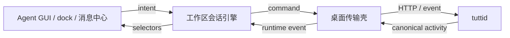

# Agent GUI 架构收敛方案（历史记录）

状态：架构重构完成（2026-07-11 复核）。本文只保留这次重构的背景、关键决策、迁移切片和退出标准，不再充当现行架构规范。原始规模快照、逐文件归属表和详细迁移清单可从 Git 历史读取。

现行规范：

- [Agent GUI Node](./agent-gui-node.md)：界面、会话引擎、宿主边界
- [Agent Extensions](./agent-extensions.md)：扩展目标、运行时安装、setup 生命周期
- [Provider-native Subagents](../specs/2026-07-15-provider-native-subagents.md)：child session 实体关系
- `packages/agent/gui/AGENTS.md`：包内编辑路由和硬规则

## 1. 为什么重构

原实现没有单个致命错误，而是多个局部合理选择累积成系统性偏移：

1. 数据模型没有独立 turn，session 同时承载会话、执行和交互状态
2. 工作区级编排依附 React 面板生命周期
3. daemon、桌面桥、多个 store 和组件各持有一份乐观状态
4. provider 差异以名称分支渗入界面
5. Agent GUI 以横向巨石文件组织，修改一个流程会横跨整棵组件树
6. dock、消息中心、通知等消费方各自推导 session 状态
7. 架构约束主要是散文禁令，缺少类型和自动检查

文件过长只是职责、状态所有权和时序边界不清的可见症状。

## 2. 决策

### 2.1 实体边界

活动域分为三个实体：

| 实体        | 所有内容                                   | 不应包含              |
| ----------- | ------------------------------------------ | --------------------- |
| Session     | 目标、工作目录、标题、设置、当前 turn 引用 | turn 结果、待处理审批 |
| Turn        | 一次提交的阶段、结果、错误、文件变化       | 后续 turn 的状态      |
| Interaction | 审批、提问、计划确认及处理状态             | session 级展示状态    |

派生值不作为第二份事实保存：

- 展示状态由 turn 和 interaction 推导
- 提交可用性由 selector 推导
- session 只引用 active turn，不复制其 phase/outcome
- interaction 是否待处理由其自身状态表达，不使用三态 `null` 补丁协议

### 2.2 状态所有权

判定问题只有一个：关闭所有 Agent GUI 面板后，该状态是否仍应存在并继续工作？

- 是：属于 daemon 或工作区级会话引擎
- 否：属于组件本地状态

队列推进、乐观提交、运行时事件对账、当前 session/turn 投影属于引擎；滚动位置、输入焦点、临时展开状态属于组件。会话 Rail 的滚动、section 折叠和“显示更多”按 `workspaceId + agentTargetId/all` 记忆；搜索 query 只建立瞬时导航状态，不扩张永久 scope map。query controller 只报告当前请求 scope 是否已精确 resolved，不拥有 DOM 或滚动位置。`activeConversationId` 只表达选中事实；外部打开与新建会话通过显式 reveal intent 请求滚动，Rail 点击与 provider 恢复不发滚动命令。

### 2.3 单向数据流



约束：

- daemon 是业务规则和持久状态权威
- 引擎是客户端时序、乐观状态和对账的唯一所有者
- 桌面层只做传输和宿主集成，不形成第二业务核心
- React 读取快照、派发意图、渲染；不以 effect 编排业务生命周期
- 所有消费方共享 selector，不自行重建状态词汇表

### 2.4 Provider 差异

传输协议不是稳定边界，归一化活动契约才是。

- provider 身份、运行时策略、能力和目标元数据由 descriptor/target 下发
- UI 按 capability 渲染，不按 provider 名称猜行为
- 标准 ACP、专属协议和 SDK 边车都投影为同一活动契约
- 新 provider 不得要求在 Agent GUI 内新增行为分支

### 2.5 类型与协议

- OpenAPI 是跨 daemon 边界传输类型的事实源
- Go/TypeScript 传输类型从契约生成
- 内部域类型允许存在，但只能通过显式投影跨层
- 时间、状态和身份字段使用单一表示
- 未知枚举必须有显式处理路径，不能用宽字符串绕开检查

## 3. 目标模块

```text
packages/agent/
├── activity-core/            # 规范化活动状态、reducer、selectors
└── gui/
    ├── agent-gui/            # 功能模块装配
    ├── shared/               # 有明确领域名的复用能力
    └── host/                 # 最小宿主接口

apps/desktop/
└── workspace-agent/          # 传输适配、桌面集成、工作区实例装配

services/tuttid/
├── service/agent/            # 会话、turn、interaction 业务规则
└── api/                      # OpenAPI 投影和路由
```

Agent GUI 纵向拆分为：

- session list：选择、分组、固定、未读
- timeline：活动投影、消息记录、文件变化
- composer：输入、附件、提交能力
- interactions：审批、提问、计划确认
- readiness/setup：目标就绪状态和安装入口

模块可共享域模型和 selector；不得共享“万能 controller”“万能 utils”或扁平大 view model。

## 4. 迁移切片

迁移按可独立验证的切片完成，不做一次性重写。

### 切片 1：建立机械护栏

- 记录文件尺寸、effect/ref、provider 分支和公共 props 基线
- 加入 renderer/provider/activity 边界检查
- 规则使用“只降不升”的过渡预算

退出标准：新增代码不能继续扩大已知偏移。

### 切片 2：生成契约成为唯一跨层类型源

- 先改 OpenAPI，再生成 Go/TypeScript 类型
- 删除手写传输镜像
- 保留内部域类型与生成类型间的显式投影

退出标准：跨边界字段改动由生成检查发现遗漏。

### 切片 3：Session、Turn、Interaction 实体化

- turn 与 interaction 成为持久实体
- session 只保留 active turn 引用
- daemon 启动时将未结束且不可恢复的 turn 收敛为 interrupted
- 取消操作归 turn 且保持幂等

退出标准：重启后不靠 session 字符串猜 turn 状态。

### 切片 4：工作区会话引擎

- 用户 intent 与运行时 event 进入同一 reducer
- 乐观提交声明确认、拒绝和超时条件
- 所有对账逻辑集中到一处
- selectors 服务 Agent GUI、dock、通知、消息中心

退出标准：面板卸载不影响队列、运行状态或对账。

### 切片 5：桌面桥变薄

- 移除桌面层的独立乐观状态和业务判断
- 只保留客户端调用、事件订阅、生命周期装配

退出标准：相同规则不在 desktop 与 engine 各实现一次。

### 切片 6：Agent GUI 纵向拆分

- 按 list/timeline/composer/interactions/readiness 拆模块
- controller 只装配模块
- 组件不持有工作区业务状态

退出标准：业务文件不超过仓库 800 行限制；新增功能只触及所属纵向模块。

### 切片 7：清理过渡代码

- 删除旧 store、双写、兼容 reader 和旧 selector
- 删除已归零的过渡预算
- 将仍有效的规则合并进耐久架构文档

退出标准：生产路径只有一个事实源和一个对账路径。

## 5. 完成快照

2026-07-11 实施快照：

- 协议 P1-P3、provider descriptor、引擎骨架、切片 1 已完成
- activation/submit/queue owner 已进入 engine，旧 overlay 符号扫描为零
- 旧 `AgentHostWorkspaceAgentSession/Message/Timeline` 生产镜像已删除
- generated-file mention provider 已通过 canonical selector 读取
- 原巨石已拆到 800 行以内，会话列表旧 store 已退役
- grouped props/view-model、纵向 view modules、渲染预算与低于 800 行的薄 controller 已落地
- 切片 7 的镜像、过渡导出、旧事件与终值基线清理已完成
- 唯一延后项是按客户端覆盖窗口删除私有持久化/launch migration reader；兼容读取不得重新进入公共写路径

## 6. 关键状态机

### 6.1 Turn

```text
submitted -> running -> waiting -> running -> settling -> settled
                    \------------------------------/
```

规则：

- `pendingIntents` 是提交乐观消息、接受、确认、结果未知、失败与到期的单一事实源
- controller 不把命令完成还原为 Promise 工作流
- 激活与普通提交共用同一 prompt envelope
- 乐观消息准入同时认文本与可渲染的结构化 `content`
- 合成计划决策走 tuttid 语义 API 与 durable `plan_decision` saga
- provider 原生 exit-plan 继续走 durable `interactive_response`
- session read 契约不再暴露旧 `status/turnLifecycle/submitAvailability/lastError/runtimeContext`
- 进程丢失后的未结算 turn 由 daemon 启动时统一收敛为 `settled/interrupted`

### 6.2 Interaction

```text
pending -> answered
        -> dismissed
        -> superseded
```

规则：

- 每个 interaction 有独立 ID、类型、状态和所属 turn
- 回答操作幂等，重复回答返回已处理状态
- 新 turn 开始时按规则取代不再有效的 interaction
- UI 只显示 selector 给出的 pending interaction

### 6.3 Readiness / Setup

```text
unavailable -> needs_setup -> setting_up -> ready
                         \-> failed
```

规则：

- built-in provider 的 managed-environment wizard 只服务其拥有的内建 provider
- Agent Extension setup 属于 Agent Target 生命周期，由 daemon 持久安装/setup 状态驱动
- React 只读取 host API 快照、发起显式用户动作、渲染状态
- provider 名称不得成为 readiness/setup 分支条件

## 7. 静态护栏

保留以下只降不升预算：

- 文件长度
- React effect/ref 数量
- provider 名称分支
- view props 面积
- 组件内 store 创建

预算下降时可更新 baseline；预算上升必须先修源头，不能通过抬 baseline 合并。
