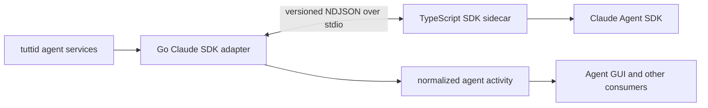

# Claude Code SDK Runtime

Claude Code has one supported runtime path: the daemon starts the
`@tutti-os/claude-sdk-sidecar` package, and the sidecar talks to the Claude Agent
SDK.

The product-fidelity and acceptance contract is maintained in
[Claude Code SDK Refactor Fidelity Requirements](./claude-code-sdk-requirements.md).

## Boundary



The public boundary is normalized agent activity and capability data. The GUI
must branch on capabilities or event semantics, not on the Claude Code provider
name. Claude-specific SDK messages, tool shapes, session cursors, and transport
details stay behind the daemon adapter and sidecar.

## Daemon ownership

The Go runtime under `packages/agent/daemon/runtime` is split by responsibility:

| Module                         | Ownership                                                |
| ------------------------------ | -------------------------------------------------------- |
| `claude_sdk_adapter.go`        | Adapter construction, shared state, and sink wiring      |
| `claude_sdk_lifecycle.go`      | Session start, resume, close, and live-session release   |
| `claude_sdk_execution.go`      | Prompt validation, execution, guidance, and cancellation |
| `claude_sdk_settings.go`       | Live settings and permission-mode application            |
| `claude_sdk_transport.go`      | Sidecar process and NDJSON transport                     |
| `claude_sdk_protocol.go`       | Protocol version and envelope validation                 |
| `claude_sdk_session.go`        | Session storage, command/env helpers, and state payloads |
| `claude_sdk_events.go`         | Sidecar event dispatch and lifecycle routing             |
| `claude_sdk_activity.go`       | Conversion into normalized activity events               |
| `claude_sdk_live_state.go`     | Live message, task, and usage state reconciliation       |
| `claude_sdk_interactive.go`    | Approval and interactive prompt handling                 |
| `claude_sdk_goal.go`           | Goal and plan lifecycle projection                       |
| `normalized_session_events.go` | Protocol-neutral session activity projection             |

The descriptor selects the SDK runtime kind; these adapter modules own the
process/session lifecycle and normalization behind that selection. They must not expose
raw SDK envelopes to services or GUI packages. Service-layer provider catalogs,
composer profiles, targets, status probes, and identity projections consume the
same `ProviderDescriptor` instead of re-registering Claude Code locally.
Claude modules do not call ACP-owned helpers; protocol-neutral session and
interactive activity projection have their own modules, while Claude goal,
command, usage, and interaction decoding stay inside the Claude SDK boundary.
New normalized session updates use `sessionUpdateKind`; the former ACP-named
metadata key is accepted only while reading imported or durable historical
events.

Claude credential-sensitive operations share the process-wide gate owned by
`services/tuttid/service/claudecode`. Real session startup, hidden model
discovery, and `claude auth status` acquire this same gate. The AgentGUI's
initial provider demand only checks local availability; Anthropic usage is
queried after the user opens a usage surface or explicitly refreshes it.

Composer model discovery uses an account-level scope made from provider,
agent-target identity, and a non-secret auth fingerprint. It intentionally does
not include workspace or caller cwd for Claude Code, so switching workspaces
cannot create duplicate discovery processes. The process runs from the
daemon-owned discovery directory. A composer request waits at most 20 seconds,
but that wait does not cancel the SDK initialization: the background lifecycle
may continue for up to ten minutes so OAuth refresh state can be persisted.
Transient failures before a session starts remain retryable. Auth invalidation
marks in-flight results superseded and clears caches, but never closes a hidden
discovery session early; the original ten-minute lifecycle remains responsible
for teardown so credential refresh has time to finish persisting.
The descriptor's `CLAUDE_CONFIG_DIR` root override is honored consistently by
runtime endpoint discovery, status/custom-config inspection, and auth watching.

## Sidecar ownership

`packages/agent/claude-sdk-sidecar/src/main.ts` is only the stdio server and
request router. `sessionRuntime.ts` coordinates a session through focused
collaborators:

- `protocol.ts` and `eventSink.ts`: versioned wire envelopes and event emission.
- `sessionConfiguration.ts`, `sessionSettings.ts`, and `options.ts`: SDK query
  configuration and mutable session settings.
- `promptQueue.ts` and `turnLifecycle.ts`: prompt ordering and turn ownership.
- `messageRouter.ts`, `messageProjection.ts`, `assistantStream.ts`, and
  `sdkMessages.ts`: SDK message routing and assistant output projection.
- `toolActivity.ts`, `toolEvents.ts`, `toolActivityTypes.ts`, `taskPlan.ts`, and
  `taskNotification.ts`: normalized tool, delegated-task, and plan activity.
- `interactive.ts`: approvals and interactive questions.
- `compaction.ts` and `usage.ts`: context compaction and usage reporting.
- `authDiagnostics.ts`, `errors.ts`, and `runtimeValues.ts`: diagnostics and
  small runtime value helpers.
- `testDriver.ts`: isolated deterministic sidecar-driver behavior used by
  runtime integration tests.

The dependency direction is from `main.ts` to `sessionRuntime.ts`, then to these
collaborators. Collaborators must not import `main.ts` or own the stdio loop.
Projection modules emit typed sidecar events; they do not call daemon or GUI
code.

Raw sidecar stderr is never copied into activity, logs, or user-visible errors.
The Go transport retains only a bounded failure classification; explicitly
prefixed auth diagnostics are separately sanitized before structured logging.

## Protocol and compatibility

The daemon and sidecar exchange newline-delimited JSON over standard input and
output. Every request and event carries the current protocol version. Missing
or unsupported versions fail explicitly. Change both
`claude_sdk_protocol.go` and `src/protocol.ts` together and cover the change on
both sides.

Capability and composer contracts are intentionally stable across this runtime
split. Imported historical metadata may still be read for display compatibility
without affecting runtime selection.

Desktop packaging runs the deterministic sidecar protocol smoke twice: once
after production dependencies are vendored, and again from the final Electron
Resources directory after symlinks have been replaced. Both checks must complete
`start`, `exec`, and `close` without reading repository sources.

The vendored bundle excludes the native `claude` executable (it still carries
the SDK's JS, type metadata, and `manifest.json`). The binary the SDK spawns
is provisioned at runtime by tuttid from the CDN (npm mirrors as fallback),
pinned and verified against the vendored SDK's `manifest.json` (see
`services/tuttid/service/agentstatus/claude_binary.go`). The sidecar picks the
executable in `src/executablePath.ts`: an explicit `CLAUDE_CODE_EXECUTABLE`
always wins, a native package next to the SDK (dev tree) comes next, and
`TUTTI_CLAUDE_CODE_FALLBACK_EXECUTABLE` — the provisioned binary or a
PATH-installed claude, chosen by `runtimeprep.ClaudeCodePreparer` — covers the
packaged app.

`close` is a request/ack boundary, not a fire-and-forget signal. The sidecar
awaits SDK query shutdown before replying `ok`; the daemon only then closes
stdin and the process. Transport reads are context-aware so a request timeout
can stop waiting without implicitly killing a provider process.

## Code health and validation

Production business files follow the repository limit of at most 800 lines.
Before adding another responsibility to a file near that limit, extract a
named collaborator with one owner and a directed dependency. Tests are grouped
by session, assistant streaming, delegated tasks, nested tasks, interaction,
and lifecycle behavior rather than collected in one fixture file.

Run these focused checks after changing the runtime:

```sh
cd packages/agent/claude-sdk-sidecar
pnpm typecheck
pnpm test
pnpm exec oxlint src

cd ../daemon
go test ./runtime
golangci-lint run ./runtime/...
```

Also run `pnpm check:changed` from the repository root for cross-package
contracts and packaging checks.
