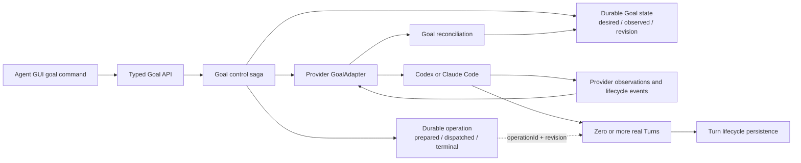
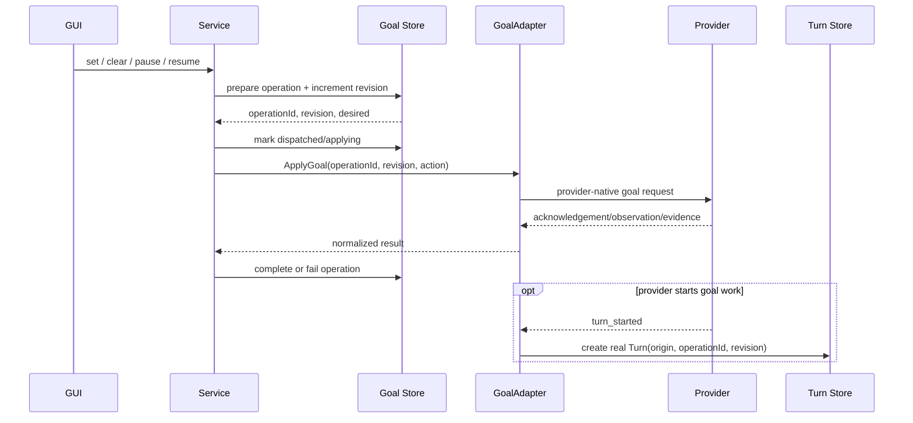
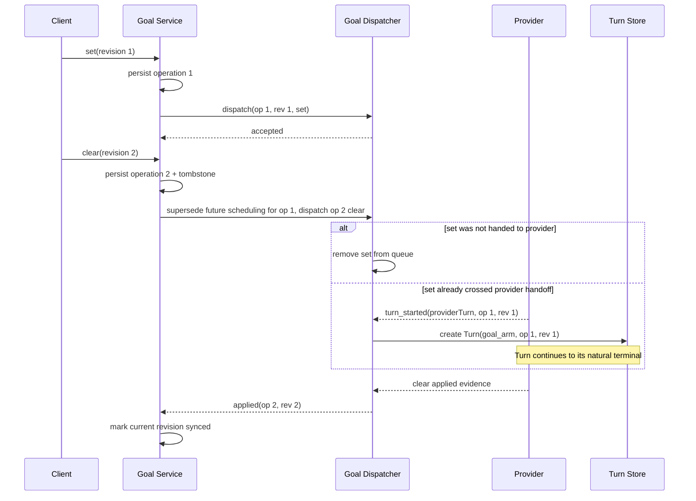
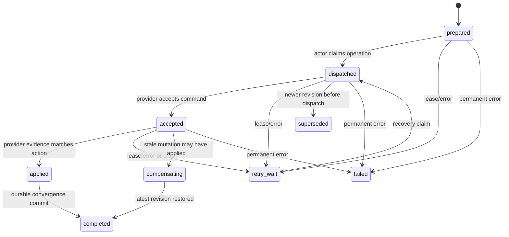

# Agent Goal Control Design

Status: implemented, independently reviewed, and accepted on
`codex/goal-control-root-fix`

## Problem

Goal is a session-level, long-running provider capability. It may exist while
no Turn exists and may cause the provider to create multiple Turns over time.
The old path classified `/goal` after allocating a local Turn ID. A direct
control could therefore attach messages and loading state to a Turn the
provider never started. Immediate `/goal clear` left that phantom Turn without
a terminal event, so the first reply stayed thinking and the session stayed
running.

The invalid model was:

```text
Goal == specially shaped Turn
```

The durable model is:

```text
Session owns Goal state and GoalControlOperation records
Goal may cause zero or more provider-created Turns
Turn optionally records the Goal operation/revision that caused it
```

## Architecture



Ownership rules:

- `workspace_agent_session_goals` is upper-layer durable business state.
- `workspace_agent_goal_control_operations` is the control saga log. It has no
  `turn_id` foreign key.
- Provider state is observation, not a replacement for desired state.
- `workspace_agent_turns` is created only by an explicit Turn lifecycle
  transition. A message cannot manufacture a Turn.
- A Goal audit message is session-level and has an empty Turn ID.

## State Model

Goal state contains:

- `desired`: latest upper-layer intent.
- `observed`: latest normalized provider observation.
- `revision`: monotonic desired-state version.
- `tombstoned`: durable clear intent; a stale non-empty observation cannot
  resurrect it.
- `syncStatus`: `pending`, `applying`, `synced`, `diverged`, `unknown`, or
  `failed`.
- `pendingOperationId`, evidence, error, and observation timestamps.

Each operation contains a stable operation ID, session identity, goal revision,
action, objective, status, evidence, error, and timestamps. It never claims a
Turn in advance.

## Turn Relationship

Turn provenance is immutable after first classification:

- `user_prompt`
- `goal_arm`
- `goal_continuation`
- `provider_initiated`
- `legacy_unknown`

A Goal-created Turn records `sourceGoalOperationId` and
`sourceGoalRevision`. Steer is input on an existing Turn and is not an origin.
Delayed continuation scheduling captures the revision and exits before
provider handoff when a newer set/clear has superseded it. Once the provider
has accepted or started a Turn, that Turn keeps its original provenance and
runs to its natural terminal; superseding Goal state only blocks later work.

### Exact Goal-generation provenance ledger

Codex identifies a Goal-created Turn by correlating the provider-authored Goal
generation returned by `thread/goal/set` with the same generation on the
turn-scoped `thread/goal/updated` notification. This correlation cannot rely on
a bounded process-local cache: after eviction or daemon restart, a delayed old
generation could otherwise inherit the current Goal operation.

The durable ledger key is:

```text
(workspaceId, agentSessionId, sessionCreatedAtUnixMs,
 providerSessionId, generationFingerprint)
```

`generationFingerprint` is a fixed-length SHA-256 digest of canonical
provider-authored generation material (`threadId`, `createdAt`, `updatedAt`,
and `objective`). The objective is never stored in the ledger key or logs.
The value is the immutable `(operationId, revision, repairEpoch)` identity.
`sessionCreatedAtUnixMs` is the session-incarnation fence: bind must match the
currently persisted, non-deleted session row, so an ACK from before
`ClearSessions` cannot attach to a same-ID recreated session.
First bind wins; rebinding the same fingerprint to a different identity
atomically replaces the identity with a permanent `ambiguous` tombstone.
Ambiguous generations are never adopted, and a collision observed while
binding fails closed by terminating that provider session.

The adapter performs a bounded synchronous durable bind before accepting a
successful Goal mutation and an exact durable lookup before adopting a
provider-created Turn. Missing evidence remains pending only for the bounded
provenance grace window; ledger failure closes the provider rather than
guessing. The in-memory maps are only a working set for the current generation
and unmatched/active Turns. Handoff, settlement, rejection, and expiry release
Turn evidence and prune unprotected bindings, so more than 256 continuations
cannot permanently degrade a valid long-running Goal. Session delete, batch
delete, and clear explicitly remove ledger rows even when SQLite foreign keys
are disabled.



Clear is valid whether or not a Turn exists. It updates the Goal entity and
operation; it does not allocate a Turn, emit `turn_started`, or cancel any
already accepted or started Turn. Provider-native clear affects future Goal
scheduling and continuation only.

## Provider Adapter

All providers implement one semantic boundary:

- capability discovery
- apply Goal action
- reconcile/query observation where supported
- normalize provider state
- typed `/goal` classification before Turn allocation

Codex uses thread goal RPCs and an authoritative goal query. Claude Code has no
equivalent query API, so the adapter forwards native slash commands and labels
its evidence as lifecycle-inferred. The upper layer, not the provider adapter,
decides convergence.

## Synchronization And Repair

Top-down:

1. Persist desired state and operation atomically.
2. Mark applying before calling the provider.
3. Pass operation ID and revision through the adapter.
4. Persist provider result and evidence.

Bottom-up:

1. Normalize provider runtime snapshots.
2. Update only observed state and evidence.
3. While an operation is pending, keep `syncStatus=applying`.
4. Never replace desired state or clear a tombstone from an observation.

Calibration APIs:

- `GET /v1/workspaces/{workspaceID}/agent-sessions/{agentSessionID}/goal`
- `POST /v1/workspaces/{workspaceID}/agent-sessions/{agentSessionID}/goal/reconcile`

## Required Invariants

1. Goal control never preallocates a Turn ID.
2. A non-empty message Turn ID must reference an existing Turn.
3. A control operation is durable before provider dispatch.
4. Revision is monotonic and invalidates stale continuation scheduling before
   provider acceptance, never an already accepted or started Turn.
5. Turn origin is durable and immutable.
6. Goal clear cannot cancel any current Turn, including `user_prompt`,
   `goal_arm`, or `goal_continuation`.
7. Provider observations cannot erase newer desired state or tombstones.
8. Provider-specific capabilities and evidence stay behind `GoalAdapter`.

## Compatibility

Existing sessions are backfilled from stored session goal metadata at revision
zero. Existing Turns become `legacy_unknown`. Provider-specific compatibility
entry points remain for focused tests, while production controller paths use
the semantic adapter and typed Goal API.

## Delivery Plan And Quality Gates

The root fix is delivered in three ordered stages. A stage is complete only
after its implementation, an independent review, review corrections, and the
listed regression checks all pass. Later stages must not be used to waive an
earlier stage's acceptance criteria.

### Stage 1: Close The Original Race

Stage status: implemented, independently reviewed, and accepted.

#### Objective

Make every Goal command enter one durable control path, and make provider
acknowledgement, provider execution, and Turn provenance unambiguous. This
stage must close the reported `set -> immediate clear` hang without depending
on a restart or a repair worker.

#### Work

1. Move typed `/goal` classification to the Service/API boundary. A typed
   Goal command must enter the same Goal control saga as the dedicated Goal
   API before a submit claim or Turn ID is allocated. `Controller.Exec` must
   not provide a second, non-durable Goal execution path.
2. Keep `/input` Turn-producing. For a new session, either create an empty
   session and then call Goal control or expose an atomic
   `CreateSessionWithGoal` operation. Do not return an empty Turn ID through a
   response contract that promises a Turn.
3. Add an operation-aware Claude Goal dispatcher before the normal prompt
   queue. Each item carries immutable `operationId`, `revision`, `action`, and
   optional provider Turn ID.
4. Coalesce an undispatched older `set` when a newer `clear` arrives. If the
   old set has already been handed to the SDK, retain its identity and allow
   its Turn to settle naturally. Apply the latest clear as the desired state so
   no later continuation is scheduled; revision supersession alone must never
   interrupt the accepted Turn.
5. Split provider phases. Sidecar `ok` means only `accepted`; it must not mark
   the Goal operation `synced`. Persist evidence for `accepted`,
   `execution_started`/`applied`, and `completed` where the provider exposes
   those transitions. A clear remains applying until its effect is consumed or
   observed.
6. Replace mutable session-global Goal provenance with an immutable command or
   provider-Turn association. A delayed Turn must keep the operation and
   revision that caused it even after a newer command changes session state.
7. Do not translate Claude Goal clear into either generic or precise Turn
   cancellation. Exact quiesce is reserved for missing/ambiguous provenance;
   explicit user cancellation remains a separate Turn operation.

#### State And Sequence Contract



#### Acceptance Gate

- A real integration-style test executes `set`, receives only the sidecar
  scheduling ACK, immediately executes `clear`, and proves the accepted Turn
  reaches its natural terminal, clear prevents another continuation, and the
  session does not remain running.
- The test must not inject a synthetic `turn_canceled` event to make the queue
  advance.
- Typed `/goal` and the dedicated Goal API create the same durable operation
  records and allocate no Turn before `turn_started`.
- A delayed revision-1 Turn cannot be labelled with revision 2 or operation 2.
- Goal clear leaves the current Goal or user Turn running and only prevents
  future Goal continuations.
- A fully proven superseded Turn is adopted with its original operation and
  revision; only missing or ambiguous provenance is quiesced.
- Relevant Go, sidecar, API, generated-client, typecheck, and lint checks pass.

### Stage 2: Make The State Machine Recoverable

Stage status: implemented, corrected through five independent review gates, and accepted.

#### Objective

Make ordering and convergence correct under overlapping requests, slow
provider RPCs, process crashes, retries, and manual reconciliation.

#### Work

1. Introduce one per-session `GoalActor` (or an equivalent single-writer
   dispatcher) that serializes set, clear, reconcile, continuation/nudge, and
   compensation. Provider mutations may not bypass this ordering boundary.
2. Apply a revision fence before provider dispatch and after provider result.
   A stale result is evidence only and may not update current desired or sync
   state. If a stale provider mutation could already have taken effect, enqueue
   compensation toward the latest desired revision.
3. Make reconciliation transactional. Its compare-and-swap predicate includes
   session ID, desired revision, pending operation ID, and observation time.
   Retry on CAS conflict instead of overwriting a concurrent transition.
4. Promote Goal operations from an audit log to a recoverable outbox with
   owner, lease expiry, attempt count, next-attempt time, and provider phase.
   The delivery age/attempt budget begins at the first durable `dispatched`
   transition and is immutable across ordinary retries. A `prepared` operation
   whose runtime is unavailable has not crossed the Provider boundary and may
   remain pending; a dispatched/applying operation must deterministically fail
   when its generation budget expires. A stale-result repair wake creates a new
   delivery generation and resets these baselines.
5. Add startup and periodic recovery. Claim expired non-terminal operations and
   determine the next action from durable desired state and provider evidence.
   Codex uses authoritative query; Claude replays idempotent clear and resumes
   set only from a persisted safe provider phase.
6. Do not use a request context to persist a provider result after the request
   has been canceled. Completion/failure persistence uses a bounded service
   context and surfaces storage errors.
7. Allow reconciliation to CAS-complete a matching pending operation when
   authoritative evidence proves convergence.
8. Separate control convergence from Goal lifecycle. For the same objective
   and revision, lifecycle states such as `complete`, `blocked`, or limited can
   be control-converged even though they are not `active`.

#### State Machine



Only `completed`, `superseded`, and `failed` are terminal. `accepted` is never
equivalent to synchronized.

#### Acceptance Gate

- A slow revision-1 provider result arriving after revision-2 clear cannot
  change revision-2 desired, pending operation, or sync status.
- Concurrent reconcile and set/clear tests prove CAS conflict/retry behavior.
- Crash-point tests cover after prepare, after dispatch, after accept, and
  after provider apply but before durable completion.
- Restart recovery drains or deterministically fails every expired operation;
  no operation remains `applying` forever.
- Recovery never replays a non-idempotent Claude set from an unsafe phase.
- Terminal/limited provider lifecycle for the same Goal can be control-synced.

#### Deferred bounded-retention hardening

The reconcile inbox currently retains completed and failed request identities
for the lifetime of the session. A follow-up migration must add bounded,
incremental GC without weakening replay safety: completed rows retain a
documented request-id dedupe window; failed rows use a longer retention window
and are eligible only after the same revision has a durable terminal incident
summary/fence. The worker should prune a small fixed batch per tick and tests
must prove ACK replay remains idempotent inside the window and terminal audit
survives row removal. This is deliberately deferred from the terminal-fence
correction because retention changes deletion semantics and migration policy.

### Stage 3: Harden Protocol And Persistence Invariants

Stage status: implemented, corrected through independent review gates, and
accepted.

Batch A status: accepted. The runtime/reporter path keeps first-class
`SessionAuditEvent` records separate from Turn messages; the compatibility
HTTP/store envelope encodes them as `kind=session_audit` with no Turn ID, and
realtime projection publishes the dedicated `session_audit` event. Runtime/API
messages remain strictly Turn-scoped. Read-only external transcript import is
the only explicit historical compatibility path allowed to retain older
turnless rows; the import flag is internal and cannot be inferred from or
forged by the reported origin. Existing nullable legacy rows remain readable
and are never assigned a guessed Turn.

Batch B/C status: accepted. Interaction persistence rejects unknown Turns; a
provider-raised first interaction carries an explicit `provider_initiated`
Turn proposal and commits the matching Turn plus interaction atomically, while
conflict/replay keeps any existing origin unchanged. Clear, single-delete, and
batch-delete paths explicitly remove runtime-operation outbox/events and
operations, then Goal operations and Goal state, even with foreign keys
disabled. Ordinary system notices are Turn-scoped. `origin`,
`sourceGoalOperationId`, `sourceGoalRevision`, and `sourceGoalRepairEpoch`
survive event compatibility, durable reload, HTTP/realtime projection,
canonical reducers, and replay; historical `legacy_unknown` rows are never
reclassified.

Batch D status: accepted. Codex Goal generation provenance uses the exact
durable ledger described above, with session-incarnation fencing, permanent
ambiguity tombstones, bounded synchronous bind/lookup, and fail-closed handling
for storage failure, malformed/empty durable Goal responses, and malformed
turn-scoped Goal observations. More than 320 continuation Turns, restart,
delayed old generations, collisions, deletion, and same-ID session recreation
are covered by regression tests.

#### Objective

Remove compatibility loopholes that can recreate phantom Turns, lose Goal
records, or cause audit delivery to retry forever.

#### Work

1. Introduce a first-class session-level `SessionAuditEvent`, separate from
   Turn messages. If wire compatibility requires one envelope, `turnId` is
   nullable only when `kind=session_audit`; all Turn-scoped kinds still require
   a real Turn.
2. Update activity compatibility, event projection, generated contracts, and
   reporters so session audit events do not enter Turn lifecycle logic and do
   not retry because a Turn ID is absent.
3. Enforce the unknown-Turn invariant for interactions as well as messages.
   Provider-initiated interaction must explicitly create a
   `provider_initiated` Turn before persisting the interaction.
4. Explicitly delete Goal operations and Goal state in `ClearSessions` before
   deleting sessions. Correctness must not depend on SQLite foreign-key cascade
   being enabled.
5. Preserve immutable origin and Goal source fields across all event,
   persistence, compatibility, and projection paths. Legacy rows remain
   `legacy_unknown`; they are not guessed into a Goal origin.
6. Document and test the final compatibility boundary for older clients and
   stored sessions.
7. Persist exact provider Goal-generation provenance before reporting a
   durable Goal mutation as applied. Adoption after restart must resolve the
   same operation, revision, repair epoch, provider session, and session
   incarnation; it may not fall back to the current in-memory Goal identity.
8. Fail closed when a durable provenance bind/lookup cannot be completed or a
   provider response cannot produce a valid generation fingerprint. Empty
   responses remain compatible only for provider actions whose contract
   explicitly permits them, such as pause/resume status mirrors.

#### Acceptance Gate

- Session audit events round-trip through adapter, compatibility layer, event
  protocol, persistence, and projection with no Turn ID and no retry loop.
- Every non-audit message or interaction with an unknown non-empty Turn ID is
  rejected; no implicit Turn is manufactured.
- `ClearSessions` removes Goal operations and Goal state with
  `PRAGMA foreign_keys=OFF`, and recreating the same session ID starts clean.
- Provenance survives daemon restart and event replay unchanged.
- Full Go tests, sidecar tests, client tests, typecheck, lint, generated-file
  checks, and `git diff --check` pass.

#### Independent Review Corrections

The Stage 3 review found and closed the following blocking boundaries before
acceptance:

- a sticky revision-scoped terminal fence now protects every Goal observation
  and sync-status write path;
- reconcile uses a durable two-phase inbox (`quiesce_pending` then
  `finalized`), leases, poison-row isolation, bounded retries, and atomic
  exhaustion escalation;
- provider recovery policy is exposed through adapter capabilities instead of
  provider-name branches in the service;
- adopted Codex Goal Turns use a per-Turn processing mutex and atomic
  pending/adopting/active handoff so buffered notifications cannot race settle;
- durable provenance bind is acknowledged before `applied`; missing ACK,
  collision, malformed fingerprint material, or an empty durable set response
  closes the provider session instead of guessing;
- the ledger key includes the durable session incarnation, preventing an old
  ACK from binding after clear and same-ID session recreation.

#### Deferred Non-Blocking Hardening

- The HTTP Goal-provenance client contract exists for a future remote
  control-plane reporter, but this repository has no matching server route.
  Current production wiring uses the in-process activity projection and SQLite
  ledger. A remote deployment must add bind/lookup routes and an end-to-end
  contract test before enabling that client path.
- Reconcile-inbox completed/failed retention remains the bounded-GC follow-up
  documented under Stage 2. It is not required for convergence correctness,
  but should be implemented before unbounded session lifetimes become an
  operational storage concern.

#### Verification Record

- affected Go packages: passed;
- Goal-focused store, service, and runtime race tests: passed;
- `@tutti-os/agent-activity-core`: 181/181 passed;
- `@tutti-os/client-tuttid-ts`: 53/53 passed;
- `@tutti-os/claude-sdk-sidecar`: 72/72 passed;
- TypeScript typecheck, Go/TypeScript lint, generated API/event/Codex protocol
  checks, provider-catalog check, and `git diff --check`: passed.

## Final Completion Criteria

The design is complete only when all three stage gates pass and the following
cross-stage invariants hold:

1. Goal state is session-owned and durable; Turn state is an observed execution
   consequence, never Goal identity.
2. There is exactly one production mutation path and one per-session ordering
   authority for Goal control.
3. Every provider transition is tied to immutable operation/revision evidence.
4. An acknowledgement is not treated as application or convergence.
5. Desired state can be repaired after crash without resurrecting a cleared
   Goal or canceling unrelated work.
6. No message, interaction, audit event, or compatibility path can fabricate a
   Turn.
